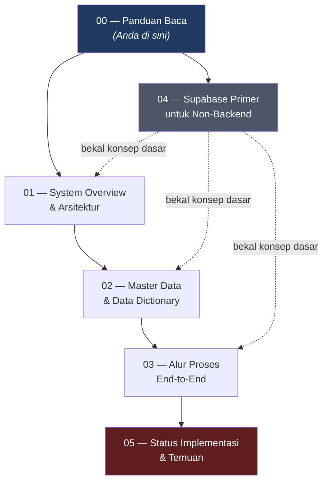
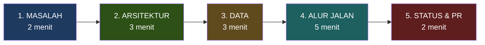

# Panduan Baca — Dokumentasi Backend Mangkasir-Ritel

> **Untuk siapa dokumen ini:** pembimbing magang, reviewer teknis, dan anggota tim baru
> yang perlu memahami sistem backend Mangkasir-Ritel tanpa harus membuka database.
>
> **Sumber data:** seluruh angka dan struktur di dokumen ini **diverifikasi langsung**
> dari database Supabase produksi pada 15 Juli 2026 — bukan dari asumsi atau desain di atas kertas.

---

## 1. Ringkasan Eksekutif (baca ini dulu — 60 detik)

| Pertanyaan | Jawaban singkat |
|---|---|
| **Ini sistem apa?** | Backend **POS Retail multi-tenant** (SaaS) bernama Mangkasir-Ritel / *MangRitel* |
| **Dibangun di atas apa?** | Supabase (PostgreSQL 17) — *database-as-backend*, tanpa server aplikasi terpisah |
| **Asalnya dari mana?** | Adaptasi dari database POS legacy **Mangkasir** (`mpos`, MariaDB) → di-*port* & diperluas ke Postgres |
| **Sudah sejauh mana?** | **51 tabel**, **6 view**, **10 function**, **8 trigger**, **24 migrasi** — skema **100% selesai**, RLS aktif di **51/51 tabel** |
| **Apa yang belum?** | Belum ada data operasional (0 outlet, 0 produk, 0 transaksi). Tahap saat ini = **fondasi backend**, bukan aplikasi jalan |
| **Apa nilai teknis utamanya?** | Stok & kas terjaga otomatis lewat **ledger + trigger**, dan isolasi antar-tenant dijaga **di level database (RLS)**, bukan di kode aplikasi |

**Satu kalimat untuk pembimbing:**
> *"Saya membangun fondasi backend POS retail multi-tenant di Supabase: 51 tabel dengan Row Level Security aktif menyeluruh, ledger stok berbasis trigger yang menjamin stok tidak pernah out-of-sync, dan RBAC 7 peran dengan 26 permission — semuanya ditegakkan di level database sehingga aplikasi klien tidak bisa membocorkan data antar-toko meskipun kodenya salah."*

---

## 2. Peta Dokumen



| # | Dokumen | Isinya | Baca kalau… |
|---|---|---|---|
| **00** | `00_README_Panduan_Baca.md` | Indeks, ringkasan eksekutif, skrip presentasi | Anda baru mulai |
| **01** | `01_System_Overview_dan_Arsitektur.md` | Konteks produk, arsitektur *database-as-backend*, model multi-tenant, model keamanan (RLS + RBAC), keputusan teknis | Ingin paham **kenapa** dibangun begini |
| **02** | `02_Master_Data_dan_Data_Dictionary.md` | Beda master vs transaksi, peta 51 tabel per modul, ERD, kamus data, seed data | Ingin paham **data apa saja** yang ada |
| **03** | `03_Alur_Proses_End_to_End.md` | 8 alur bisnis lengkap (auth → setup → beli → jual → retur → kas → laporan), rantai trigger, state machine | Ingin paham **bagaimana sistem berjalan** dari awal sampai akhir |
| **04** | `04_Supabase_Primer_untuk_Non_Backend.md` | Kelas kilat: tabel, PK/FK, RLS, trigger, function, migrasi, view, PostgREST + glosarium | Anda **bukan orang backend** dan butuh bekal istilah |
| **05** | `05_Status_Implementasi_dan_Temuan.md` | Status per modul, hasil audit keamanan, gap yang ditemukan, rekomendasi berikutnya | Ingin tahu **apa yang sudah/belum selesai & apa PR-nya** |

> **Saran urutan baca untuk pembimbing yang sibuk:** `00` → `01` → `03`.
> Dokumen `02` dan `05` dipakai sebagai lampiran/rujukan saat ada pertanyaan detail.

---

## 3. Skrip Presentasi (alur cerita 15 menit)

Ini kerangka bercerita agar penjelasan Anda runtut dari awal sampai akhir, bukan lompat-lompat.



| Babak | Yang Anda katakan | Rujukan |
|---|---|---|
| **1. Masalah** | "Mangkasir yang lama itu POS generik, satu toko. Untuk retail beneran, ada 3 hal yang hilang: tidak ada supplier & pembelian, tidak ada konsep 'satu bisnis punya banyak cabang', dan stok cuma angka yang di-update — tanpa jejak audit." | Dok 01 §2 |
| **2. Arsitektur** | "Saya tidak membuat server backend. Supabase mengubah tabel jadi REST API otomatis, dan keamanan saya taruh di database pakai RLS. Jadi meskipun aplikasi Flutter-nya salah kode, data toko A tetap tidak bisa bocor ke toko B." | Dok 01 §4–§6 |
| **3. Data** | "Ada 51 tabel, saya kelompokkan jadi 9 modul. Hierarkinya: Business → Outlet → Warehouse → Stock. Master data ada di dua level: brand/unit/supplier di level bisnis, produk/kategori/pelanggan di level outlet." | Dok 02 §3–§5 |
| **4. Alur jalan** | *(bagian terpenting)* "Saya tunjukkan satu transaksi penjualan. Kasir simpan 1 baris item — lalu database sendiri yang jalan: catat pergerakan stok, kurangi saldo batch, hitung ulang total stok produk, dan kalau bayarnya tunai, otomatis buat catatan kas. Kasir tidak menulis satu pun angka itu." | Dok 03 §5 |
| **5. Status & PR** | "Skema 100% selesai dan RLS aktif di semua tabel. Yang belum: data operasional dan 7 temuan audit yang sudah saya daftar beserta prioritasnya." | Dok 05 |

---

## 4. Fakta Kunci untuk Dihafal

Kalau pembimbing menembak pertanyaan mendadak, ini angka-angka yang perlu ada di kepala:

| Metrik | Angka | Catatan |
|---|---|---|
| Tabel di schema `public` | **51** | Semua RLS aktif |
| Tabel dengan RLS aktif | **51 / 51 (100%)** | 1 tabel (`otp_verifications`) sengaja tanpa policy = terkunci total |
| View pelaporan | **6** | Mewarisi RLS dari tabel dasarnya |
| Function buatan sendiri | **10** | 3 untuk keamanan, 7 untuk otomatisasi |
| Trigger | **8** | Inti otomatisasi stok & kas |
| Migrasi tercatat | **24** | `0001` … `0021b`, semua versioned |
| Peran (roles) | **7** | Owner, Administrator, Manager, Kasir, Purchasing, Gudang, Finance |
| Permission | **26** | Dipetakan lewat **106** baris `role_permissions` |
| Edge Function | **0** | Disengaja — semua logika di database |
| Versi PostgreSQL | **17.6** | Region `ap-southeast-2` (Sydney) |

---

## 5. Cara Memverifikasi Klaim di Dokumen Ini

Bagian ini penting untuk kredibilitas: pembimbing bisa cek sendiri, tidak perlu percaya begitu saja.
Jalankan di **Supabase Dashboard → SQL Editor**.

```sql
-- Klaim: "51 tabel, semua RLS aktif"
SELECT count(*) FILTER (WHERE relrowsecurity) AS rls_aktif,
       count(*)                                AS total_tabel
FROM pg_class c
JOIN pg_namespace n ON n.oid = c.relnamespace
WHERE n.nspname = 'public' AND c.relkind = 'r';
-- Harusnya: rls_aktif = 51, total_tabel = 51

-- Klaim: "8 trigger otomatisasi"
SELECT count(*) FROM pg_trigger t
JOIN pg_class c ON c.oid = t.tgrelid
JOIN pg_namespace n ON n.oid = c.relnamespace
WHERE n.nspname = 'public' AND NOT t.tgisinternal;
-- Harusnya: 8

-- Klaim: "7 role, 26 permission, 106 mapping"
SELECT (SELECT count(*) FROM roles)            AS roles,
       (SELECT count(*) FROM permissions)      AS permissions,
       (SELECT count(*) FROM role_permissions) AS mappings;
-- Harusnya: 7, 26, 106
```

---

## 6. FAQ — Pertanyaan Umum tentang Dokumentasi Ini

<details>
<summary><b>Q1: Dokumen ini dibuat dari desain atau dari database yang sungguhan jalan?</b></summary>

Dari **database yang sungguhan jalan**. Setiap angka (51 tabel, 8 trigger, 26 permission, 106 mapping)
ditarik langsung lewat query ke Supabase pada 15 Juli 2026. Isi function dan trigger yang dikutip di
Dokumen 03 adalah hasil `pg_get_functiondef()` — yaitu kode asli yang tersimpan di database, bukan
salinan dari file rancangan.

Ini penting karena dokumen desain sering "bohong" — ditulis di awal lalu implementasinya bergeser.
Dokumen ini justru merekam **kondisi nyata**, termasuk bagian yang menyimpang dari desain
(lihat Dokumen 05).
</details>

<details>
<summary><b>Q2: Kenapa perlu 6 dokumen? Tidak bisa 1 saja?</b></summary>

Karena pembacanya berbeda-beda kebutuhan, dan ini praktik standar di industri:

- Pembimbing yang ingin *gambaran besar* → cukup Dok 01
- Reviewer database → butuh Dok 02 (kamus data)
- Developer yang akan lanjut ngoding → butuh Dok 03 (alur) + Dok 05 (PR yang tersisa)
- Anggota tim baru yang belum paham backend → butuh Dok 04

Satu dokumen raksasa akan membuat semua orang membaca 80% hal yang tidak mereka butuhkan.
Pemisahan berdasarkan *concern* ini juga mengikuti struktur folder dokumentasi yang sudah ada
di repo (`00_Project`, `01_Business`, `02_Architecture`, `03_Data`, …).
</details>

<details>
<summary><b>Q3: Kalau pembimbing tanya hal yang tidak ada di dokumen, bagaimana?</b></summary>

Jawab jujur: *"Belum saya dokumentasikan — saya cek dulu ke database dan saya kabari."*
Lalu gunakan query di §5 atau pola query serupa. Ini jauh lebih baik daripada mengarang,
karena database bisa dicek dalam 10 detik dan tebakan yang meleset merusak kredibilitas
seluruh dokumen.
</details>

<details>
<summary><b>Q4: Diagram Mermaid ini tampilnya bagaimana?</b></summary>

Mermaid adalah diagram berbasis teks yang **otomatis dirender jadi gambar** oleh GitHub,
GitLab, VS Code (dengan ekstensi Markdown Preview Mermaid), Notion, dan Obsidian.

Jadi kalau file ini dibuka di GitHub, blok `mermaid` akan tampil sebagai flowchart sungguhan,
bukan teks. Keunggulannya dibanding gambar biasa: diagram ikut ter-*version control* — kalau
alurnya berubah, diff-nya kelihatan di Git. Ini alasan Mermaid jadi standar dokumentasi teknis
modern, dan repo ini memang sudah memakainya.

Kalau pembimbing membuka file di editor teks polos (Notepad), diagramnya akan tampil sebagai
kode. Solusinya: buka lewat GitHub, atau ekspor ke PDF.
</details>

<details>
<summary><b>Q5: Apa bedanya "Mangkasir", "Mangkasir-Ritel", dan "MangRitel"?</b></summary>

- **Mangkasir** = produk POS **lama** yang sudah jalan di produksi. Database MariaDB (`mpos` + `mpos_transaction`). POS generik untuk segala jenis usaha.
- **Mangkasir-Ritel** = nama **repo & project Supabase** untuk sistem baru ini.
- **MangRitel** = nama **produk** untuk sistem baru — spin-off khusus retail, multi-tenant, di Postgres.

Ketiganya merujuk hal terkait, tapi jangan tertukar: Mangkasir = *sumber/legacy*,
MangRitel = *target/baru*. Dokumen ini membahas yang **baru**.
</details>

---

## 7. Daftar Istilah Cepat

Kalau ada istilah yang tidak dikenali saat membaca, cek **Dokumen 04 §14 (Glosarium)** yang lengkap.
Lima yang paling sering muncul:

| Istilah | Arti singkat |
|---|---|
| **RLS** (Row Level Security) | Satpam di dalam database — menyaring baris data per pengguna, otomatis, sebelum data keluar |
| **Multi-tenant** | Satu database dipakai banyak bisnis sekaligus, tapi data mereka saling terisolasi |
| **Trigger** | Kode yang otomatis jalan saat data berubah — "kalau X terjadi, lakukan Y" |
| **Ledger** | Buku besar — catatan pergerakan yang hanya bisa ditambah, tidak diubah/dihapus |
| **Migrasi** | Satu berkas SQL bernomor yang mengubah struktur database, tersimpan sebagai riwayat |

---

*Dokumen 00 dari 6 · Terakhir diverifikasi terhadap database: 15 Juli 2026*
