# System Overview & Arsitektur — Mangkasir-Ritel

> **Tujuan dokumen:** menjawab pertanyaan **"kenapa sistem ini dibangun seperti ini?"**
> Bukan daftar tabel (itu Dokumen 02), bukan alur proses (itu Dokumen 03) — ini soal
> keputusan arsitektur dan alasannya.

## Daftar Isi
1. [Identitas Sistem](#1-identitas-sistem)
2. [Konteks: Dari Mana Sistem Ini Berasal](#2-konteks-dari-mana-sistem-ini-berasal)
3. [Peta Kapabilitas Bisnis](#3-peta-kapabilitas-bisnis)
4. [Keputusan Arsitektur Utama: Database-as-Backend](#4-keputusan-arsitektur-utama-database-as-backend)
5. [Model Multi-Tenant](#5-model-multi-tenant)
6. [Model Keamanan: RLS + RBAC](#6-model-keamanan-rls--rbac)
7. [Arsitektur Data: Ledger & Projection](#7-arsitektur-data-ledger--projection)
8. [Ringkasan Keputusan Teknis](#8-ringkasan-keputusan-teknis)
9. [Batasan yang Diketahui](#9-batasan-yang-diketahui)
10. [FAQ](#10-faq)

---

## 1. Identitas Sistem

| Atribut | Nilai |
|---|---|
| **Nama produk** | MangRitel (Mangkasir Retail) |
| **Nama repo / project** | `mangkasir-ritel` |
| **Jenis sistem** | Point of Sale (POS) Retail — SaaS multi-tenant |
| **Platform database** | Supabase — PostgreSQL **17.6** |
| **Project ref** | `emovquokperyixwnpqaa` |
| **Region** | `ap-southeast-2` (Sydney) |
| **Dibuat** | 30 Juni 2026 |
| **Migrasi terakhir** | 2 Juli 2026 (`0021b_fix_trigger_and_align_document_gaps_v2`) |
| **Klien yang dituju** | Aplikasi mobile Flutter (+ rencana web) |

**Aktor sistem:**

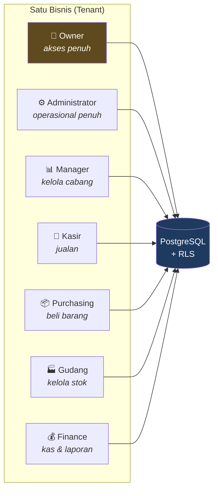

---

## 2. Konteks: Dari Mana Sistem Ini Berasal

Sistem ini **bukan dibangun dari nol**. Ia adalah adaptasi dari POS legacy yang sudah jalan di
produksi. Memahami ini penting, karena banyak keputusan desain hanya masuk akal kalau tahu asalnya.

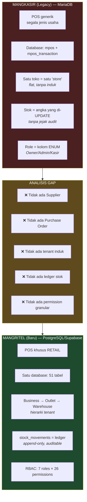

### Apa yang dipertahankan vs diubah

| Aspek | Mangkasir (lama) | MangRitel (baru) | Alasan perubahan |
|---|---|---|---|
| DBMS | MariaDB/MySQL | **PostgreSQL 17** | Butuh RLS, trigger canggih, tipe UUID native |
| Struktur toko | `stores` (datar) | `businesses` → `outlets` | Satu bisnis bisa punya banyak cabang |
| Stok | `products.qty` di-UPDATE langsung | `stock_movements` (ledger) → proyeksi ke `stocks` & `products` | Butuh jejak audit; angka bisa dihitung ulang |
| Role | Kolom ENUM di `users` | Tabel `roles` + `permissions` + `role_permissions` | Permission granular per aksi |
| Pembelian | Tidak ada | `purchase_orders` → `goods_receipts` → stok | Retail wajib punya siklus pengadaan |
| Uang | `double` | `DECIMAL(15,2)` | `double` menyebabkan error pembulatan pada uang |
| Kuantitas | `int` | `DECIMAL(18,4)` | Retail jual pecahan (0,5 kg gula) |
| Soft delete | `deleted` (boolean) | `deleted_at` (timestamp) | Tahu **kapan** dihapus, bukan cuma "ya/tidak" |
| Keamanan | Logika di kode aplikasi | **RLS di database** | Kode aplikasi bisa salah; database tidak bisa dilewati |

> 💡 **Poin bercerita ke pembimbing:** *"Migrasi ini bukan sekadar pindah database.
> Empat perubahan fundamental: tenancy berjenjang, ledger stok, RBAC granular,
> dan keamanan pindah dari aplikasi ke database."*

---

## 3. Peta Kapabilitas Bisnis

Sembilan modul yang membentuk sistem, dan bagaimana mereka saling bergantung:

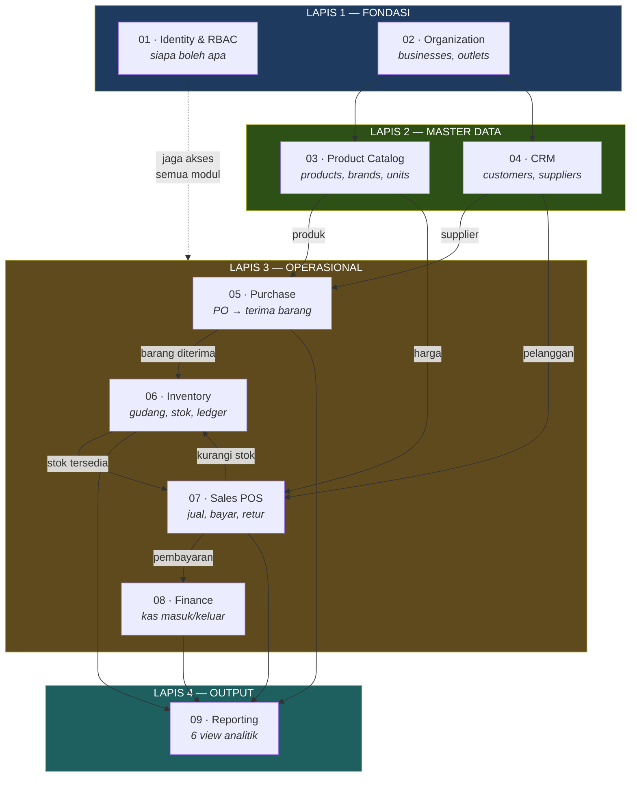

**Cara membaca:** anak panah = ketergantungan. Modul di lapis bawah harus ada dulu sebelum
lapis di atasnya bisa berfungsi. Ini juga menjelaskan **urutan 24 migrasi**: fondasi dulu
(`0001_fondasi_tenant_dan_organization`), baru produk (`0004`), baru penjualan (`0011`),
baru laporan (`0013`).

---

## 4. Keputusan Arsitektur Utama: Database-as-Backend

Ini **keputusan terpenting** dalam sistem ini, dan paling sering ditanya.

### Arsitektur tradisional vs yang dipakai

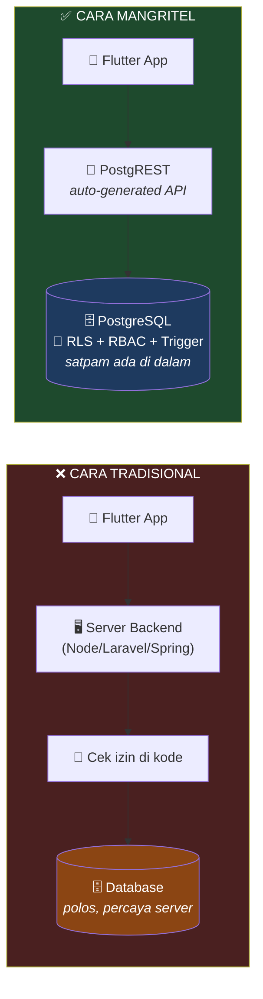

**Bukti bahwa ini disengaja:** jumlah Edge Function di project ini = **0**.
Tidak ada satu pun kode server. Semua logika ada di database sebagai function & trigger.

### Kenapa memilih ini

| Keuntungan | Penjelasan konkret |
|---|---|
| **Keamanan tak bisa dilewati** | Di cara tradisional, kalau developer lupa satu `if (user.storeId == data.storeId)`, data bocor. Dengan RLS, aturan melekat di **tabelnya**. Mau diakses lewat app, lewat Postman, atau lewat SQL langsung — filternya tetap jalan. |
| **Tidak ada server yang di-maintain** | Tidak ada deploy, tidak ada scaling, tidak ada server down jam 2 pagi. |
| **Satu sumber kebenaran** | Aturan bisnis (stok berkurang saat jual) ada di **satu tempat**. Kalau nanti ada web app dan mobile app, keduanya otomatis patuh aturan yang sama — tanpa duplikasi kode. |
| **Konsistensi transaksional** | Trigger jalan di dalam transaksi database yang sama. Kalau ada yang gagal, semuanya di-*rollback*. Tidak mungkin "stok berkurang tapi transaksi gagal tersimpan". |

### Konsekuensi yang harus diterima

| Kekurangan | Mitigasi di project ini |
|---|---|
| Logika di SQL lebih susah di-*debug* daripada di Dart/JS | Setiap trigger dibuat kecil & satu tanggung jawab; migrasi bernomor jadi bisa dilacak |
| *Vendor lock-in* ke Supabase | Sebenarnya rendah — semuanya PostgreSQL standar, bisa pindah ke Postgres mana pun |
| Tim harus paham SQL, bukan cuma framework | Ini alasan **Dokumen 04** (primer) dibuat |
| Susah menaruh logika non-database (kirim email, panggil API pihak ketiga) | Belum dibutuhkan; nanti pakai Edge Function kalau perlu |

### Alur permintaan data secara nyata

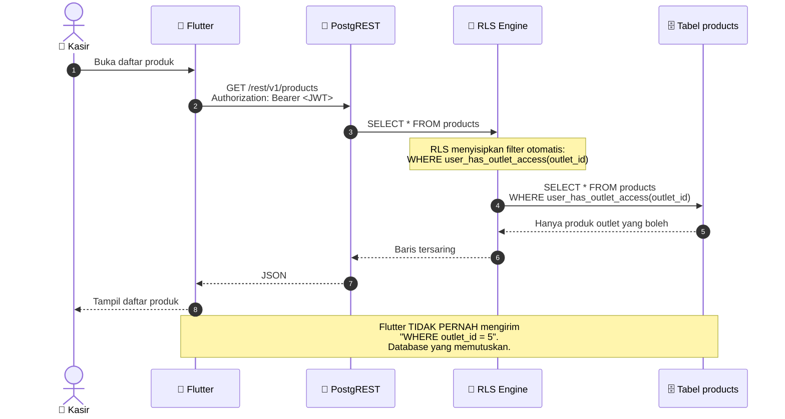

> 💡 **Poin bercerita:** *"Perhatikan langkah 3–4. Aplikasi minta 'semua produk'.
> Database yang diam-diam menambahkan filter. Aplikasi bahkan tidak tahu ada filter.
> Inilah kenapa data tidak bisa bocor meskipun aplikasinya salah kode."*

---

## 5. Model Multi-Tenant

**Multi-tenant** = satu database melayani banyak bisnis sekaligus, tapi tiap bisnis
tidak boleh bisa melihat data bisnis lain. Ini jantung produk SaaS.

### Hierarki

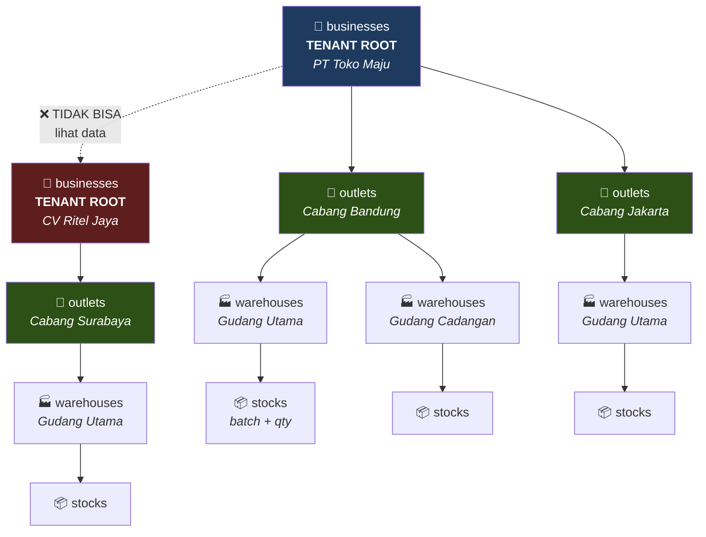

### Master data ada di dua level — dan ini disengaja

Ini detail yang membedakan desain matang dari desain asal jadi:

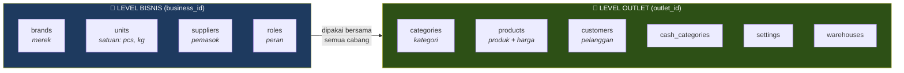

**Logika pemisahannya:**

| Level | Isinya | Alasan |
|---|---|---|
| **Bisnis** | brands, units, suppliers, roles | Merek "Indomie" sama di semua cabang. Supplier dinegosiasi di level perusahaan. Satuan "kg" universal. Kalau ditaruh per-outlet → duplikasi & tidak konsisten. |
| **Outlet** | products, categories, customers, settings, warehouses | **Harga bisa beda tiap cabang** (cabang mall vs cabang kampung). Pelanggan itu lokal. Kategori bisa disesuaikan tiap cabang. |

> ⚠️ **Konsekuensi yang perlu jujur disebut:** karena `products` di level outlet, satu produk
> yang dijual di 3 cabang = **3 baris berbeda** dengan `uuid` berbeda. Ini memudahkan harga
> per-cabang, tapi menyulitkan laporan "total penjualan Indomie se-perusahaan". Trade-off
> yang disengaja untuk MVP. (Lihat Dokumen 05 §4.)

---

## 6. Model Keamanan: RLS + RBAC

Keamanan sistem ini punya **dua lapis berbeda** yang sering tertukar. Bedakan baik-baik:

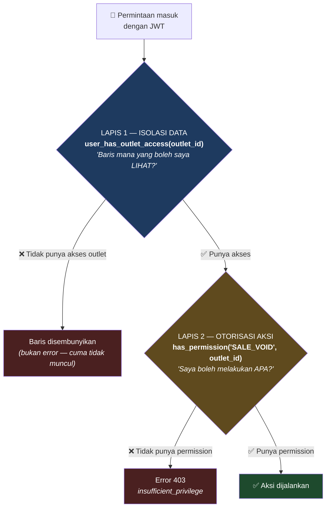

| | Lapis 1 — Isolasi Data | Lapis 2 — Otorisasi Aksi |
|---|---|---|
| **Pertanyaannya** | "Baris ini milik outlet saya?" | "Saya berhak melakukan aksi ini?" |
| **Function** | `user_has_outlet_access(outlet_id)` | `has_permission(code, outlet_id)` |
| **Kalau gagal** | Baris **tidak muncul** (senyap) | Error **403** (berisik) |
| **Analogi** | Kartu akses gedung — Anda hanya bisa masuk lantai kantor Anda | Jabatan — di lantai Anda pun, tidak semua orang boleh menandatangani cek |

### Tiga function keamanan (kode asli dari database)

#### `get_auth_business_id()` — menentukan tenant

```sql
CREATE OR REPLACE FUNCTION public.get_auth_business_id()
 RETURNS bigint
 LANGUAGE plpgsql
 STABLE SECURITY DEFINER
 SET search_path TO ''
AS $function$
BEGIN
    RETURN (SELECT business_id FROM public.users WHERE uuid = auth.uid());
END;
$function$
```

Ini **jembatan** antara Supabase Auth dan tabel bisnis: `auth.uid()` (UUID dari JWT)
dicocokkan ke `users.uuid`, lalu diambil `business_id`-nya.

#### `user_has_outlet_access(p_outlet_id)` — isolasi data

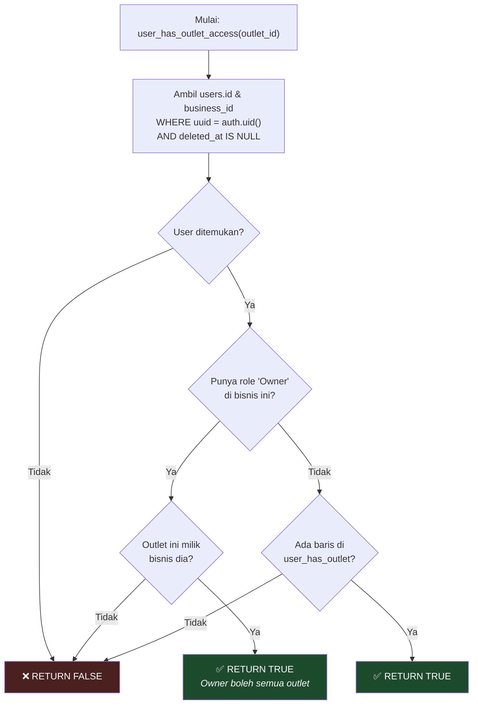

**Dua jalur berbeda:** Owner dapat akses **semua outlet dalam bisnisnya** secara otomatis.
Non-Owner harus terdaftar eksplisit di tabel `user_has_outlet`.

#### `has_permission(code, outlet_id)` — otorisasi aksi

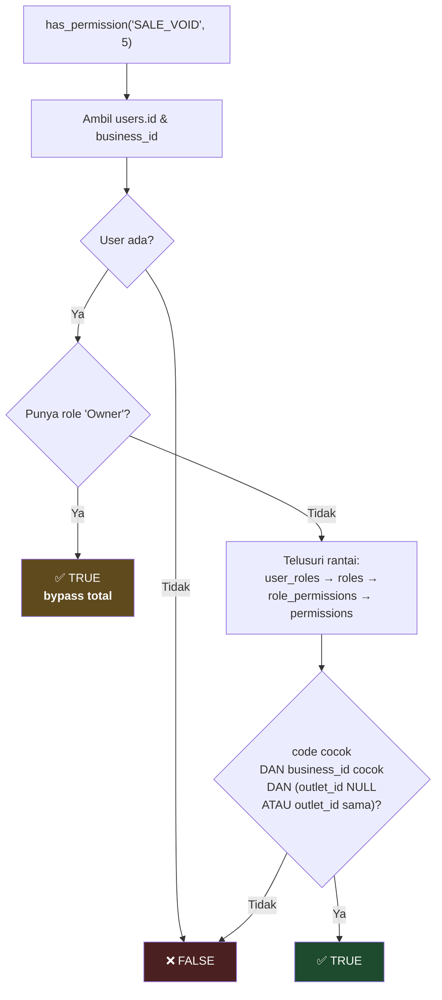

> 🔍 **Detail penting:** `ur.outlet_id IS NULL OR ur.outlet_id = p_outlet_id`.
> Kalau `user_roles.outlet_id` = NULL, artinya peran itu berlaku di **semua outlet**.
> Kalau diisi, peran hanya berlaku di outlet tersebut. Jadi seseorang bisa jadi
> "Manager di Cabang Bandung saja".

**Kenapa semua function ini `SECURITY DEFINER`?**
Karena tabel `users` sendiri dilindungi RLS. Kalau function jalan sebagai pengguna biasa
(`SECURITY INVOKER`), maka membaca `users` akan memicu RLS → yang memanggil function ini lagi
→ **rekursi tak berujung**. `SECURITY DEFINER` membuat function jalan sebagai pemiliknya
(bypass RLS), memutus lingkaran itu. `SET search_path TO ''` adalah pengaman wajib agar
tidak bisa dibajak lewat manipulasi `search_path`.

### RBAC: 7 peran × 26 permission

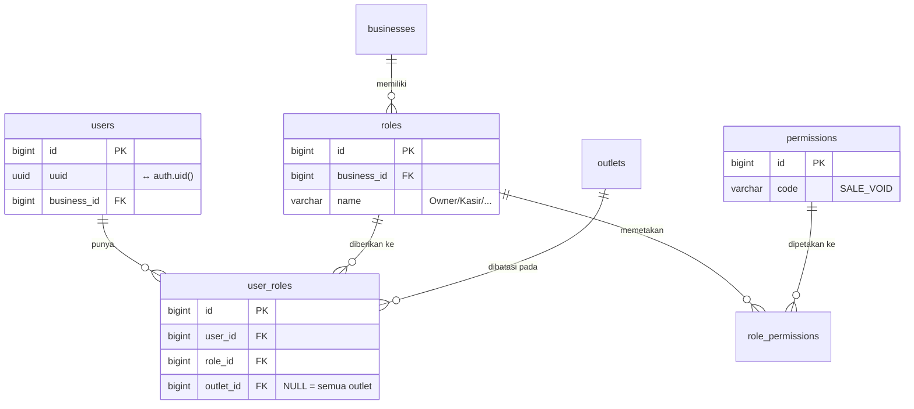

Sebaran permission per peran (data nyata dari database):

| Peran | Jumlah permission | Karakter |
|---|---|---|
| **Owner** | 26 (semua) | Pemilik — bypass di level function |
| **Administrator** | 25 | Semua kecuali `USER_MANAGE` |
| **Manager** | 21 | Tanpa `SALE_VOID`, `PRODUCT_DELETE`, `PURCHASE_APPROVE`, `USER_MANAGE`, `PRODUCT_MANAGE` |
| **Kasir** | 11 | Fokus jualan + kas + pelanggan |
| **Purchasing** | 9 | Fokus pengadaan |
| **Gudang** | 8 | Fokus stok |
| **Finance** | 6 | Fokus kas & laporan (read-only ke penjualan) |

> 💡 **Pola yang bagus untuk ditunjukkan:** Manager **tidak punya** `SALE_VOID`, tapi Kasir punya.
> Ini masuk akal secara operasional — kasir perlu membatalkan transaksi salah input saat itu juga.
> Sebaliknya Manager punya `PURCHASE_CREATE` tapi **tidak** `PURCHASE_APPROVE` — pemisahan
> tugas (*segregation of duties*), prinsip kontrol internal standar: yang mengajukan tidak boleh
> yang menyetujui.

---

## 7. Arsitektur Data: Ledger & Projection

Ini pola arsitektur paling canggih di sistem ini, dan **paling layak dipamerkan**.

### Masalahnya

Di Mangkasir lama: jual barang → `UPDATE products SET qty = qty - 1`.
Masalahnya:
- Kalau nilainya salah, **tidak ada cara tahu kenapa** — tidak ada riwayat
- Kalau dua transaksi bersamaan, bisa *race condition*
- Auditor tanya "kenapa stok 47?" → tidak ada jawaban

### Solusinya: ledger + proyeksi

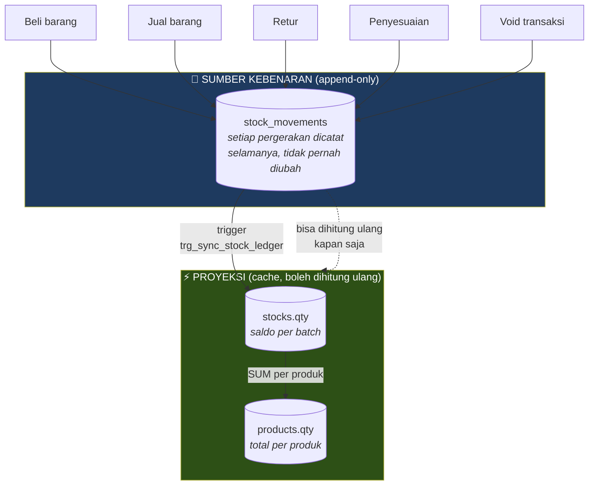

**Analogi rekening bank:** `stock_movements` = mutasi rekening (tiap transaksi tercatat,
tidak bisa dihapus). `stocks.qty` & `products.qty` = saldo yang tampil di aplikasi —
sebenarnya cuma penjumlahan mutasi, disimpan agar tidak perlu dihitung ulang tiap buka layar.

| Aspek | `stock_movements` (Ledger) | `stocks.qty` / `products.qty` (Proyeksi) |
|---|---|---|
| Sifat | Append-only, tidak pernah di-UPDATE | Sering di-UPDATE |
| Peran | **Sumber kebenaran** | Cache untuk kecepatan |
| Kalau rusak? | Bencana — data hilang permanen | Bisa dibangun ulang dari ledger |
| Isinya | Siapa, kapan, berapa, kenapa, referensi ke dokumen | Cuma angka saldo |

Kolom `balance_after` di `stock_movements` menyimpan saldo **setelah** tiap pergerakan —
seperti kolom "saldo" di buku rekening. Ini membuat audit bisa dilakukan baris per baris.

> 💡 **Istilah untuk pembimbing:** pola ini adalah **Event Sourcing** (ledger sebagai
> catatan peristiwa) dipadu **CQRS** (pemisahan model tulis dan model baca) dalam bentuk
> ringan. Ini pola yang dipakai sistem perbankan dan akuntansi.

---

## 8. Ringkasan Keputusan Teknis

Tabel ini adalah "kartu contekan" untuk menjawab pertanyaan "kenapa pilih X?":

| Keputusan | Pilihan | Alasan |
|---|---|---|
| **Backend** | Tanpa server — PostgREST + RLS | Keamanan tak bisa dilewati; nol maintenance; 0 Edge Function membuktikan ini disengaja |
| **PK internal** | `BIGINT GENERATED BY DEFAULT AS IDENTITY` | Cepat, hemat index, JOIN efisien |
| **ID publik** | `uuid` (kolom terpisah) | ID internal tidak bocor ke API; tidak bisa ditebak (`/products/1`, `/products/2`, …) |
| **Uang** | `DECIMAL(15,2)` | `float`/`double` menyimpan `0.1 + 0.2 = 0.30000000000000004`. Haram untuk uang. |
| **Kuantitas** | `DECIMAL(18,4)` | Retail jual 0,5 kg gula atau 1,25 liter minyak |
| **Waktu** | `TIMESTAMPTZ` | Sadar zona waktu; aman kalau nanti buka cabang lintas provinsi/negara |
| **Hapus data** | Soft delete (`deleted_at`) | Data transaksi retail wajib bisa diaudit; hard delete merusak riwayat |
| **Status** | `CHECK` constraint, bukan `ENUM` | ENUM Postgres susah diubah (butuh `ALTER TYPE`); CHECK cukup di-*drop* & buat ulang |
| **Otomatisasi** | Trigger database | Jalan dalam transaksi yang sama → tidak mungkin setengah jadi |
| **Laporan** | View | Otomatis mewarisi RLS tabel dasarnya — tidak perlu tulis ulang aturan keamanan |
| **Pencarian** | Ekstensi `pg_trgm` | Pencarian produk *fuzzy* (typo-tolerant) |

---

## 9. Batasan yang Diketahui

Bagian ini **sengaja ada**. Dokumen arsitektur yang hanya memuji dirinya sendiri tidak
dipercaya reviewer berpengalaman. Detail & rencana perbaikan ada di **Dokumen 05**.

| # | Batasan | Dampak | Tingkat |
|---|---|---|---|
| 1 | Tabel `outlets` & `users` masih pakai kolom audit gaya lama (`createdat`, bukan `created_at`) | Tidak konsisten; developer mudah salah tulis | 🟡 Sedang |
| 2 | Model varian ganda: `products.parent_id` (lama) **dan** tabel `product_variants` (baru) hidup berdampingan | Ambigu — varian harus disimpan di mana? | 🟡 Sedang |
| 3 | `transactions.flag` tidak punya CHECK constraint, padahal trigger bergantung pada nilai `'done'`/`'void'` | Salah ketik nilai → trigger diam-diam tidak jalan | 🔴 Tinggi |
| 4 | Tabel wilayah (`provinces`, `cities`, `districts`, `villages`) kosong (0 baris) | Form alamat belum bisa dipakai | 🟡 Sedang |
| 5 | `users.password` masih ada, padahal auth sudah lewat Supabase Auth | Membingungkan; berpotensi jadi jalur auth bayangan | 🟡 Sedang |
| 6 | Trigger function terekspos sebagai RPC ke role `anon` | Bisa dipanggil dari luar konteks trigger | 🟠 Sedang-Tinggi |
| 7 | Belum ada data operasional sama sekali | Trigger belum teruji dengan data nyata | 🔴 Tinggi |

---

## 10. FAQ

<details>
<summary><b>Q1: Kenapa tidak pakai backend Node.js / Laravel saja seperti umumnya?</b></summary>

Tiga alasan, urut dari yang terpenting:

**1. Keamanan yang tidak bisa dilewati.**
Dengan backend tradisional, aturan "user hanya boleh lihat data outletnya" ditulis sebagai
kode di setiap endpoint. Kalau ada 40 endpoint dan satu lupa dicek → data bocor. Dengan RLS,
aturan menempel di **tabel**. Mau diakses lewat endpoint mana pun, lewat Postman, lewat SQL
langsung — filternya tetap jalan. Aturannya cuma ditulis sekali.

**2. Konsistensi transaksional.**
Saat penjualan terjadi, ada 4 hal yang harus terjadi bersamaan: catat item, catat pergerakan
stok, kurangi saldo batch, buat catatan kas. Di backend tradisional, kalau server mati di
tengah proses, bisa jadi stok sudah berkurang tapi transaksi tidak tersimpan. Dengan trigger,
semuanya dalam **satu transaksi database** — kalau ada yang gagal, semuanya batal.

**3. Tidak ada server yang di-maintain.**
Tidak ada deploy, scaling, atau server down.

**Kapan pilihan ini salah?** Kalau butuh integrasi berat dengan pihak ketiga (payment gateway,
kirim email/WhatsApp), atau logika yang tidak cocok ditulis di SQL. Untuk itu Supabase punya
Edge Function — dan project ini punya **0**, artinya belum butuh.
</details>

<details>
<summary><b>Q2: Apa bedanya RLS dan RBAC? Terdengar mirip.</b></summary>

Ini pertanyaan jebakan favorit reviewer. Jawabannya: **beda pertanyaan**.

- **RLS** menjawab *"baris data mana yang boleh saya lihat?"* → soal **data**
- **RBAC** menjawab *"aksi apa yang boleh saya lakukan?"* → soal **perilaku**

Contoh konkret:

Seorang **Kasir di Cabang Bandung** mencoba membatalkan transaksi di Cabang Jakarta.
- **RLS** menghentikannya duluan: transaksi Jakarta tidak pernah muncul di hasil query-nya. Baris itu **tidak ada** dari sudut pandang dia.
- Kalau dia Kasir di Bandung membatalkan transaksi **Bandung**: RLS lolos (baris muncul), lalu **RBAC** dicek — Kasir punya `SALE_VOID` → boleh.
- Kalau **Manager Bandung** melakukan hal sama: RLS lolos, tapi RBAC menolak — Manager tidak punya `SALE_VOID`.

Di sistem ini keduanya dipakai bersama: RLS untuk isolasi (`user_has_outlet_access`),
RBAC untuk otorisasi (`has_permission`). Keduanya dipanggil dari dalam policy RLS,
jadi RBAC sebenarnya *ditegakkan lewat* mekanisme RLS.
</details>

<details>
<summary><b>Q3: Kalau logika bisnis ada di database, bukankah susah di-debug dan di-test?</b></summary>

Ya, ini trade-off nyata dan saya tidak akan menyangkalnya.

**Yang lebih susah:**
- Tidak ada *breakpoint* seperti di IDE
- *Stack trace* SQL kurang informatif
- Tes otomatis butuh setup database, tidak bisa cuma *mock*

**Yang memitigasi di project ini:**
- Tiap trigger kecil & satu tanggung jawab (`sync_sale_to_cash_func` cuma urus kas, tidak sekalian stok)
- 24 migrasi bernomor = seluruh riwayat perubahan bisa dilacak & di-*rollback*
- Trigger `RAISE EXCEPTION` dengan pesan jelas saat data tidak valid

**Yang belum ada (jujur):** belum ada tes otomatis. Ini PR yang tercatat di Dokumen 05.
Standar industrinya pakai **pgTAP** untuk unit test SQL.
</details>

<details>
<summary><b>Q4: Kenapa products di level outlet, tapi brands di level bisnis?</b></summary>

Karena sifat datanya beda:

**Brand "Indomie" itu identik di semua cabang.** Kalau ditaruh per-outlet, punya 10 cabang
= 10 baris "Indomie" dengan ID berbeda. Lalu laporan "penjualan per merek" jadi mimpi buruk,
dan kalau nama merek diperbarui harus diubah 10 kali.

**Produk beda.** Harga jual Indomie di cabang mall bisa Rp 4.000, di cabang perumahan
Rp 3.500. Stoknya juga beda fisik. Jadi produk **wajib** melekat ke outlet.

Aturan umumnya: *data yang sama persis di semua cabang → level bisnis. Data yang bisa
berbeda per cabang → level outlet.*

Yang sama logikanya: `suppliers` di level bisnis (kontrak dinegosiasi perusahaan),
`customers` di level outlet (pelanggan itu lokal).

**Konsekuensi jujur:** karena produk per-outlet, laporan lintas-cabang untuk produk yang
sama jadi sulit — harus cocokkan berdasarkan SKU atau barcode. Ini trade-off yang disengaja
untuk MVP, dan tercatat sebagai batasan di §9.
</details>

<details>
<summary><b>Q5: Apa itu SECURITY DEFINER, dan kenapa terlihat berbahaya?</b></summary>

`SECURITY DEFINER` = function jalan dengan hak akses **pembuatnya**, bukan pemanggilnya.
Ibarat kunci master.

**Kenapa wajib di sini:** tabel `users` dilindungi RLS. Function `has_permission` perlu
membaca `users` untuk tahu siapa yang memanggil. Kalau function jalan sebagai pengguna biasa,
membaca `users` memicu policy RLS → yang memanggil `has_permission` lagi → **rekursi tak
berujung** → query gagal. `SECURITY DEFINER` memutus lingkaran itu.

**Kenapa terlihat berbahaya:** kalau function-nya bisa dimanipulasi, penyerang bisa jalan
dengan hak superuser.

**Pengamanan yang sudah dipasang:** `SET search_path TO ''` di semua function.
Tanpa ini, penyerang bisa bikin tabel `users` palsu di schema lain dan mengubah `search_path`
sehingga function membaca tabel palsu itu. Dengan `search_path` kosong, semua referensi
**wajib** ditulis lengkap (`public.users`) — pembajakan jadi mustahil.

**Yang masih PR:** Supabase Advisor menemukan function-function ini juga bisa dipanggil
sebagai RPC oleh role `anon`. Untuk trigger function, ini tidak seharusnya. Perbaikannya:
`REVOKE EXECUTE ... FROM anon, authenticated`. Tercatat di Dokumen 05.
</details>

<details>
<summary><b>Q6: Kalau Supabase tutup atau harganya naik, kita terjebak?</b></summary>

Risikonya lebih kecil daripada yang dibayangkan, karena **semua yang dipakai adalah PostgreSQL standar**:
tabel, function PL/pgSQL, trigger, view, RLS — semua fitur native Postgres, bukan fitur eksklusif Supabase.

Yang Supabase-spesifik hanya:
- `auth.uid()` — fungsi kecil, mudah diganti
- PostgREST — open source, bisa di-*self-host*
- Storage — bisa diganti S3

Jadi migrasi ke Postgres yang di-host sendiri (atau AWS RDS) = `pg_dump` + ganti `auth.uid()`
dengan sumber identitas lain. Bukan penulisan ulang.

Bandingkan dengan Firebase, yang datanya NoSQL proprietary — pindah dari sana artinya
merancang ulang seluruh model data.
</details>

<details>
<summary><b>Q7: Sistem ini sudah bisa dipakai?</b></summary>

**Belum — dan itu memang bukan target tahap ini.**

Yang **sudah selesai**: seluruh fondasi backend. 51 tabel, RLS aktif 100%, 8 trigger
otomatisasi, RBAC 7 peran, 6 view laporan, 24 migrasi terdokumentasi.

Yang **belum**: data operasional (0 outlet, 0 produk, 0 transaksi), aplikasi Flutter yang
mengonsumsinya, dan pengujian trigger dengan data nyata.

Analoginya: **rumah sudah berdiri lengkap dengan pondasi, listrik, dan pipa air — tapi
belum ada perabot dan penghuni.** Tahap berikutnya adalah mengisi (seed data + uji alur
end-to-end), lalu menyambungkan aplikasi.

Ini status yang normal dan sehat untuk fase *backend foundation*. Membangun database dulu
sebelum aplikasi justru urutan yang benar — kebalikannya (aplikasi dulu, database menyusul)
biasanya berujung skema berantakan.
</details>

---

## Dokumen Terkait

- **[00] Panduan Baca** — indeks & skrip presentasi
- **[02] Master Data & Data Dictionary** — detail 51 tabel yang disebut di sini
- **[03] Alur Proses End-to-End** — bagaimana arsitektur ini bekerja saat transaksi nyata
- **[04] Supabase Primer** — kalau istilah di dokumen ini terasa asing
- **[05] Status & Temuan** — pendalaman batasan di §9

---

*Dokumen 01 dari 6 · Terakhir diverifikasi terhadap database: 15 Juli 2026*
