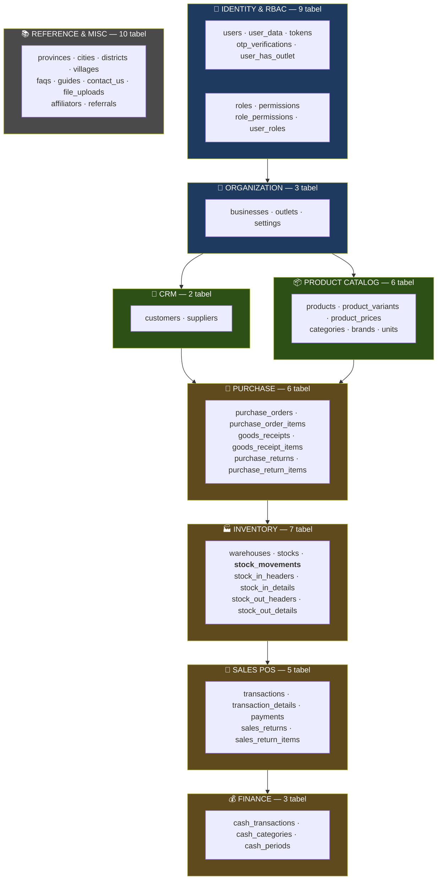
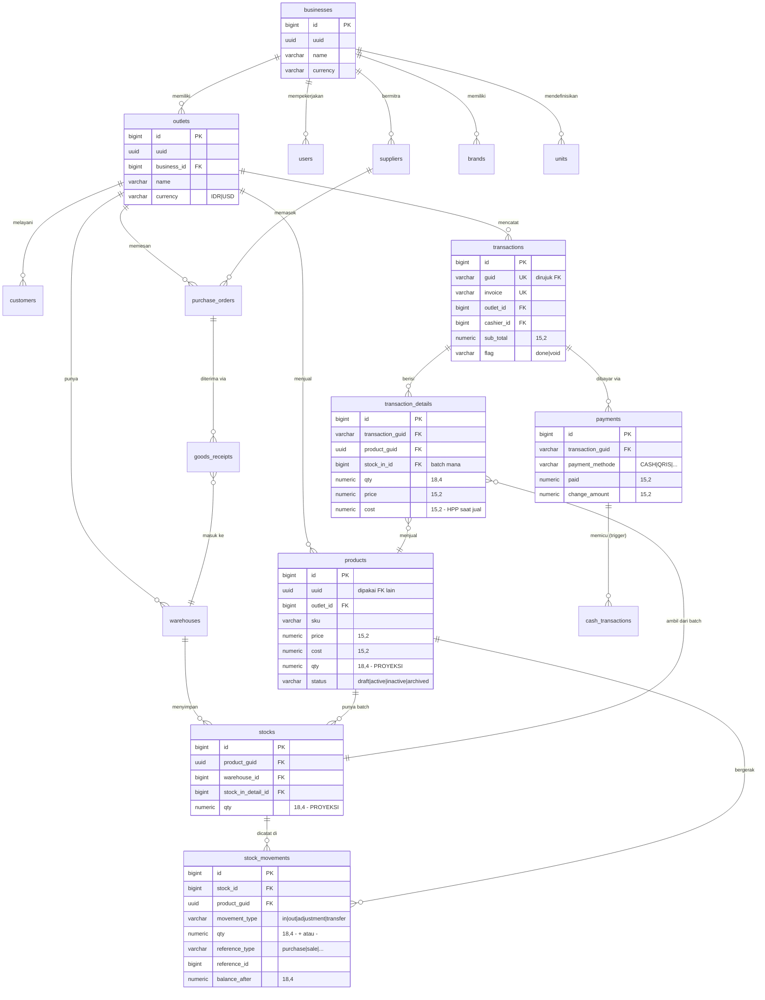
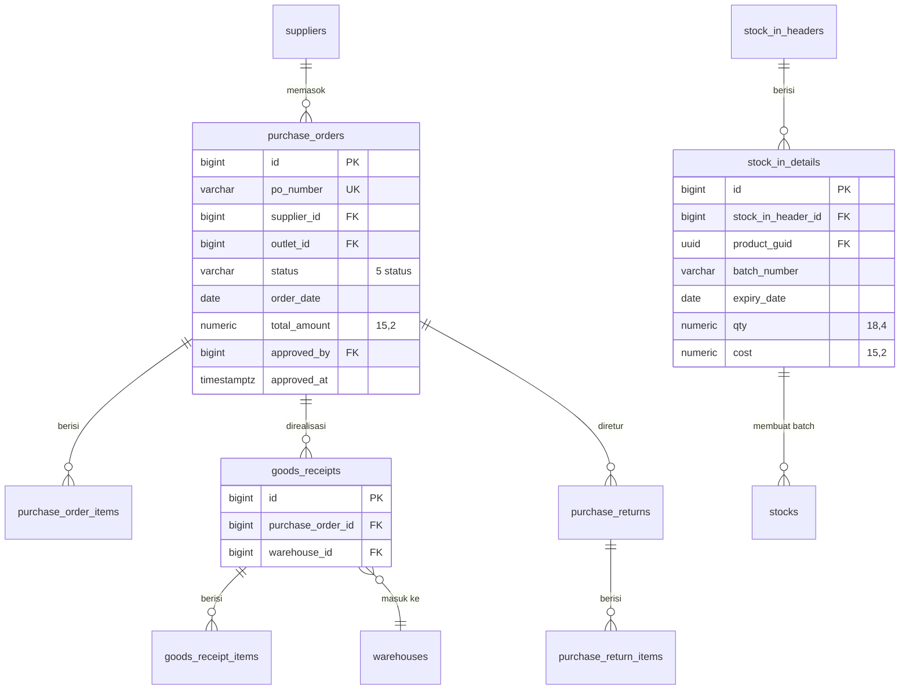
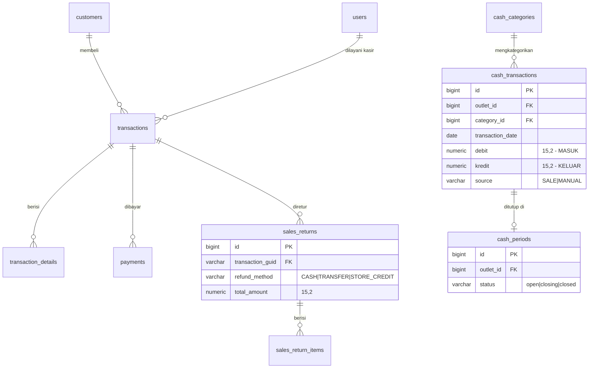
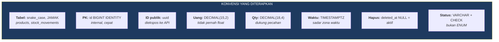
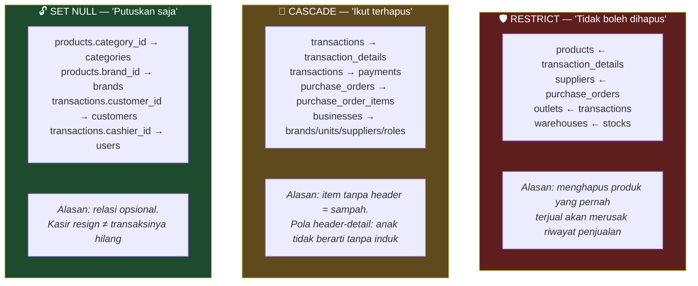
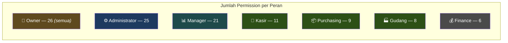

# Master Data & Data Dictionary — Mangkasir-Ritel

> **Tujuan dokumen:** menjawab **"data apa saja yang ada di sistem ini, dan bagaimana
> mereka saling terhubung?"**
>
> Semua struktur di bawah ditarik langsung dari database Supabase pada 15 Juli 2026.

## Daftar Isi
1. [Konsep: Master Data vs Data Transaksi](#1-konsep-master-data-vs-data-transaksi)
2. [Peta 51 Tabel per Modul](#2-peta-51-tabel-per-modul)
3. [Klasifikasi Lengkap](#3-klasifikasi-lengkap)
4. [ERD Inti Sistem](#4-erd-inti-sistem)
5. [ERD per Modul](#5-erd-per-modul)
6. [Kamus Data — Tabel Kunci](#6-kamus-data--tabel-kunci)
7. [Konvensi Penamaan & Tipe Data](#7-konvensi-penamaan--tipe-data)
8. [Aturan Integritas (FK Delete Rules)](#8-aturan-integritas-fk-delete-rules)
9. [Seed Data — Kondisi Nyata](#9-seed-data--kondisi-nyata)
10. [View Pelaporan](#10-view-pelaporan)
11. [FAQ](#11-faq)

---

## 1. Konsep: Master Data vs Data Transaksi

Ini konsep paling dasar yang **wajib** dikuasai sebelum menjelaskan apa pun ke pembimbing.

```mermaid
flowchart LR
    subgraph M["📇 MASTER DATA"]
        direction TB
        M1["<b>Sifat:</b> Kata benda<br/>Sesuatu yang ADA"]
        M2["<b>Contoh:</b> produk, pelanggan,<br/>supplier, gudang, merek"]
        M3["<b>Perubahan:</b> Jarang<br/>(bulanan/tahunan)"]
        M4["<b>Jumlah:</b> Ratusan–ribuan"]
        M5["<b>Kalau dihapus:</b><br/>Riwayat ikut rusak<br/>→ pakai RESTRICT"]
    end

    subgraph T["🧾 DATA TRANSAKSI"]
        direction TB
        T1["<b>Sifat:</b> Kata kerja<br/>Sesuatu yang TERJADI"]
        T2["<b>Contoh:</b> penjualan, pembelian,<br/>pergerakan stok, pembayaran"]
        T3["<b>Perubahan:</b> Terus-menerus<br/>(tiap detik)"]
        T4["<b>Jumlah:</b> Jutaan"]
        T5["<b>Kalau dihapus:</b><br/>Laporan keuangan salah<br/>→ soft delete saja"]
    end

    M -->|"transaksi MERUJUK<br/>ke master"| T

    style M fill:#1e3a5f,color:#fff
    style T fill:#5f4a1e,color:#fff
```



**Tes cepat membedakannya:** tanyakan *"kalau bisnisnya tutup hari ini, data ini masih
bermakna?"*

- **Produk "Indomie Goreng"** → masih bermakna, itu tetap sebuah produk → **master**
- **Penjualan Indomie tanggal 3 Juli jam 14:22** → itu peristiwa yang terikat waktu → **transaksi**

**Kenapa ini penting?** Karena menentukan perlakuannya:

| | Master | Transaksi |
|---|---|---|
| Boleh di-*hard delete*? | Tidak — `RESTRICT` di FK | Tidak — soft delete (`deleted_at`) |
| Perlu di-*cache* di klien? | Ya (jarang berubah) | Tidak (selalu fresh) |
| Di-*seed* saat setup? | Ya (units, roles, permissions) | Tidak — tumbuh dari operasional |

**Kategori ketiga: Data Referensi.**
Data yang tidak dimiliki tenant mana pun dan tidak pernah diubah pengguna —
misal daftar provinsi/kota Indonesia. Read-only untuk semua, ditulis hanya oleh admin sistem.

---

## 2. Peta 51 Tabel per Modul



**Total: 9 + 3 + 6 + 2 + 6 + 7 + 5 + 3 + 10 = 51 tabel** ✓

---

## 3. Klasifikasi Lengkap

Legenda: 📇 Master · 🧾 Transaksi · 📖 Ledger · 🔗 Relasi (junction) · 📚 Referensi · ⚙️ Sistem

### 🔐 Modul 01 — Identity & RBAC (9 tabel)

| Tabel | Tipe | Level | Isinya | Policy |
|---|---|---|---|---|
| `users` | 📇 | Bisnis | Akun pengguna; `uuid` ↔ `auth.uid()` | 3 |
| `user_data` | 📇 | — | Profil (nama, alamat, wilayah) | 4 |
| `roles` | 📇 | Bisnis | 7 peran | 4 |
| `permissions` | 📚 | Global | 26 kode izin | 1 |
| `role_permissions` | 🔗 | — | Peran ↔ izin (106 baris) | 3 |
| `user_roles` | 🔗 | — | User ↔ peran ↔ outlet | 4 |
| `user_has_outlet` | 🔗 | — | User ↔ outlet (akses data) | 3 |
| `tokens` | ⚙️ | — | Refresh token legacy | 3 |
| `otp_verifications` | ⚙️ | — | Kode OTP | **0** ⚠️ |

> ⚠️ `otp_verifications` punya RLS **aktif tapi 0 policy** = **terkunci total** untuk klien.
> Ini kemungkinan **disengaja** (OTP hanya boleh diakses server/service_role — klien tidak
> boleh membaca kode OTP orang lain). Tapi harus dikonfirmasi, bukan diasumsikan.

### 🏢 Modul 02 — Organization (3 tabel)

| Tabel | Tipe | Level | Isinya | Policy |
|---|---|---|---|---|
| `businesses` | 📇 | **TENANT ROOT** | Badan usaha; puncak hierarki | 4 |
| `outlets` | 📇 | Bisnis | Cabang/toko (dulu `stores`) | 4 |
| `settings` | 📇 | Outlet | Preferensi per outlet | 4 |

### 📦 Modul 03 — Product Catalog (6 tabel)

| Tabel | Tipe | Level | Isinya | Policy |
|---|---|---|---|---|
| `products` | 📇 | **Outlet** | Produk + harga + HPP + qty | 4 |
| `product_variants` | 📇 | Outlet | Varian terstruktur (ukuran/warna) | 8 |
| `product_prices` | 📖 | Outlet | Riwayat harga (diisi trigger) | 8 |
| `categories` | 📇 | Outlet | Kategori (dulu `product_cats`) | 4 |
| `brands` | 📇 | **Bisnis** | Merek | 4 |
| `units` | 📇 | **Bisnis** | Satuan (12 baris seed) | 4 |

### 👥 Modul 04 — CRM (2 tabel)

| Tabel | Tipe | Level | Isinya | Policy |
|---|---|---|---|---|
| `customers` | 📇 | Outlet | Pelanggan | 4 |
| `suppliers` | 📇 | **Bisnis** | Pemasok (**baru** — tidak ada di Mangkasir) | 4 |

### 🛒 Modul 05 — Purchase (6 tabel) — **seluruhnya baru**

| Tabel | Tipe | Isinya | Policy |
|---|---|---|---|
| `purchase_orders` | 🧾 | PO header; status 5 tahap; `approved_by`/`approved_at` | 4 |
| `purchase_order_items` | 🧾 | Item PO | 4 |
| `goods_receipts` | 🧾 | Penerimaan barang → gudang | 4 |
| `goods_receipt_items` | 🧾 | Item yang diterima | 4 |
| `purchase_returns` | 🧾 | Retur ke supplier | 4 |
| `purchase_return_items` | 🧾 | Item retur | 4 |

### 🏭 Modul 06 — Inventory (7 tabel)

| Tabel | Tipe | Isinya | Policy |
|---|---|---|---|
| `warehouses` | 📇 | Gudang per outlet; `is_default` dijaga trigger | 4 |
| **`stock_movements`** | 📖 | **LEDGER — sumber kebenaran stok** | 2 |
| `stocks` | 🧾 | Saldo per batch (**proyeksi**) | 4 |
| `stock_in_headers` | 🧾 | Header stok masuk | 4 |
| `stock_in_details` | 🧾 | Detail + `batch_number` + `expiry_date` | 4 |
| `stock_out_headers` | 🧾 | Header stok keluar | 4 |
| `stock_out_details` | 🧾 | Detail stok keluar | 4 |

### 🧾 Modul 07 — Sales POS (5 tabel)

| Tabel | Tipe | Isinya | Policy |
|---|---|---|---|
| `transactions` | 🧾 | Invoice; `flag` = done/void | 4 |
| `transaction_details` | 🧾 | Item + `cost` (HPP) + `stock_in_id` (batch) | 4 |
| `payments` | 🧾 | Pembayaran; 7 metode | 4 |
| `sales_returns` | 🧾 | Retur penjualan (**baru**) | 4 |
| `sales_return_items` | 🧾 | Item retur | 4 |

### 💰 Modul 08 — Finance (3 tabel)

| Tabel | Tipe | Isinya | Policy |
|---|---|---|---|
| `cash_categories` | 📇 | Kategori kas (income/expense) | 4 |
| `cash_transactions` | 🧾 | Kas masuk (debit) / keluar (kredit) | 4 |
| `cash_periods` | 🧾 | Periode shift; status open/closing/closed | 4 |

### 📚 Modul 09 — Reference & Misc (10 tabel)

| Tabel | Tipe | Isinya | Policy |
|---|---|---|---|
| `provinces` | 📚 | Provinsi — **0 baris** ⚠️ | 1 |
| `cities` | 📚 | Kota — **0 baris** ⚠️ | 1 |
| `districts` | 📚 | Kecamatan — **0 baris** ⚠️ | 1 |
| `villages` | 📚 | Kelurahan — **0 baris** ⚠️ | 1 |
| `faqs` | 📚 | FAQ in-app (MOBILE/WEB) | 1 |
| `guides` | 📚 | Panduan in-app | 1 |
| `contact_us` | 🧾 | Form kontak — insert publik | 2 |
| `file_uploads` | ⚙️ | Metadata berkas | 4 |
| `affiliators` | 📇 | Program afiliasi | 1 |
| `referrals` | 🧾 | Pelacakan rujukan | 1 |

---

## 4. ERD Inti Sistem

Ini **13 tabel paling penting** — kalau hanya sempat menjelaskan satu diagram, pakai ini.



> 🔍 **Detail yang layak ditunjuk saat presentasi:**
> `transaction_details.cost` menyimpan **HPP saat barang dijual**, bukan HPP sekarang.
> Kalau harga beli naik bulan depan, laba transaksi bulan lalu **tidak ikut berubah**.
> Ini disebut *point-in-time snapshot* — wajib untuk laporan keuangan yang benar.
> Hal yang sama berlaku untuk `product_name` & `product_sku` yang disalin ke detail:
> kalau produk di-*rename*, struk lama tetap menampilkan nama saat itu.

---

## 5. ERD per Modul

### Purchase → Inventory (siklus pengadaan)



### Sales → Finance



---

## 6. Kamus Data — Tabel Kunci

### `businesses` — akar tenant

| Kolom | Tipe | Null | Keterangan |
|---|---|---|---|
| `id` | bigint | NO | PK internal |
| `uuid` | uuid | NO | ID publik |
| `name` | varchar | NO | Nama badan usaha |
| `tax_id` | varchar | YES | NPWP |
| `currency` | varchar | YES | Mata uang default |
| `is_active` | boolean | NO | Status langganan |
| `created_at` … `deleted_by` | — | — | Audit standar (6 kolom) |

### `outlets` — cabang

| Kolom | Tipe | Null | Keterangan |
|---|---|---|---|
| `id` | bigint | NO | PK |
| `uuid` | uuid | NO | ID publik |
| `business_id` | bigint | YES | → `businesses` (RESTRICT) |
| `name` | varchar | NO | Nama cabang |
| `address`, `phone`, `image` | varchar | YES | Info cabang |
| `currency` | varchar | YES | CHECK: `IDR` \| `USD` |
| `is_active` | boolean | YES | |
| `createdat` `createdby` `updatedat` `updatedby` | — | YES | ⚠️ **gaya legacy** |
| `deleted_at` | timestamptz | YES | Soft delete |

> ⚠️ **Temuan:** kolom audit di sini **tanpa underscore** (`createdat`), berbeda dari tabel
> baru yang pakai `created_at`. Peninggalan migrasi dari Mangkasir. Detail: Dokumen 05.

### `products` — pusat katalog

| Kolom | Tipe | Null | Keterangan |
|---|---|---|---|
| `id` | bigint | NO | PK |
| `uuid` | uuid | NO | **Dirujuk FK** oleh stocks, transaction_details, stock_movements |
| `outlet_id` | bigint | NO | → `outlets` (RESTRICT) |
| `name` | varchar | NO | |
| `sku` | varchar | YES | Unik per `(outlet_id, sku)` |
| `barcode` | varchar | YES | |
| `price` | numeric(15,2) | NO | Harga jual |
| `cost` | numeric(15,2) | NO | HPP |
| `qty` | numeric(18,4) | NO | **PROYEKSI** — dihitung trigger |
| `category_id` | bigint | YES | → `categories` (SET NULL) |
| `brand_id` | bigint | YES | → `brands` (SET NULL) |
| `unit_id` | bigint | YES | → `units` (SET NULL) |
| `parent_id` | bigint | YES | ⚠️ varian gaya lama (self-ref) |
| `status` | varchar | YES | CHECK: `draft`\|`active`\|`inactive`\|`archived` |
| `is_stock` | boolean | NO | Barang fisik? |
| `is_use_stock` | boolean | NO | Kurangi stok saat jual? |
| `last_stock_sync_at` | timestamptz | YES | Kapan `qty` terakhir dihitung |

> 🔍 **`qty` adalah proyeksi, bukan sumber kebenaran.** Jangan pernah `UPDATE products SET qty = ...`
> secara manual — nilainya akan ditimpa trigger. Kebenaran ada di `stock_movements`.

### `stock_movements` — 📖 LEDGER (tabel terpenting)

| Kolom | Tipe | Null | Keterangan |
|---|---|---|---|
| `id` | bigint | NO | PK |
| `stock_id` | bigint | YES | → `stocks` (SET NULL) — batch mana |
| `product_guid` | uuid | NO | → `products.uuid` (CASCADE) |
| `warehouse_id` | bigint | YES | → `warehouses` (RESTRICT) |
| `movement_type` | varchar | NO | CHECK: `in`\|`out`\|`adjustment`\|`transfer` |
| `qty` | numeric(18,4) | NO | **Bertanda**: positif=masuk, negatif=keluar |
| `reference_type` | varchar | NO | CHECK: `purchase`\|`sale`\|`adjustment`\|`opname`\|`return`\|`transfer` |
| `reference_id` | bigint | YES | ID dokumen sumber |
| `balance_after` | numeric(18,4) | NO | Saldo setelah pergerakan — **untuk audit** |
| `created_at`, `created_by` | — | — | Siapa & kapan |
| `deleted_at` | timestamptz | YES | (secara prinsip tidak dipakai) |

**Kenapa `qty` bertanda?** Supaya saldo = `SUM(qty)` saja, tanpa `CASE WHEN type='in' THEN...`.
Trigger proyeksi jadi satu baris: `UPDATE stocks SET qty = qty + NEW.qty`.

### `transactions` — invoice penjualan

| Kolom | Tipe | Null | Keterangan |
|---|---|---|---|
| `id` | bigint | NO | PK |
| `guid` | varchar | YES | **UK** — dirujuk FK oleh details/payments/returns |
| `invoice` | varchar | YES | **UK** — nomor struk |
| `outlet_id` | bigint | YES | → `outlets` (RESTRICT) |
| `cashier_id` | bigint | YES | → `users` (SET NULL) |
| `customer_id` | bigint | YES | → `customers` (SET NULL) |
| `customer_name` | varchar | YES | Snapshot nama |
| `date` | timestamptz | YES | Waktu transaksi |
| `sub_total` | numeric(15,2) | YES | |
| `invoice_discount` | numeric(15,2) | YES | Diskon tingkat invoice |
| `invoice_ppn` | numeric(15,2) | YES | PPN tingkat invoice |
| `flag` | varchar | NO | `done` \| `void` — ⚠️ **tanpa CHECK constraint** |
| `deleted_at` | timestamptz | YES | |

> 🔴 **Temuan penting:** `flag` **tidak punya CHECK constraint**, padahal trigger
> `trg_sync_void_transaction_stock` bergantung persis pada nilai `'done'` dan `'void'`.
> Kalau ada yang menulis `'VOID'` atau `'voided'`, trigger **diam-diam tidak jalan** dan
> stok tidak dikembalikan — tanpa error apa pun. Detail & perbaikan: Dokumen 05.

### `transaction_details` — item penjualan

| Kolom | Tipe | Null | Keterangan |
|---|---|---|---|
| `id` | bigint | NO | PK |
| `transaction_guid` | varchar | YES | → `transactions.guid` (CASCADE) |
| `product_guid` | uuid | YES | → `products.uuid` (RESTRICT) |
| `stock_in_id` | bigint | YES | → `stocks.id` (RESTRICT) — **batch mana yang diambil** |
| `product_name` | varchar | YES | **Snapshot** nama |
| `product_sku` | varchar | YES | **Snapshot** SKU |
| `qty` | numeric(18,4) | YES | |
| `price` | numeric(15,2) | YES | Harga jual saat itu |
| `cost` | numeric(15,2) | NO | **HPP saat itu** — untuk hitung laba |
| `discount`, `ppn`, `total_price` | numeric(15,2) | YES | |

> 🔍 `stock_in_id` adalah kunci pelacakan batch: sistem tahu persis **batch mana** yang terjual,
> memungkinkan FIFO dan pelacakan kedaluwarsa.

---

## 7. Konvensi Penamaan & Tipe Data



### Pola kolom audit (6 kolom standar)

```sql
created_at TIMESTAMPTZ NOT NULL DEFAULT NOW(),
created_by VARCHAR(255) NULL,
updated_at TIMESTAMPTZ NULL,
updated_by VARCHAR(255) NULL,
deleted_at TIMESTAMPTZ NULL,   -- NULL = masih aktif
deleted_by VARCHAR(255) NULL
```

> ⚠️ **Pengecualian yang harus dijelaskan:** `outlets` & `users` masih pakai
> `createdat`/`createdby`/`updatedat`/`updatedby` (tanpa underscore), plus `users.isemailverified`.
> Ini **peninggalan Mangkasir** yang belum dinormalisasi. Tercatat di Dokumen 05.

### Kenapa uang tidak boleh `float`

```
float:            0.1 + 0.2 = 0.30000000000000004   ❌
DECIMAL(15,2):    0.10 + 0.20 = 0.30                ✅
```

Kalau ada 10.000 transaksi/hari, error pembulatan kecil menumpuk jadi selisih kas nyata.
Ini alasan **setiap** sistem keuangan pakai decimal. `DECIMAL(15,2)` = maksimal
9.999.999.999.999,99 — lebih dari cukup untuk rupiah.

### Kenapa qty butuh 4 desimal

Retail menjual: `0.5 kg` gula, `1.25 liter` minyak, `0.333 kg` daging.
`DECIMAL(18,4)` mendukung sampai 4 angka di belakang koma.

---

## 8. Aturan Integritas (FK Delete Rules)

Sistem ini memakai **3 aturan berbeda secara sengaja** — ini menunjukkan desain yang dipikirkan:



**Logika pemilihannya:**

| Aturan | Dipakai saat | Contoh nyata |
|---|---|---|
| `RESTRICT` | Menghapus induk akan **merusak riwayat keuangan** | Tidak bisa hapus produk yang sudah pernah dijual → laporan penjualan lama akan bolong |
| `CASCADE` | Anak **tidak bermakna** tanpa induk | Hapus invoice → item-itemnya ikut hilang (memang tidak ada gunanya) |
| `SET NULL` | Relasi **opsional/pelengkap** | Hapus kategori → produk tetap ada, cuma jadi "tanpa kategori" |

> 💡 **Poin bercerita:** *"Perhatikan `transactions.cashier_id` pakai SET NULL, bukan RESTRICT.
> Artinya kasir yang resign boleh dihapus, dan transaksinya tetap utuh — cuma jadi 'kasir tidak
> diketahui'. Tapi `transaction_details.product_guid` pakai RESTRICT — produk yang pernah
> terjual TIDAK BOLEH dihapus, karena struknya harus tetap bisa dibaca. Ini keputusan sadar,
> bukan default."*

---

## 9. Seed Data — Kondisi Nyata

Diverifikasi 15 Juli 2026:

| Tabel | Baris | Status | Keterangan |
|---|---|---|---|
| `permissions` | **26** | ✅ | Lengkap |
| `roles` | **7** | ✅ | Owner, Administrator, Manager, Kasir, Purchasing, Gudang, Finance |
| `role_permissions` | **106** | ✅ | Pemetaan lengkap |
| `units` | **12** | ✅ | pcs, kg, liter, dll. |
| `businesses` | **1** | 🟡 | Ada 1 bisnis, tapi **0 outlet** → yatim |
| `provinces` | **0** | ⚠️ | Belum di-seed |
| `cities` | **0** | ⚠️ | Belum di-seed |
| `districts` | **0** | ⚠️ | Belum di-seed |
| `villages` | **0** | ⚠️ | Belum di-seed |
| `outlets` | **0** | ⏳ | Belum ada data operasional |
| `users` | **0** | ⏳ | |
| `warehouses` | **0** | ⏳ | |
| `products` | **0** | ⏳ | |
| `transactions` | **0** | ⏳ | |

**Bacaan jujurnya:**
- ✅ Seed **sistem** (permission, role, unit) sudah beres → RBAC siap pakai
- ⚠️ Seed **referensi wilayah** belum → form alamat belum berfungsi
- ⏳ Data **operasional** nol → **trigger belum pernah diuji dengan data nyata**

Poin terakhir yang paling penting: 8 trigger otomatisasi sudah terpasang dan secara sintaks valid,
tapi belum pernah dijalankan pada transaksi sungguhan. Ini PR prioritas #1 (Dokumen 05).

### Sebaran permission per peran



**26 permission** dikelompokkan jadi 8 domain:
`PRODUCT_*` (5) · `SALE_*` (4) · `PURCHASE_*` (4) · `STOCK_*` (3) · `INVENTORY_*` (2) ·
`CRM_*` (3) · `CASH_*` (2) · `REPORTS_READ` · `SETTING_MANAGE` · `USER_MANAGE`

---

## 10. View Pelaporan

6 view yang **otomatis mewarisi RLS** dari tabel dasarnya:

```mermaid
flowchart LR
    subgraph src["Tabel Sumber (RLS aktif)"]
        T1["transactions"]
        T2["transaction_details"]
        T3["products"]
        T4["stocks"]
        T5["purchase_orders"]
        T6["cash_transactions"]
    end

    subgraph v["View Laporan"]
        V1["view_dashboard_metrics<br/><i>metrik hari ini</i>"]
        V2["view_sales_report<br/><i>omset, HPP, laba</i>"]
        V3["view_inventory_report<br/><i>nilai aset stok</i>"]
        V4["view_purchase_report<br/><i>histori PO</i>"]
        V5["view_finance_report<br/><i>debit vs kredit</i>"]
        V6["view_product_import_helper<br/><i>bantu impor</i>"]
    end

    src -->|"RLS ikut terbawa<br/>otomatis"| v
    v --> C["📱 Client"]

    style src fill:#1e3a5f,color:#fff
    style v fill:#2d5016,color:#fff
```



| View | Isinya |
|---|---|
| `view_dashboard_metrics` | Penjualan, laba, pembelian, arus kas bersih **hari ini** per outlet |
| `view_sales_report` | Penjualan mendalam: omset, HPP, laba bersih per barang |
| `view_inventory_report` | Sisa stok, nilai HPP, potensi penjualan per gudang |
| `view_purchase_report` | Histori PO + supplier |
| `view_finance_report` | Rekap kas masuk vs keluar per kategori |
| `view_product_import_helper` | Pembantu impor produk massal |

> 💡 **Kenapa view, bukan query di aplikasi?** Karena view **mewarisi RLS tabel dasarnya
> secara otomatis**. Kalau laporan ditulis sebagai query di Flutter, aturan keamanan harus
> ditulis ulang di sana — dan bisa lupa. Dengan view, keamanannya gratis dan tidak bisa lupa.

---

## 11. FAQ

<details>
<summary><b>Q1: Kenapa ada `id` DAN `uuid` di banyak tabel? Bukankah mubazir?</b></summary>

Tidak mubazir — keduanya punya tugas berbeda.

**`id` (BIGINT)** = kunci **internal**. Cepat untuk JOIN, hemat tempat di index
(8 byte vs 16 byte), dan urut sehingga index-nya efisien.

**`uuid`** = ID **publik** yang diekspos ke API. Dua alasan:

1. **Keamanan** — kalau API-nya `/products/1`, `/products/2`, orang bisa menebak dan
   memanen seluruh katalog (ini disebut *enumeration attack*). UUID tidak bisa ditebak.
2. **Tidak membocorkan informasi bisnis** — `/orders/5023` memberi tahu kompetitor bahwa
   Anda baru punya ~5.000 order.

Ini pola standar industri: BIGINT ke dalam, UUID ke luar.

**Detail menarik di sistem ini:** beberapa FK justru merujuk ke `uuid`, bukan `id` —
misal `stocks.product_guid → products.uuid`. Ini warisan Mangkasir, di mana aplikasi mobile
melakukan sinkronisasi offline dan butuh ID yang bisa dibuat di sisi klien tanpa bentrok
(BIGINT auto-increment tidak bisa).
</details>

<details>
<summary><b>Q2: `products.qty` sudah ada, kenapa masih perlu tabel `stocks` dan `stock_movements`? Bukankah 3 kali menyimpan hal yang sama?</b></summary>

Ketiganya menyimpan hal berbeda:

| Tabel | Menjawab | Contoh |
|---|---|---|
| `stock_movements` | *"Apa saja yang pernah terjadi?"* | "3 Juli, keluar 2 pcs, karena penjualan INV-001, sisa 47" |
| `stocks` | *"Berapa sisa batch tertentu?"* | "Batch B-2026-07 di Gudang Utama: 47 pcs" |
| `products.qty` | *"Berapa total barang ini?"* | "Indomie total: 152 pcs (dari 4 batch)" |

**Kenapa tidak `products.qty` saja?** Karena tidak bisa menjawab:
- Batch mana yang kedaluwarsa duluan? (butuh `stocks`)
- Kenapa stok tinggal 47, padahal kemarin 60? (butuh `stock_movements`)
- Barang ini ada di gudang mana? (butuh `stocks.warehouse_id`)

**Hubungannya berjenjang:**
```
stock_movements (kebenaran, append-only)
     ↓ trigger jumlahkan
stocks.qty (saldo per batch)
     ↓ trigger SUM per produk
products.qty (total, untuk tampil cepat di layar POS)
```

Dua yang bawah adalah **cache**. Kalau rusak, bisa dihitung ulang dari ledger.
Ledger yang rusak = data hilang selamanya.

**Analogi:** rekening bank. Mutasi = `stock_movements`. Saldo tiap deposito = `stocks`.
Total kekayaan = `products.qty`. Bank tidak "menyimpan saldo saja" — mereka simpan mutasi,
saldo hanya turunan.
</details>

<details>
<summary><b>Q3: Kenapa `transactions.guid` bertipe VARCHAR, bukan UUID, padahal `products.uuid` UUID?</b></summary>

Ini **inkonsistensi nyata**, dan lebih baik diakui daripada dibela.

`transactions.guid` bertipe `VARCHAR` dan dirujuk sebagai FK oleh `transaction_details`,
`payments`, dan `sales_returns`. Sementara `products.uuid` bertipe `UUID` asli.

**Kenapa terjadi:** `transactions` adalah tabel warisan Mangkasir yang di-migrasi apa adanya
(migrasi `0011_sales_pos_migration_and_triggers_v2` dan `0019f_fix_transactions_final`).
Mengubah tipe kolom yang sudah dirujuk 3 FK berisiko, jadi ditunda.

**Dampaknya:**
- VARCHAR lebih boros (36 byte vs 16 byte untuk UUID)
- Tidak ada validasi format — `'bukan-uuid'` akan diterima
- JOIN sedikit lebih lambat

**Apakah kritis?** Tidak — sistemnya tetap berjalan benar. Tapi ini utang teknis yang
sebaiknya dibereskan sebelum ada jutaan baris. Tercatat di Dokumen 05.

**Cara menjawab kalau ditanya:** *"Itu peninggalan legacy yang saya sadari. Saya prioritaskan
menyelesaikan gap fungsional dulu (supplier, PO, ledger) daripada memoles tipe data. Perbaikannya
sudah saya daftar sebagai utang teknis dengan prioritas menengah."* — Jawaban ini jauh lebih
kuat daripada berdalih.
</details>

<details>
<summary><b>Q4: Kenapa tabel wilayah kosong? Bukankah itu masalah?</b></summary>

Ya, itu gap nyata. Tabel `provinces`, `cities`, `districts`, `villages` sudah punya struktur
lengkap (dengan FK berjenjang `provinces → cities → districts → villages`) dan RLS
read-only untuk semua user terautentikasi — **tapi 0 baris**.

**Dampaknya:** form alamat pelanggan/user yang butuh dropdown wilayah belum bisa dipakai.
`user_data.village_code` merujuk ke `villages.code` yang kosong → tidak bisa diisi.

**Kenapa bisa terlewat:** ini data referensi eksternal (dari BPS/Kemendagri), bukan sesuatu
yang muncul dari pengembangan. Fokus pengembangan ada di alur transaksi.

**Perbaikannya sederhana:** impor dataset wilayah Indonesia (tersedia publik, ~90.000 baris
untuk level kelurahan). Sekali impor, selesai. Effort ~1 jam, tercatat di Dokumen 05.
</details>

<details>
<summary><b>Q5: Kenapa ada `products.parent_id` DAN tabel `product_variants`? Bukankah tumpang tindih?</b></summary>

Ya, dan ini temuan yang jujur harus disebut.

**`products.parent_id`** = cara Mangkasir lama menyimpan varian: varian adalah baris `products`
tersendiri yang menunjuk ke induknya. Sederhana tapi berantakan — katalog jadi penuh baris
"Kaos Merah XL", "Kaos Merah L", "Kaos Biru XL"…

**`product_variants`** = cara baru (migrasi `0017c`): tabel terpisah dengan SKU, barcode,
cost, price sendiri, terhubung ke satu `products`.

**Masalahnya:** keduanya **masih hidup berdampingan**. Tidak ada aturan yang memaksa memilih
salah satu. Developer baru akan bingung: varian disimpan di mana?

**Kenapa dibiarkan:** menghapus `parent_id` butuh migrasi data dari model lama ke baru, dan
karena belum ada data produk sama sekali (0 baris), migrasinya belum mendesak.

**Rekomendasi:** karena data masih 0, **sekarang adalah waktu terbaik** untuk menghapus
`parent_id` — tidak ada data yang perlu dipindahkan. Semakin lama ditunda, semakin mahal.
Tercatat di Dokumen 05.
</details>

<details>
<summary><b>Q6: Apa itu "batch" dan kenapa penting untuk retail?</b></summary>

**Batch** (atau *lot*) = sekelompok barang yang masuk bersamaan dari pembelian yang sama,
dengan harga beli dan tanggal kedaluwarsa yang sama.

**Contoh:** Anda beli Indomie 3 kali:
| Batch | Tanggal | Qty | Harga beli | Kedaluwarsa |
|---|---|---|---|---|
| B-001 | 1 Juni | 100 | Rp 2.800 | Des 2026 |
| B-002 | 15 Juni | 100 | Rp 3.000 | Jan 2027 |
| B-003 | 1 Juli | 100 | Rp 3.100 | Feb 2027 |

Total 300 pcs — tapi **tidak semuanya sama**.

**Kenapa penting:**

1. **HPP yang benar.** Kalau jual 1 pcs, HPP-nya Rp 2.800 atau Rp 3.100? Tanpa batch,
   tidak bisa tahu → laba salah hitung.
2. **FIFO.** Batch tertua harus keluar duluan, kalau tidak barang lama busuk di rak.
3. **Kedaluwarsa.** Bisa lapor "batch B-001 kedaluwarsa 2 minggu lagi, cepat diskon!"
4. **Penarikan barang (recall).** Kalau produsen menarik batch B-002, harus tahu persis
   mana yang B-002.

**Di sistem ini:** satu baris `stocks` = satu batch (terhubung ke `stock_in_details` yang
menyimpan `batch_number` & `expiry_date`). Saat penjualan, `transaction_details.stock_in_id`
mencatat **batch mana** yang terjual. Inilah yang membuat pelacakan HPP akurat sampai
level batch.
</details>

<details>
<summary><b>Q7: Kalau pembimbing minta lihat semua tabel, bagaimana cara cepatnya?</b></summary>

Buka **Supabase Dashboard → Table Editor** untuk tampilan visual, atau
**SQL Editor** untuk jawaban cepat:

```sql
-- Semua tabel + status RLS + jumlah policy + jumlah kolom
SELECT c.relname AS tabel,
       c.relrowsecurity AS rls_aktif,
       (SELECT count(*) FROM pg_policy p WHERE p.polrelid = c.oid) AS policy,
       (SELECT count(*) FROM information_schema.columns col
        WHERE col.table_name = c.relname AND col.table_schema = 'public') AS kolom
FROM pg_class c
JOIN pg_namespace n ON n.oid = c.relnamespace
WHERE n.nspname = 'public' AND c.relkind = 'r'
ORDER BY c.relname;
```

Untuk melihat **ERD visual otomatis**: Supabase Dashboard → **Database → Schema Visualizer**.
Ini menggambar diagram relasi langsung dari database — bagus untuk ditunjukkan live saat presentasi.
</details>

---

## Dokumen Terkait

- **[01] System Overview & Arsitektur** — kenapa strukturnya begini
- **[03] Alur Proses End-to-End** — bagaimana tabel-tabel ini dipakai saat transaksi
- **[04] Supabase Primer** — kalau istilah PK/FK/index terasa asing
- **[05] Status & Temuan** — pendalaman temuan ⚠️ di dokumen ini

---

*Dokumen 02 dari 6 · Terakhir diverifikasi terhadap database: 15 Juli 2026*
