# Alur Proses End-to-End — Mangkasir-Ritel

> **Tujuan dokumen:** menjawab **"apa yang sebenarnya terjadi, dari user buka aplikasi
> sampai angka muncul di laporan?"**
>
> Ini **dokumen inti** untuk presentasi. Kalau cuma sempat baca satu dokumen, baca yang ini.
>
> Semua trigger & constraint di bawah ditarik langsung dari database Supabase pada 15 Juli 2026.

## Daftar Isi
1. [Peta Besar: 8 Alur dalam Satu Gambar](#1-peta-besar-8-alur-dalam-satu-gambar)
2. [Alur 1 — Autentikasi & Sesi](#2-alur-1--autentikasi--sesi)
3. [Alur 2 — Setup Organisasi](#3-alur-2--setup-organisasi)
4. [Alur 3 — Setup Master Produk](#4-alur-3--setup-master-produk)
5. [Alur 4 — Pembelian (Purchase)](#5-alur-4--pembelian-purchase)
6. [Alur 5 — Inventory & Ledger](#6-alur-5--inventory--ledger)
7. [Alur 6 — Penjualan POS ⭐ **rantai trigger**](#7-alur-6--penjualan-pos--rantai-trigger)
8. [Alur 7 — Void & Retur](#8-alur-7--void--retur)
9. [Alur 8 — Kas & Tutup Shift](#9-alur-8--kas--tutup-shift)
10. [Alur 9 — Pelaporan](#10-alur-9--pelaporan)
11. [Referensi Lengkap 8 Trigger](#11-referensi-lengkap-8-trigger)
12. [State Machine](#12-state-machine)
13. [Matriks: Event → Dampak](#13-matriks-event--dampak)
14. [FAQ](#14-faq)

---

## 1. Peta Besar: 8 Alur dalam Satu Gambar

Sebelum masuk detail, ini gambaran keseluruhan. **Arah panah = arah data mengalir.**

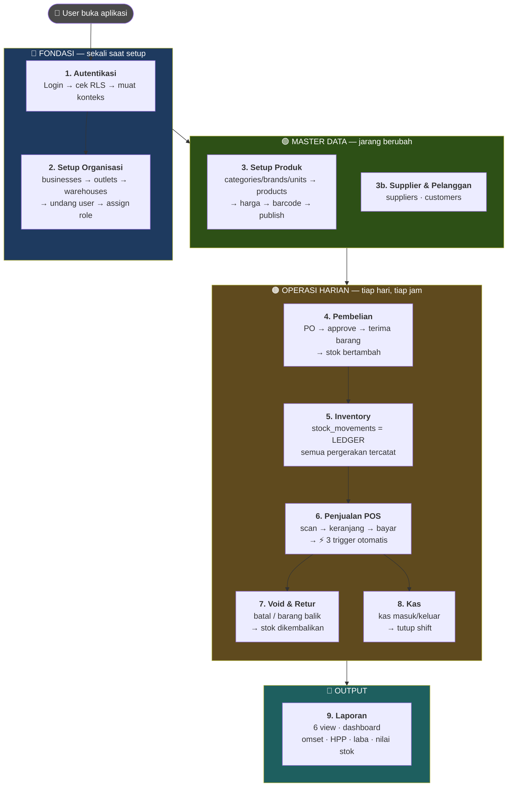

**Aturan urutan yang tidak bisa dilanggar** (dan database memaksanya lewat FK):

```
businesses  →  outlets  →  warehouses  →  stocks
                  ↓
               products  →  transaction_details
```

Tidak bisa bikin produk sebelum ada outlet. Tidak bisa jual sebelum ada stok.
Tidak bisa ada stok sebelum ada gudang. **Ini bukan aturan di aplikasi Flutter — ini
FK constraint di database.** Artinya berlaku untuk semua klien, selamanya.

> 💡 **Poin bercerita ke pembimbing:**
> *"Perhatikan bahwa urutan ini tidak saya tulis di kode Flutter. Kalau saya tulis di Flutter,
> orang bisa bypass lewat Postman atau lewat web app nanti. Karena saya taruh sebagai FK
> constraint di database, aturannya berlaku untuk semua klien — sekarang maupun nanti."*

---

## 2. Alur 1 — Autentikasi & Sesi

### Diagram alur

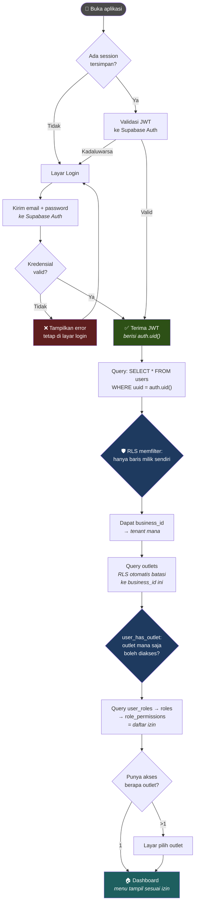

### Yang terjadi di balik layar

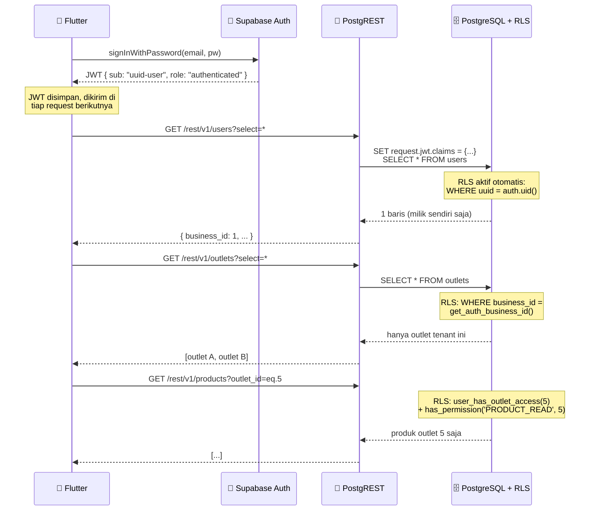

> 🔑 **Poin kunci:** Flutter **tidak pernah** menulis `WHERE business_id = ...`.
> Aplikasi cuma bilang "kasih saya semua outlet". Database yang memutuskan mana yang
> boleh dilihat. Kalau kode Flutter ada bug, atau ada yang pakai Postman langsung,
> **filternya tetap jalan**.

### ⚠️ Catatan kondisi nyata

Alur ini **belum bisa diuji end-to-end** — tabel `users` masih **0 baris**. Struktur RLS-nya
sudah lengkap dan terverifikasi, tapi belum pernah ada user asli login.
Ini PR prioritas (Dokumen 05).

---

## 3. Alur 2 — Setup Organisasi

Ini alur yang dijalankan **sekali** saat sebuah bisnis onboarding.

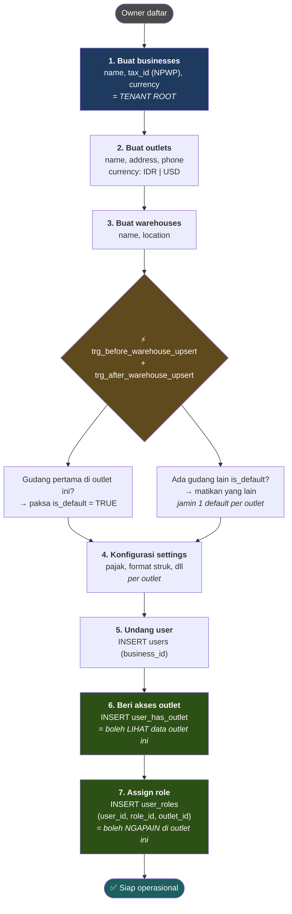

### Dua tabel yang sering tertukar

Ini pertanyaan jebakan yang mungkin ditanya pembimbing:

| | `user_has_outlet` | `user_roles` |
|---|---|---|
| **Menjawab** | *Outlet mana yang boleh saya **lihat**?* | *Di outlet itu saya boleh **ngapain**?* |
| **Dipakai oleh** | `user_has_outlet_access()` | `has_permission()` |
| **Analogi** | Kartu akses gedung 🚪 | Jabatan di gedung itu 👔 |
| **Tanpa ini** | Tidak bisa lihat data outlet sama sekali | Bisa lihat, tapi tidak bisa apa-apa |

> 💡 **Kenapa dipisah?** Karena satu orang bisa punya **peran berbeda di outlet berbeda**.
> Contoh: Budi = Manager di Outlet Jakarta, tapi cuma Kasir di Outlet Bandung.
> Kalau digabung jadi satu kolom `users.role`, ini mustahil.

### ⚠️ Catatan kondisi nyata

Database punya **1 `businesses`** tapi **0 `outlets`** → bisnis itu **yatim**, tidak punya
cabang. Artinya alur ini baru jalan sampai langkah 1. Langkah 2–7 belum pernah dieksekusi
dengan data nyata.

---

## 4. Alur 3 — Setup Master Produk

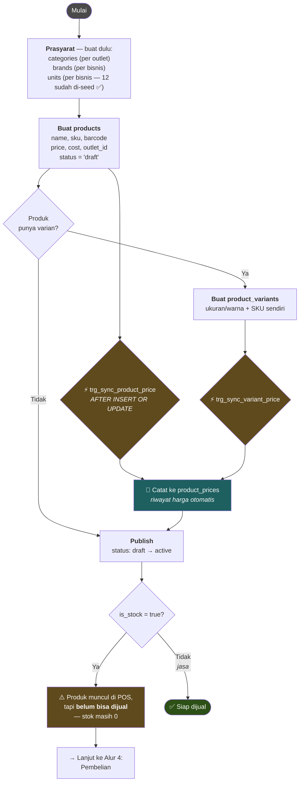

### Dua flag yang membingungkan

| Kolom | Artinya | Contoh |
|---|---|---|
| `is_stock` | Barang **fisik**? | Indomie = true · Jasa potong rambut = false |
| `is_use_stock` | Saat dijual, **kurangi stok**? | Indomie = true · Voucher pulsa = false |

Bisa `is_stock=true` tapi `is_use_stock=false`: misal barang display/pajangan yang
dicatat ada tapi tidak pernah berkurang saat "dijual".

### ⚠️ Temuan: dua model varian hidup berdampingan

`products.parent_id` (cara lama Mangkasir) **dan** tabel `product_variants` (cara baru)
sama-sama masih ada. Tidak ada aturan yang memaksa pilih salah satu.
Karena data produk masih **0 baris**, **sekarang waktu terbaik menghapus `parent_id`** —
tidak ada data yang perlu dimigrasi. Detail: Dokumen 05.

---

## 5. Alur 4 — Pembelian (Purchase)

Seluruh modul ini **baru** — tidak ada di Mangkasir lama.

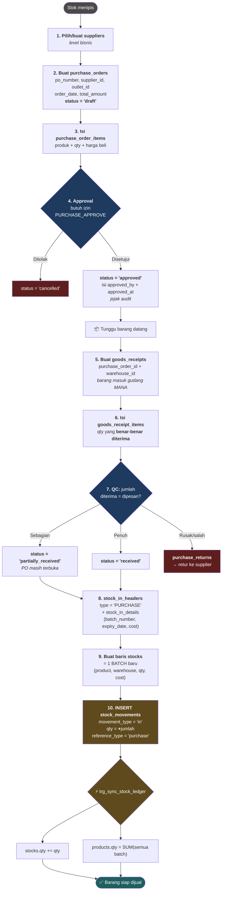

### Kenapa harus PO dulu, tidak langsung terima barang?

| Tanpa PO | Dengan PO |
|---|---|
| Siapa saja bisa "menambah stok" | Harus ada **persetujuan** (`approved_by`) sebelum uang keluar |
| Tidak ada bukti apa yang dipesan | Bisa cek: dipesan 100, datang 80 → **selisih ketahuan** |
| Tidak bisa lacak supplier bermasalah | `view_purchase_report` bisa tunjukkan supplier yang sering telat |

Ini disebut **three-way matching** (PO ↔ penerimaan ↔ tagihan) — standar di sistem
pengadaan mana pun. Ini yang membedakan sistem retail serius dari sekadar aplikasi kasir.

---

## 6. Alur 5 — Inventory & Ledger

### Konsep inti: `stock_movements` adalah SATU-SATUNYA sumber kebenaran

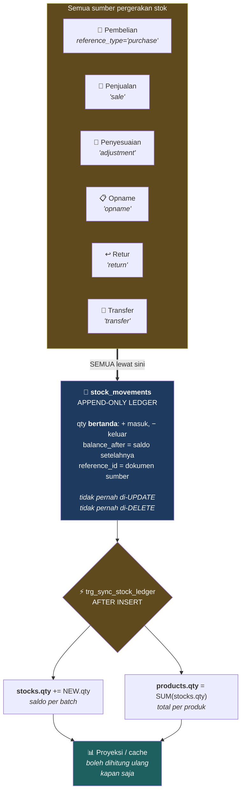

### Analogi rekening bank

| Bank | Sistem ini |
|---|---|
| **Mutasi rekening** — daftar tiap transaksi, tidak pernah dihapus | `stock_movements` |
| **Saldo tiap rekening** — turunan dari mutasi | `stocks.qty` (per batch) |
| **Total kekayaan** — jumlah semua rekening | `products.qty` |

Bank **tidak** menyimpan saldo lalu menambah/mengurangi angkanya. Bank menyimpan **mutasi**;
saldo cuma hasil penjumlahan. Kenapa? Karena kalau saldo salah, mutasi bisa dihitung ulang.
Kalau mutasi hilang, **uangnya hilang selamanya**.

> 💡 **Poin bercerita:** *"Kalau suatu hari `products.qty` ketahuan salah — misal karena bug —
> saya bisa hitung ulang dari `stock_movements` dan datanya balik benar. Tapi kalau saya
> desainnya cuma `UPDATE products SET qty = qty - 1` tiap jual, dan sekali saja gagal,
> angkanya salah **selamanya** dan tidak ada cara tahu kenapa."*

### Kenapa `qty` bertanda (+/−), bukan pakai kolom terpisah?

```sql
-- ❌ Kalau qty selalu positif, trigger harus:
UPDATE stocks SET qty = qty + CASE WHEN NEW.movement_type = 'in'
                                   THEN NEW.qty ELSE -NEW.qty END;

-- ✅ Karena qty bertanda, trigger cukup:
UPDATE stocks SET qty = qty + NEW.qty;
```

Saldo = `SUM(qty)` saja. Tidak ada `CASE`. Tidak ada tempat untuk salah tanda.

---

## 7. Alur 6 — Penjualan POS ⭐ **rantai trigger**

**Ini bagian terpenting dokumen ini.** Kalau pembimbing cuma punya waktu 3 menit,
tunjukkan bagian ini.

### 7.1 Alur dari sudut pandang kasir

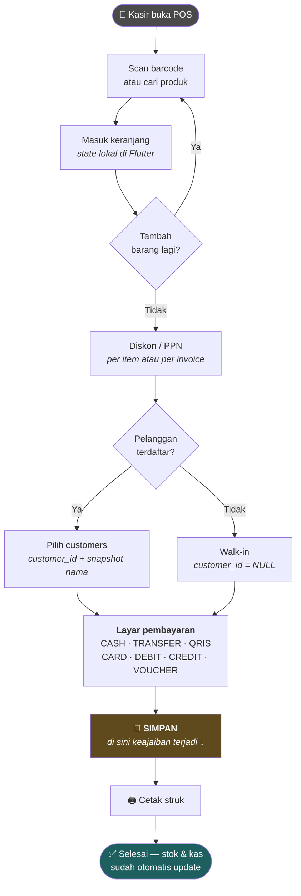

Dari sisi kasir: **cuma satu tombol Simpan**. Yang terjadi di bawahnya jauh lebih rumit.

### 7.2 Apa yang Flutter kirim (cuma 3 INSERT)

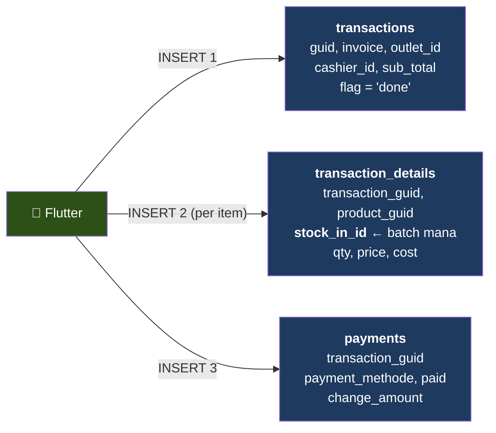

**Itu saja.** Flutter tidak menghitung stok. Tidak menyentuh `stocks`. Tidak menyentuh
`products.qty`. Tidak membuat catatan kas. Semua itu dikerjakan database.

### 7.3 ⚡ Rantai trigger — apa yang terjadi setelah 3 INSERT itu

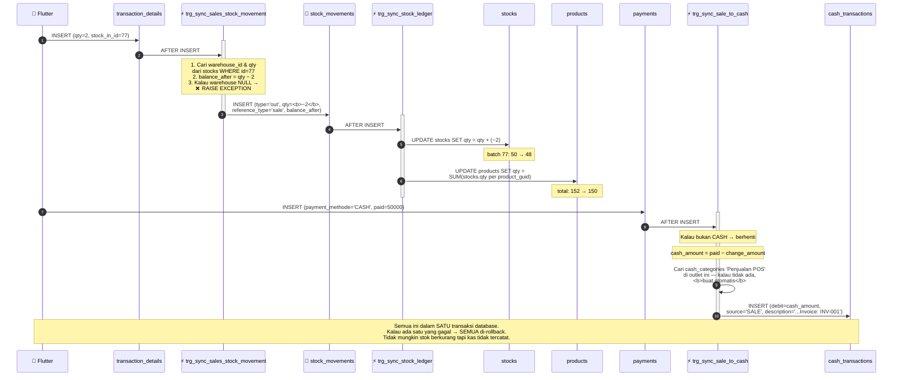

### 7.4 Tabel yang tersentuh dari 1 penjualan

Satu penjualan 2 pcs Indomie tunai menyentuh **6 tabel**:

| # | Tabel | Siapa yang nulis | Isinya |
|---|---|---|---|
| 1 | `transactions` | 📱 Flutter | Invoice INV-001, flag='done' |
| 2 | `transaction_details` | 📱 Flutter | 2 pcs, harga, HPP, batch #77 |
| 3 | `payments` | 📱 Flutter | CASH, dibayar 50.000, kembalian 44.000 |
| 4 | `stock_movements` | ⚡ **Trigger 1** | out, qty=−2, ref='sale', balance_after=48 |
| 5 | `stocks` | ⚡ **Trigger 2** | batch #77: 50 → 48 |
| 5 | `products` | ⚡ **Trigger 2** | qty total: 152 → 150 |
| 6 | `cash_transactions` | ⚡ **Trigger 3** | debit 6.000, source='SALE' |

**Flutter menulis 3. Database menulis 4.** Itu inti arsitekturnya.

> 💡 **Poin bercerita ke pembimbing — ini kalimat pamungkasnya:**
> *"Aplikasi kasir cuma tahu satu hal: 'ada penjualan'. Dia tidak tahu apa-apa soal stok,
> gudang, atau buku kas. Semua konsekuensinya dihitung database. Kenapa penting? Karena
> nanti kalau ada web dashboard, atau integrasi marketplace, atau tim lain bikin aplikasi
> baru — mereka tidak perlu tahu 4 langkah itu. Mereka cukup INSERT penjualan, dan
> konsekuensinya otomatis benar. Logika bisnisnya cuma ditulis **sekali**, di tempat yang
> tidak bisa dilewati siapa pun."*

### 7.5 Kode trigger — buka kalau ditanya detail

<details>
<summary><b>⚡ Trigger 1: sync_sales_stock_movement_func — jual → catat ledger</b></summary>

```sql
CREATE TRIGGER trg_sync_sales_stock_movement
AFTER INSERT ON public.transaction_details
FOR EACH ROW EXECUTE FUNCTION sync_sales_stock_movement_func();
```

Isi fungsinya (disederhanakan, alur aslinya persis begini):

```sql
-- 1. Ambil gudang & saldo batch yang dijual
SELECT warehouse_id, qty INTO v_warehouse_id, v_current_stock_qty
FROM stocks WHERE id = NEW.stock_in_id;

-- 2. Cari id transaksi induk (untuk reference_id)
SELECT id INTO v_transaction_id
FROM transactions WHERE guid = NEW.transaction_guid;

-- 3. Pengaman: batch tanpa gudang = data rusak → tolak transaksinya
IF v_warehouse_id IS NULL THEN
    RAISE EXCEPTION 'Warehouse not found for stock batch ID %', NEW.stock_in_id;
END IF;

-- 4. Hitung saldo setelah penjualan
v_balance_after := COALESCE(v_current_stock_qty, 0) - NEW.qty;

-- 5. Tulis ke LEDGER — qty NEGATIF karena keluar
INSERT INTO stock_movements (
    stock_id, product_guid, warehouse_id,
    movement_type, qty, reference_type, reference_id,
    balance_after, created_by
) VALUES (
    NEW.stock_in_id, NEW.product_guid, v_warehouse_id,
    'out', -NEW.qty, 'sale', v_transaction_id,
    v_balance_after, NEW.created_by
);
```

**Yang layak ditunjuk:** `RAISE EXCEPTION` di langkah 3. Kalau batch tidak punya gudang,
transaksi **dibatalkan total** — lebih baik kasir dapat error daripada stok jadi kacau
diam-diam. Ini prinsip *fail loudly, not silently*.
</details>

<details>
<summary><b>⚡ Trigger 2: sync_stock_ledger_projection_func — ledger → proyeksi</b></summary>

```sql
CREATE TRIGGER trg_sync_stock_ledger
AFTER INSERT ON public.stock_movements
FOR EACH ROW EXECUTE FUNCTION sync_stock_ledger_projection_func();
```

```sql
-- 1. Update saldo batch
UPDATE stocks
SET qty = qty + NEW.qty,          -- qty bertanda, jadi cukup ditambah
    updated_at = NOW()
WHERE id = NEW.stock_id;

-- 2. Hitung ulang total produk dari SEMUA batch-nya
UPDATE products
SET qty = COALESCE((
        SELECT SUM(s.qty) FROM stocks s
        WHERE s.product_guid = NEW.product_guid
          AND s.deleted_at IS NULL
    ), 0),
    updated_at = NOW()
WHERE uuid = NEW.product_guid;
```

**Yang layak ditunjuk:** langkah 2 tidak melakukan `qty = qty - 2`. Dia **menghitung ulang
dari nol** (`SUM` semua batch). Artinya kalau nilainya pernah rusak karena apa pun,
transaksi berikutnya akan **otomatis membetulkannya**. Ini disebut *self-healing projection*.

**Trigger ini adalah jantung sistem** — dia yang dipanggil oleh SEMUA sumber pergerakan stok
(beli, jual, retur, opname, transfer), bukan cuma penjualan.
</details>

<details>
<summary><b>⚡ Trigger 3: sync_sale_to_cash_func — bayar tunai → buku kas</b></summary>

```sql
CREATE TRIGGER trg_sync_sale_to_cash
AFTER INSERT ON public.payments
FOR EACH ROW EXECUTE FUNCTION sync_sale_to_cash_func();
```

```sql
IF NEW.payment_methode = 'CASH' THEN

    -- Ambil outlet & invoice dari transaksi induk
    SELECT outlet_id, invoice INTO v_outlet_id, v_invoice
    FROM transactions WHERE guid = NEW.transaction_guid;

    IF v_outlet_id IS NULL THEN RETURN NEW; END IF;   -- pengaman

    -- Uang yang benar-benar masuk laci = dibayar − kembalian
    v_cash_amount := NEW.paid - COALESCE(NEW.change_amount, 0);

    -- Cari kategori kas 'Penjualan POS' di outlet ini
    SELECT id INTO v_category_id FROM cash_categories
    WHERE name = 'Penjualan POS' AND outlet_id = v_outlet_id
      AND deleted_at IS NULL LIMIT 1;

    -- Belum ada? Buat otomatis (self-provisioning)
    IF v_category_id IS NULL THEN
        INSERT INTO cash_categories (outlet_id, name, type)
        VALUES (v_outlet_id, 'Penjualan POS', 'income')
        RETURNING id INTO v_category_id;
    END IF;

    INSERT INTO cash_transactions (
        outlet_id, category_id, transaction_date,
        debit, kredit, description, note, source, created_by
    ) VALUES (
        v_outlet_id, v_category_id, NEW.date::date,
        v_cash_amount, 0,
        'Pendapatan Penjualan POS Invoice: ' || v_invoice,
        NEW.notes, 'SALE', NEW.created_by
    );
END IF;
```

**Tiga hal yang layak ditunjuk:**

1. **`paid − change_amount`** — bukan `paid`. Pelanggan bayar 50.000 untuk belanja 6.000,
   kembalian 44.000. Yang benar-benar masuk laci = **6.000**. Salah di sini = kas tidak
   pernah cocok saat tutup shift.
2. **Cuma CASH.** Bayar QRIS/transfer tidak menambah kas fisik di laci — uangnya di rekening.
   Makanya trigger langsung berhenti untuk metode lain.
3. **Kategori dibuat otomatis** kalau belum ada. Outlet baru tidak perlu setup manual dulu
   sebelum bisa jualan.
</details>

---

## 8. Alur 7 — Void & Retur

Dua hal yang sering dikira sama, padahal berbeda.

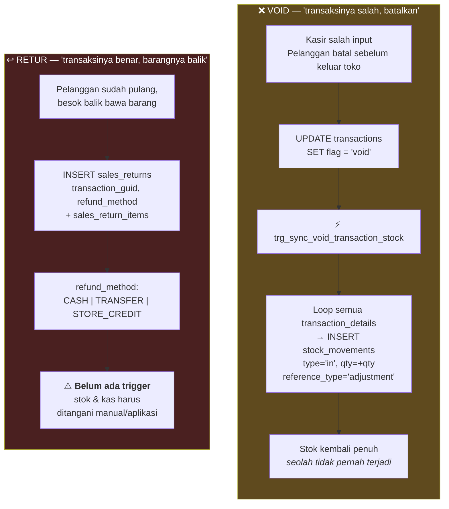

### Perbedaan yang harus bisa dijelaskan

| | Void | Retur |
|---|---|---|
| **Kapan** | Sebelum pelanggan pergi | Setelahnya, hari lain |
| **Transaksi aslinya** | Dianggap **tidak pernah ada** | Tetap **sah** — cuma ada retur |
| **Di laporan** | Hilang dari omset | Omset tetap tercatat, retur jadi baris tersendiri |
| **Sebagian?** | Tidak — semua atau tidak | Ya — bisa retur 1 dari 5 item |
| **Refund** | Kembalikan uang langsung | Tunai / transfer / kredit toko |
| **Otomatis?** | ✅ Ada trigger | ⚠️ **Belum ada trigger** |

### Detail trigger void

```sql
CREATE TRIGGER trg_sync_void_transaction_stock
AFTER UPDATE OF flag ON public.transactions
FOR EACH ROW EXECUTE FUNCTION sync_void_transaction_stock_func();
```

```sql
IF OLD.flag = 'done' AND NEW.flag = 'void' THEN
    FOR r_detail IN
        SELECT id, stock_in_id, product_guid, qty, created_by
        FROM transaction_details
        WHERE transaction_guid = NEW.guid AND deleted_at IS NULL
    LOOP
        SELECT warehouse_id, qty INTO v_warehouse_id, v_current_stock_qty
        FROM stocks WHERE id = r_detail.stock_in_id;

        v_balance_after := COALESCE(v_current_stock_qty, 0) + r_detail.qty;

        INSERT INTO stock_movements (
            stock_id, product_guid, warehouse_id,
            movement_type, qty, reference_type, reference_id,
            balance_after, created_by
        ) VALUES (
            r_detail.stock_in_id, r_detail.product_guid, v_warehouse_id,
            'in', r_detail.qty, 'adjustment', NEW.id,
            v_balance_after, NEW.updated_by
        );
    END LOOP;
END IF;
```

Perhatikan: trigger ini **tidak menghapus** baris `stock_movements` yang lama. Dia menulis
baris **baru** yang membalikkan efeknya. Ledger tetap append-only — jejak lengkapnya:
*"terjual jam 14:00, dibatalkan jam 14:03"*. Kalau baris lama dihapus, jejak audit hilang.

### 🔴 Temuan kritis: `flag` tanpa CHECK constraint

Trigger di atas bergantung **persis** pada string `'done'` dan `'void'`. Tapi kolom
`transactions.flag` **tidak punya CHECK constraint**.

**Artinya:** kalau ada yang menulis `'VOID'`, `'voided'`, atau `'cancel'`:
- Database menerimanya tanpa protes ✅
- Trigger **diam-diam tidak jalan** ❌
- Stok **tidak dikembalikan** ❌
- **Tidak ada error apa pun** ❌

Ini kategori bug terburuk: gagal tanpa suara. Perbaikannya satu baris:

```sql
ALTER TABLE transactions
ADD CONSTRAINT chk_transactions_flag CHECK (flag IN ('done', 'void'));
```

Bandingkan: kolom lain (`products.status`, `purchase_orders.status`,
`stock_movements.movement_type`, dst.) **semua punya** CHECK. `transactions.flag` terlewat
karena dia tabel warisan Mangkasir. Detail: Dokumen 05.

---

## 9. Alur 8 — Kas & Tutup Shift

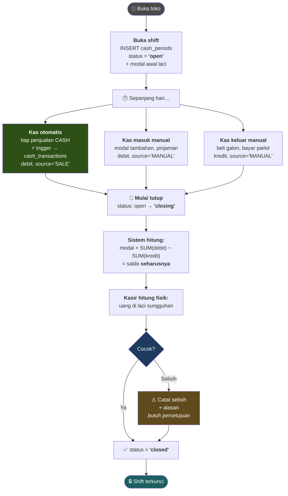

### Kenapa `debit` dan `kredit` dipisah, tidak satu kolom bertanda?

Berbeda dari `stock_movements` yang pakai qty bertanda, `cash_transactions` justru pakai
**dua kolom** (`debit` = masuk, `kredit` = keluar).

Alasannya: ini mengikuti konvensi **akuntansi double-entry** yang sudah dipakai akuntan
selama 500 tahun. Laporan keuangan standar (buku besar, neraca) mengharapkan format ini.
Kalau nanti diintegrasikan ke software akuntansi (Accurate, Jurnal, Xero), formatnya
langsung cocok.

Dua desain berbeda untuk dua domain berbeda — **dan itu disengaja**:
- Stok = domain teknis → optimalkan untuk kesederhanaan trigger (qty bertanda)
- Kas = domain akuntansi → ikuti konvensi akuntansi (debit/kredit)

### Kenapa ada status `'closing'` di tengah?

`open → closing → closed`, bukan langsung `open → closed`.

Status `'closing'` = "laci sedang dihitung, jangan ada transaksi baru masuk". Tanpa ini,
kasir bisa hitung uang, dapat angka, lalu ada penjualan masuk **saat dia sedang menghitung**
→ hitungannya jadi salah dan dia bingung kenapa selisih. Status perantara mencegah
*race condition* itu.

---

## 10. Alur 9 — Pelaporan

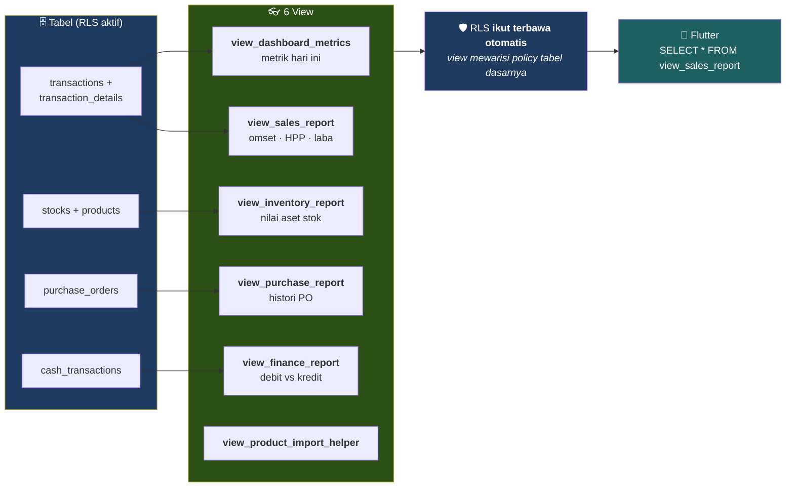

### Kenapa laba bisa dihitung akurat?

Karena `transaction_details.cost` menyimpan **HPP saat barang itu dijual** — bukan HPP
sekarang.

```
Laba = SUM(qty × price) − SUM(qty × cost)
                                    ↑
                      HPP saat itu, dibekukan permanen
```

Kalau harga beli Indomie naik dari 2.800 → 3.100 bulan depan, laba transaksi bulan lalu
**tidak ikut berubah** — karena `cost`-nya sudah dibekukan di baris detailnya.

Kalau laporan menghitung laba dengan `JOIN products` untuk ambil `cost` terkini, maka
**laba historis akan berubah setiap kali harga beli berubah** — dan laporan bulan lalu
yang sudah dicetak jadi tidak cocok dengan yang di layar. Ini bug klasik yang mahal.

Istilahnya: **point-in-time snapshot**. Hal yang sama berlaku untuk `product_name` &
`product_sku` yang ikut disalin — kalau produk di-rename, struk lama tetap menampilkan
nama saat itu.

---

## 11. Referensi Lengkap 8 Trigger

Semua trigger yang aktif di database, diverifikasi 15 Juli 2026:

| # | Trigger | Tabel | Kapan | Fungsinya |
|---|---|---|---|---|
| 1 | `trg_sync_sales_stock_movement` | `transaction_details` | AFTER INSERT | Jual → catat ledger `out` (qty negatif), ref='sale' |
| 2 | `trg_sync_stock_ledger` | `stock_movements` | AFTER INSERT | **Ledger → proyeksi**: update `stocks.qty` + hitung ulang `products.qty` |
| 3 | `trg_sync_sale_to_cash` | `payments` | AFTER INSERT | Bayar CASH → buat `cash_transactions` otomatis |
| 4 | `trg_sync_void_transaction_stock` | `transactions` | AFTER UPDATE **OF flag** | `done`→`void` → catat ledger `in` (kembalikan stok) |
| 5 | `trg_sync_product_price` | `products` | AFTER INSERT/UPDATE | Catat riwayat ke `product_prices` |
| 6 | `trg_sync_variant_price` | `product_variants` | AFTER INSERT/UPDATE | Catat riwayat varian ke `product_prices` |
| 7 | `trg_before_warehouse_upsert` | `warehouses` | BEFORE INSERT | Gudang pertama outlet → paksa `is_default=TRUE` |
| 8 | `trg_after_warehouse_upsert` | `warehouses` | AFTER INSERT/UPDATE **OF is_default** | Jamin cuma **1** gudang default per outlet |

**Semua 8 fungsi bertipe `SECURITY DEFINER`** — artinya jalan dengan hak pemilik fungsi,
bukan hak pemanggil. Ini perlu supaya trigger bisa menulis ke tabel yang mungkin tidak
boleh ditulis langsung oleh user.

> ⚠️ **Temuan keamanan:** karena `SECURITY DEFINER` **dan** ada di schema `public`, ke-8
> fungsi ini juga **terekspos sebagai endpoint RPC** (`/rest/v1/rpc/nama_fungsi`) yang bisa
> dipanggil role `anon` dan `authenticated`. Terdeteksi oleh Supabase Security Advisor.
> Perbaikan: `REVOKE EXECUTE ... FROM anon, authenticated`. Detail: Dokumen 05.

### Yang **tidak** punya trigger (ditangani aplikasi)

| Proses | Status |
|---|---|
| Retur penjualan → kembalikan stok | ⚠️ Manual |
| Retur pembelian → kurangi stok | ⚠️ Manual |
| Goods receipt → buat batch `stocks` | ⚠️ Manual |
| Stock opname → selisih | ⚠️ Manual |
| Tutup shift → hitung saldo | ⚠️ Manual |

Ini **bukan berarti salah** — sebagian memang lebih tepat di aplikasi (butuh input manusia).
Tapi retur penjualan idealnya punya trigger seperti void, supaya konsisten.

---

## 12. State Machine

Status yang punya CHECK constraint di database (jadi tidak bisa diisi sembarangan):

### `purchase_orders.status`

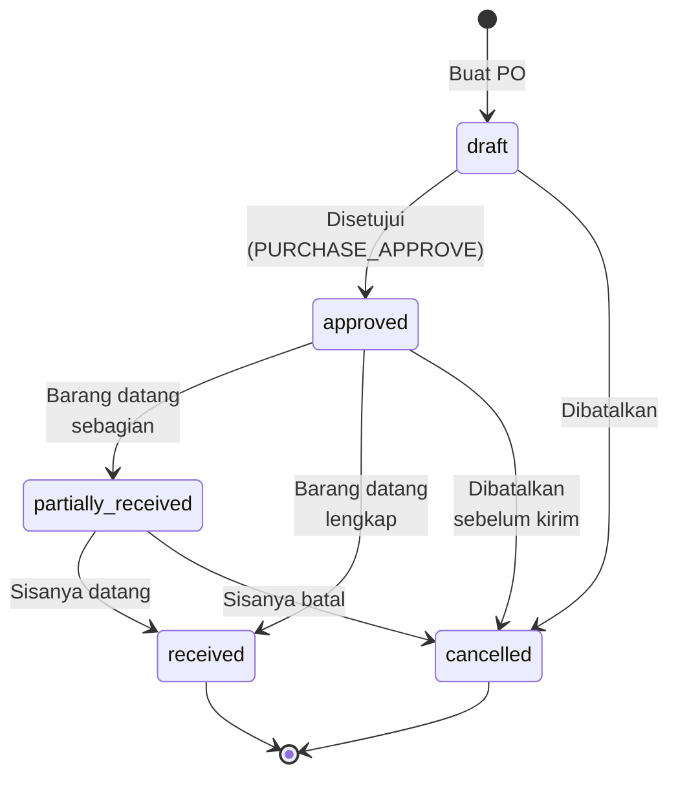

`CHECK (status IN ('draft','approved','partially_received','received','cancelled'))` ✅

### `products.status`

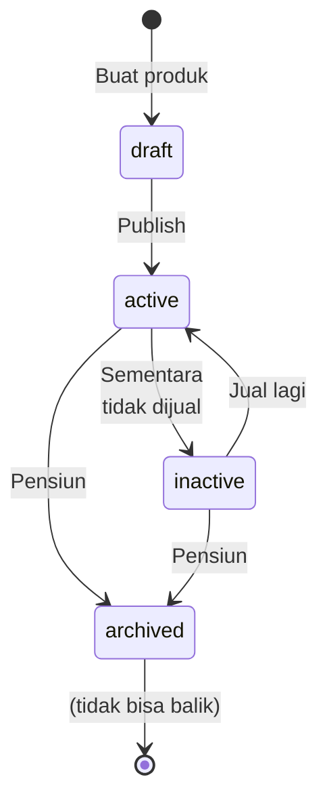

`CHECK (status IN ('draft','active','inactive','archived'))` ✅

`archived` ≠ dihapus. Produk tetap ada supaya riwayat penjualan lamanya tetap bisa dibaca —
konsisten dengan FK `RESTRICT` di `transaction_details.product_guid`.

### `cash_periods.status`

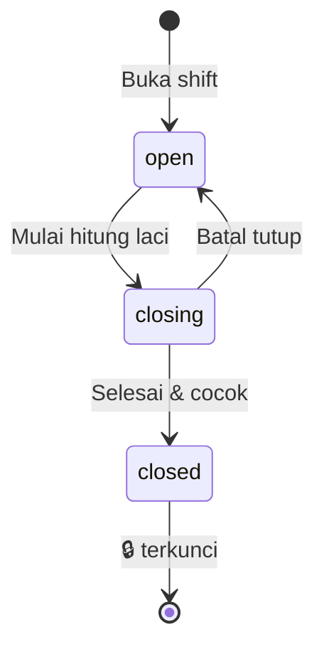

`CHECK (status IN ('open','closing','closed'))` ✅

### `transactions.flag` — 🔴 **tanpa CHECK**

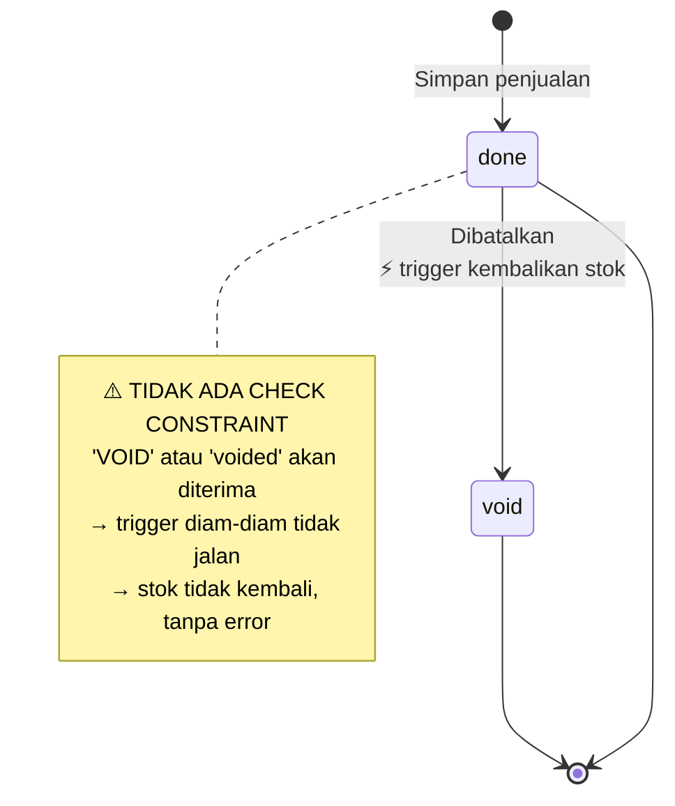

**Ini satu-satunya state machine yang tidak dilindungi database.** Perbaikan 1 baris,
prioritas 🔴. Detail: Dokumen 05.

---

## 13. Matriks: Event → Dampak

Tabel rujukan cepat — kalau pembimbing tanya *"kalau X terjadi, apa yang berubah?"*

| Event | Tabel yang ditulis Flutter | Tabel yang ditulis trigger otomatis |
|---|---|---|
| **Login** | — | — (cuma baca, RLS memfilter) |
| **Buat gudang** | `warehouses` | ⚡ `warehouses.is_default` dijaga (T7, T8) |
| **Buat produk** | `products` | ⚡ `product_prices` (T5) |
| **Ubah harga** | `products` | ⚡ `product_prices` (T5) |
| **Buat varian** | `product_variants` | ⚡ `product_prices` (T6) |
| **Approve PO** | `purchase_orders` | — |
| **Terima barang** | `goods_receipts`, `goods_receipt_items`, `stock_in_*`, `stocks`, `stock_movements` | ⚡ `stocks.qty`, `products.qty` (T2) |
| **Jual (tunai)** | `transactions`, `transaction_details`, `payments` | ⚡ `stock_movements` (T1) → ⚡ `stocks`, `products` (T2) → ⚡ `cash_transactions` (T3) |
| **Jual (QRIS)** | sama | ⚡ T1 → T2. **Tidak** ada `cash_transactions` (bukan kas fisik) |
| **Void** | `transactions.flag = 'void'` | ⚡ `stock_movements` `in` (T4) → ⚡ `stocks`, `products` (T2) |
| **Retur jual** | `sales_returns`, `sales_return_items` | ⚠️ **Tidak ada** — manual |
| **Kas manual** | `cash_transactions` | — |
| **Tutup shift** | `cash_periods.status` | ⚠️ **Tidak ada** — perhitungan di aplikasi |

**Cara membaca matriks ini:** kolom kanan yang panjang = otomatisasi kuat. Kolom kanan
kosong (`—`) = memang tidak perlu otomatis. Kolom kanan `⚠️` = **gap** yang seharusnya
otomatis tapi belum.

---

## 14. FAQ

<details>
<summary><b>Q1: Kalau semua logika di trigger, bagaimana cara debug kalau ada yang salah?</b></summary>

Pertanyaan bagus, dan ini memang **trade-off nyata** dari arsitektur ini.

**Kesulitannya:** trigger jalan "tak terlihat". Kalau stok salah, harus telusuri: trigger
mana yang jalan? urutannya bagaimana?

**Yang membantu di sistem ini:**

1. **`stock_movements` mencatat semuanya.** Ini bukan cuma ledger — ini juga **log debug**.
   Kalau stok salah, satu query bisa lihat persis apa yang terjadi:
   ```sql
   SELECT created_at, movement_type, qty, reference_type, reference_id, balance_after
   FROM stock_movements
   WHERE product_guid = '...'
   ORDER BY created_at;
   ```
   Hasilnya: seluruh riwayat produk itu, urut waktu, dengan alasan tiap pergerakan.

2. **`balance_after` mendeteksi ketidakcocokan.** Kalau `balance_after` baris N ≠
   `balance_after` baris N−1 + `qty` baris N, berarti ada yang menulis di luar jalur trigger.

3. **`RAISE EXCEPTION` gagal keras.** Trigger 1 langsung membatalkan transaksi kalau data
   tidak konsisten, bukan diam-diam melanjutkan.

4. **`RAISE NOTICE` untuk debug live** — bisa ditambahkan ke fungsi trigger, muncul di
   Supabase Logs.

**Jawaban jujur kalau ditanya:** *"Debugging trigger memang lebih sulit dari debugging kode
aplikasi — tidak ada breakpoint. Tapi saya menerima trade-off itu karena ganti rugi
kesalahan stok jauh lebih mahal daripada waktu debugging. Dan ledger-nya sendiri sudah jadi
alat debug yang bagus."*
</details>

<details>
<summary><b>Q2: Kalau salah satu trigger gagal di tengah, apa data jadi setengah jalan?</b></summary>

Tidak. Ini dijamin oleh **transaksi database (ACID)**.

Trigger jalan **di dalam** transaksi yang sama dengan INSERT yang memicunya. Kalau trigger
`RAISE EXCEPTION`, **seluruh transaksi di-rollback** — termasuk INSERT aslinya.

**Contoh konkret:** kasir simpan penjualan. Trigger 1 sadar batch #77 tidak punya gudang →
`RAISE EXCEPTION`. Hasilnya:
- ❌ `transaction_details` **tidak** tersimpan
- ❌ `stock_movements` **tidak** tersimpan
- ❌ `stocks` **tidak** berubah
- ✅ Kasir dapat pesan error di layar

**Tidak mungkin** ada kondisi "stok sudah berkurang tapi transaksinya tidak tercatat".
Semua atau tidak sama sekali.

Ini justru **alasan utama** kenapa logikanya ditaruh di database. Kalau logika yang sama
ditulis di Flutter sebagai 6 request HTTP terpisah, dan request ke-4 gagal karena sinyal
putus — request 1–3 sudah tersimpan, 4–6 tidak. Datanya rusak, dan sulit ketahuan.

**Kalimat untuk pembimbing:** *"Satu tombol Simpan di POS = satu transaksi database.
Enam tabel berubah bersama, atau tidak ada yang berubah. Itu jaminan yang tidak bisa saya
dapat kalau logikanya di aplikasi."*
</details>

<details>
<summary><b>Q3: Kenapa `stock_in_id` harus ditentukan Flutter? Kenapa bukan FIFO otomatis?</b></summary>

Karena FIFO otomatis belum diimplementasikan — dan ini gap yang jujur.

**Sekarang:** Flutter harus memutuskan **batch mana** yang dijual, lalu kirim `stock_in_id`
di `transaction_details`. Kalau Flutter asal pilih (misal batch pertama yang ketemu),
FIFO-nya tidak terjamin.

**Idealnya:** ada fungsi database yang otomatis pilih batch tertua yang masih ada stok —
kasir tidak perlu tahu soal batch sama sekali.

**Kenapa belum ada:** strukturnya sudah siap (`stocks` punya batch, `stock_in_details` punya
`expiry_date`), tapi logika pemilihan batch belum ditulis. Prioritas ada di menyelesaikan
struktur ledger dulu.

**Rekomendasi:** buat fungsi `pick_stock_batch_fifo(product_guid, warehouse_id, qty)` yang
mengembalikan daftar `(stock_in_id, qty)` — termasuk kasus 1 penjualan mengambil dari 2 batch
(misal batch A tinggal 1 pcs, jual 3 pcs → 1 dari A + 2 dari B). Tercatat di Dokumen 05.
</details>

<details>
<summary><b>Q4: Kalau `products.qty` cuma proyeksi, bagaimana cara memperbaikinya kalau rusak?</b></summary>

Karena `stock_movements` adalah sumber kebenaran, proyeksi bisa dibangun ulang kapan saja:

```sql
-- Bangun ulang stocks.qty dari ledger
UPDATE stocks s
SET qty = COALESCE((
    SELECT SUM(m.qty) FROM stock_movements m WHERE m.stock_id = s.id
), 0);

-- Bangun ulang products.qty dari stocks
UPDATE products p
SET qty = COALESCE((
    SELECT SUM(s.qty) FROM stocks s
    WHERE s.product_guid = p.uuid AND s.deleted_at IS NULL
), 0);
```

Dua query, selesai. Data kembali benar.

**Ini keuntungan besar arsitektur ledger.** Bandingkan dengan sistem yang cuma punya
`products.qty` dan meng-`UPDATE`-nya tiap transaksi: kalau angkanya salah, **tidak ada cara
tahu berapa seharusnya**. Harus stock opname fisik seluruh toko.

Cek kesehatan proyeksi (harusnya 0 baris):
```sql
SELECT p.name, p.qty AS qty_proyeksi, COALESCE(SUM(s.qty),0) AS qty_seharusnya
FROM products p LEFT JOIN stocks s
  ON s.product_guid = p.uuid AND s.deleted_at IS NULL
GROUP BY p.id, p.name, p.qty
HAVING p.qty <> COALESCE(SUM(s.qty), 0);
```
</details>

<details>
<summary><b>Q5: Bayar QRIS kenapa tidak masuk cash_transactions? Bukankah itu tetap pemasukan?</b></summary>

Tetap pemasukan — tapi bukan **kas fisik di laci**.

`cash_transactions` = buku **kas laci** (petty cash). Isinya cuma uang yang bisa
dihitung tangan saat tutup shift.

Kalau QRIS ikut masuk sini:
- Sistem bilang laci harus berisi Rp 5.000.000
- Kasir hitung, cuma ada Rp 2.000.000
- Selisih Rp 3.000.000 → panik, padahal Rp 3 juta itu memang di rekening, bukan di laci

**Uang QRIS tetap tercatat** — di `payments` dan `transactions`. Jadi omset tetap benar.
Yang tidak tercatat cuma di buku kas laci, dan itu memang benar.

**Poin bercerita:** *"Trigger `sync_sale_to_cash` sengaja cuma bereaksi ke CASH.
Ini bukan keterbatasan — ini memang definisi kas. Kalau saya masukkan QRIS ke sana,
tutup shift tidak akan pernah cocok."*

**Catatan:** rekonsiliasi uang QRIS/transfer/kartu (uang di rekening vs settlement dari
payment gateway) adalah proses terpisah yang **belum ada** di sistem ini. Tercatat di
Dokumen 05.
</details>

<details>
<summary><b>Q6: Kalau 2 kasir jual produk yang sama di detik yang sama, stoknya kacau tidak?</b></summary>

Tidak, dan ini pertanyaan yang sangat bagus untuk ditanyakan.

`UPDATE stocks SET qty = qty + NEW.qty WHERE id = 77` bersifat **atomik** di PostgreSQL.
Baris #77 di-*lock* selama update. Kasir kedua **menunggu** (biasanya < 1 milidetik),
lalu jalan dengan nilai yang sudah diperbarui.

```
Kasir A: qty = 50 + (−2) = 48   ← lock, tulis, lepas
Kasir B: qty = 48 + (−3) = 45   ← menunggu, lalu baca 48 (bukan 50)
```

Hasilnya **selalu** 45. Tidak pernah 47.

**Bandingkan kalau logikanya di Flutter:**
```
Kasir A baca qty = 50 → hitung 50−2 = 48 → tulis 48
Kasir B baca qty = 50 → hitung 50−3 = 47 → tulis 47   ← ❌ penjualan A HILANG
```
Ini disebut **lost update**, dan ini salah satu bug tersulit dilacak di sistem retail.

**Poin bercerita:** *"Ini salah satu alasan terkuat kenapa saya taruh logikanya di database.
`qty = qty + x` di dalam trigger itu atomik. Kalau saya baca-hitung-tulis dari Flutter,
dua kasir bisa saling menimpa dan penjualan hilang tanpa jejak."*

**Yang perlu dicatat jujur:** `balance_after` dihitung dengan `SELECT ... INTO` **sebelum**
`INSERT` — tanpa `FOR UPDATE`. Dalam kondisi bersamaan ekstrem, `balance_after` bisa
sedikit meleset walaupun `stocks.qty` tetap benar. `balance_after` cuma untuk audit,
jadi tidak merusak stok — tapi tetap layak dicatat sebagai catatan teknis (Dokumen 05).
</details>

<details>
<summary><b>Q7: Kalau pembimbing minta demo live, apa yang harus ditunjukkan?</b></summary>

Skrip 3 menit paling meyakinkan — buka **Supabase Dashboard → SQL Editor**:

**1. Tunjukkan semua trigger yang aktif** (bukti otomatisasinya nyata, bukan klaim):
```sql
SELECT event_object_table AS tabel, trigger_name, action_timing, event_manipulation
FROM information_schema.triggers
WHERE trigger_schema = 'public'
ORDER BY event_object_table;
```

**2. Tunjukkan RLS aktif di semua tabel:**
```sql
SELECT count(*) FILTER (WHERE relrowsecurity) AS rls_aktif,
       count(*) AS total_tabel
FROM pg_class c JOIN pg_namespace n ON n.oid = c.relnamespace
WHERE n.nspname = 'public' AND c.relkind = 'r';
-- Hasil: 51 / 51
```

**3. Buka `Database → Schema Visualizer`** — ERD otomatis, tergambar langsung dari
database. Ini visual dan mengesankan.

**4. Jelaskan alur POS pakai bagian §7.3 dokumen ini.**

**Kalau ditanya "bisa demo transaksi sungguhan?"** — jawab jujur: *"Belum, karena belum ada
data operasional. Struktur dan trigger-nya lengkap, tapi belum diuji dengan data nyata.
Itu PR prioritas pertama saya, dan saya sudah tulis rencana pengujiannya di Dokumen 05."*

Jawaban jujur seperti ini **jauh lebih kuat** daripada demo yang gagal di depan pembimbing.
</details>

<details>
<summary><b>Q8: Apa alur ini sudah pernah diuji end-to-end?</b></summary>

**Belum** — dan ini harus disampaikan di awal presentasi, bukan ditunggu sampai ketahuan.

Kondisi nyata per 15 Juli 2026:

| | Status |
|---|---|
| Struktur 51 tabel | ✅ Lengkap |
| RLS 51/51 tabel | ✅ Aktif |
| 8 trigger terpasang | ✅ Valid secara sintaks |
| Seed sistem (26 permission, 7 role, 12 unit) | ✅ Lengkap |
| Seed wilayah (provinsi/kota/kecamatan/kelurahan) | ⚠️ **0 baris** |
| Data operasional (outlet, user, produk, transaksi) | ⏳ **0 baris** |
| **Trigger diuji dengan data nyata** | ❌ **Belum pernah** |

Artinya: **8 trigger di dokumen ini sudah terpasang, tapi belum pernah benar-benar
dijalankan.** Kode-nya sudah dibaca dan diverifikasi baris per baris, tapi membaca kode
≠ menguji kode.

**Cara menyampaikannya:** *"Fondasinya sudah lengkap dan saya bisa jelaskan tiap
keputusannya. Yang belum: pembuktian end-to-end dengan data nyata. Rencana pengujiannya
sudah saya susun — buat 1 outlet, 1 gudang, 1 produk, 1 pembelian, 1 penjualan, lalu
verifikasi ke-6 tabel berubah sesuai harapan. Itu langkah pertama saya berikutnya."*

Rencana lengkapnya ada di **Dokumen 05 §Rekomendasi Prioritas**.
</details>

---

## Dokumen Terkait

- **[01] System Overview & Arsitektur** — kenapa logikanya di database, bukan di Flutter
- **[02] Master Data & Data Dictionary** — detail tiap tabel & kolom yang disebut di sini
- **[04] Supabase Primer** — kalau istilah *trigger*, *RLS*, *transaksi ACID* terasa asing
- **[05] Status & Temuan** — pendalaman 🔴 & ⚠️ di dokumen ini + rencana perbaikan

---

*Dokumen 03 dari 6 · Terakhir diverifikasi terhadap database: 15 Juli 2026*
