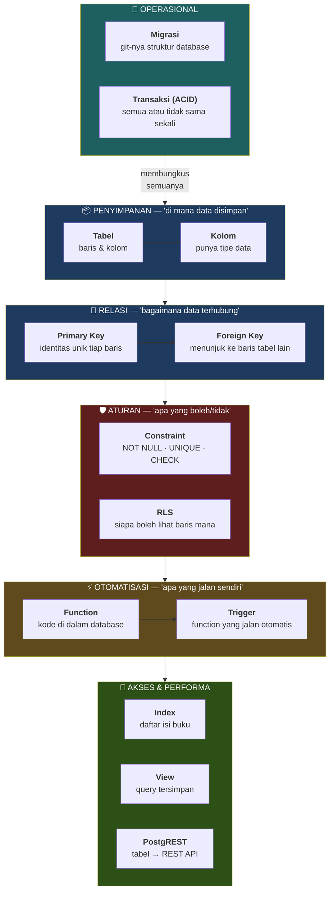
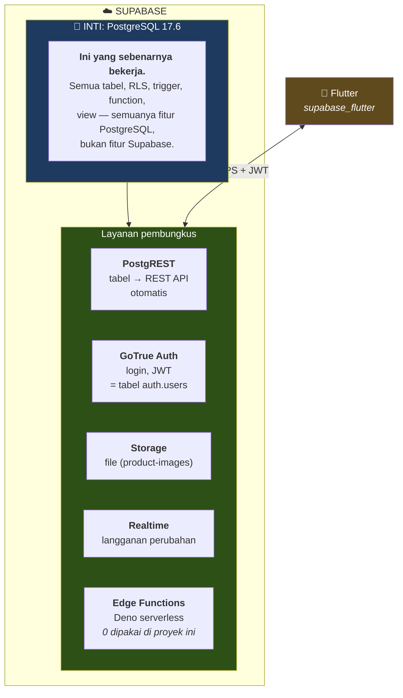
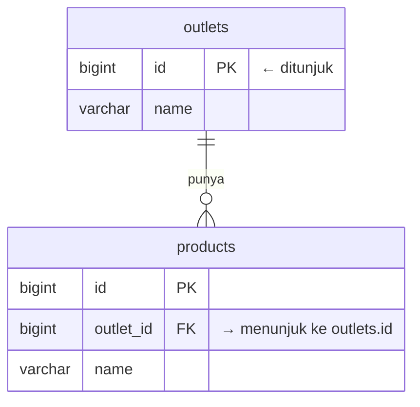
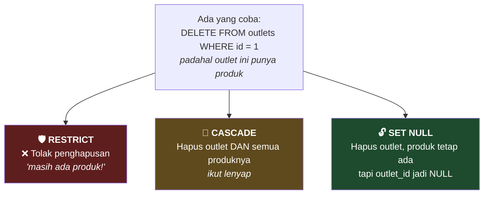
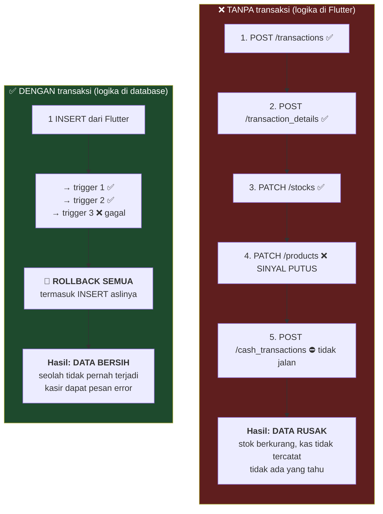
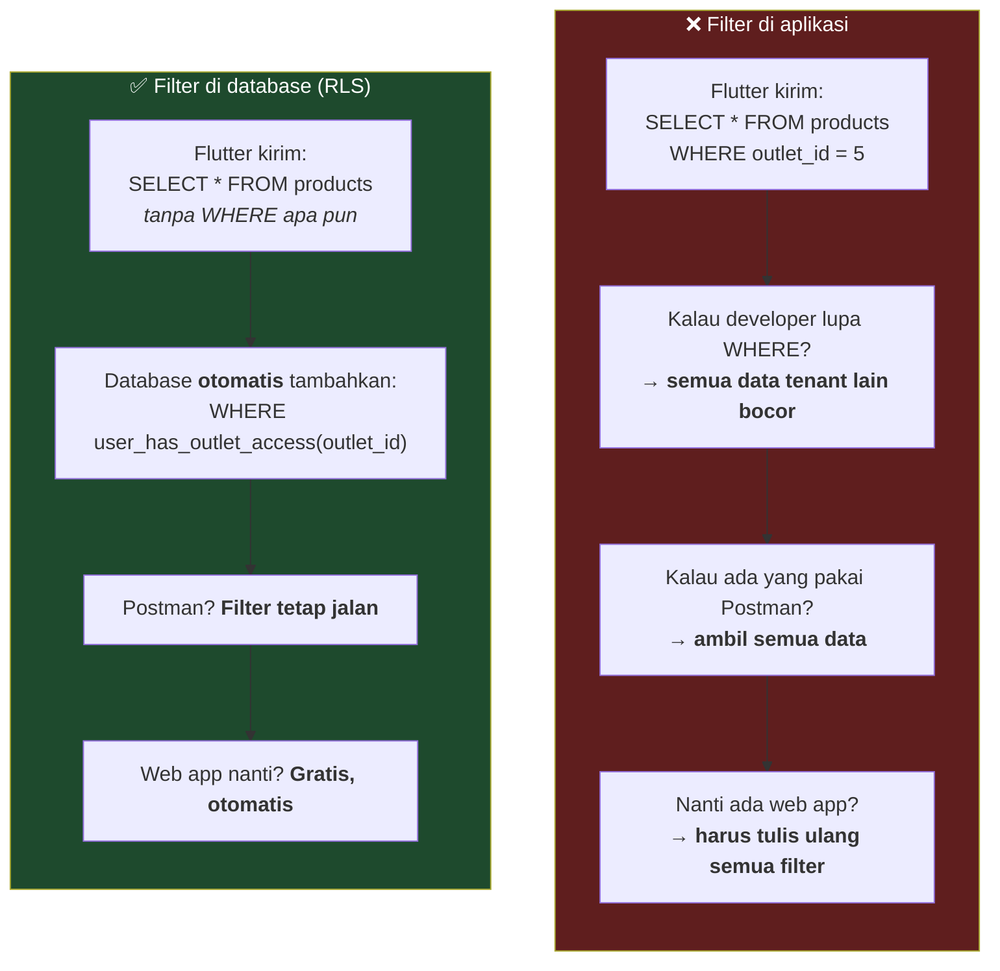
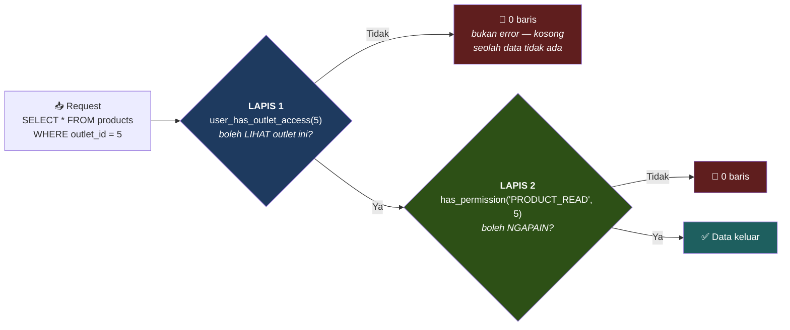
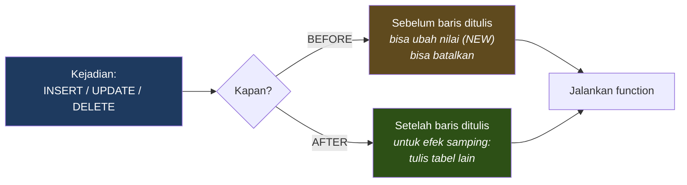
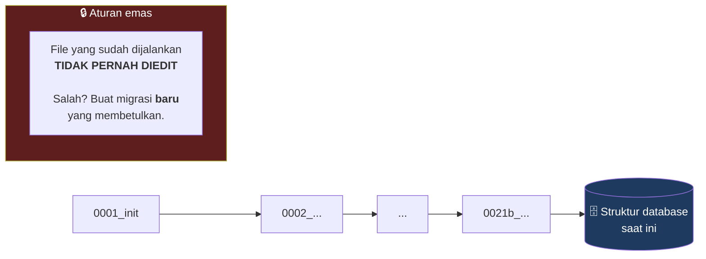
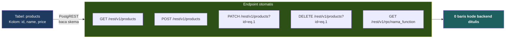

# Supabase Primer untuk Non-Backend

> **Tujuan dokumen:** kelas kilat konsep backend, khusus untuk yang latar belakangnya
> Flutter/mobile. Setelah baca ini, istilah di Dokumen 01–03 tidak akan terasa asing lagi.
>
> **Semua contoh diambil dari database Mangkasir-Ritel yang asli**, bukan contoh teori.

## Daftar Isi
1. [Peta Konsep](#1-peta-konsep)
2. [Apa Itu Supabase Sebenarnya](#2-apa-itu-supabase-sebenarnya)
3. [Tabel, Baris, Kolom](#3-tabel-baris-kolom)
4. [Primary Key & Foreign Key](#4-primary-key--foreign-key)
5. [Constraint — Aturan yang Dipaksa](#5-constraint--aturan-yang-dipaksa)
6. [Index — Kenapa Query Bisa Cepat](#6-index--kenapa-query-bisa-cepat)
7. [Transaksi & ACID](#7-transaksi--acid)
8. [RLS — Satpam di Tiap Baris](#8-rls--satpam-di-tiap-baris)
9. [Function & Trigger](#9-function--trigger)
10. [View](#10-view)
11. [Migrasi](#11-migrasi)
12. [PostgREST — Dari Tabel Jadi API](#12-postgrest--dari-tabel-jadi-api)
13. [Padanan Flutter ↔ Backend](#13-padanan-flutter--backend)
14. [Glosarium](#14-glosarium)
15. [FAQ](#15-faq)

---

## 1. Peta Konsep

Semua konsep di dokumen ini, dan bagaimana mereka saling terkait:



---

## 2. Apa Itu Supabase Sebenarnya

Kesalahpahaman paling umum: *"Supabase itu backend."*

**Bukan.** Supabase adalah **PostgreSQL** — database yang sudah ada sejak 1996 — plus
beberapa layanan pembungkus di sekelilingnya.



**Kenapa ini penting untuk dipahami:** karena artinya **95% yang kamu pelajari di sini
adalah PostgreSQL, bukan Supabase.** Ilmunya portabel — kalau besok pindah ke AWS RDS atau
self-hosted Postgres, semua tetap berlaku. Yang berubah cuma pembungkusnya.

**Ini juga jawaban bagus untuk pembimbing** kalau ditanya *"kenapa tidak pakai Firebase/backend
sendiri?"*: *"Karena saya tidak terkunci. Yang saya tulis adalah PostgreSQL standar —
RLS, trigger, constraint. Kalau suatu hari harus lepas dari Supabase, database-nya bisa
di-dump dan dijalankan di mana saja."*

### Fakta proyek ini

| | |
|---|---|
| Nama project | `mangkasir-ritel` (ref: `emovquokperyixwnpqaa`) |
| Region | ap-southeast-2 (Sydney) |
| PostgreSQL | 17.6 |
| Dibuat | 30 Juni 2026 |
| Edge Functions | **0** — semua logika di database |

---

## 3. Tabel, Baris, Kolom

Kalau familiar dengan Excel, kamu sudah paham 80%-nya.

| Excel | Database | Di Flutter |
|---|---|---|
| Sheet | **Tabel** | `class Product` |
| Baris | **Row / record** | 1 objek `Product` |
| Kolom | **Column / field** | 1 properti (`product.name`) |
| Format sel | **Tipe data** | `String`, `int`, `DateTime` |

**Bedanya dengan Excel** (dan ini bedanya besar): database **memaksa** aturan.
Di Excel, kolom "harga" bisa diisi `"seratus ribu"`. Di database, kolom
`numeric(15,2)` **menolak** teks. Bukan warning — ditolak.

### Tipe data yang dipakai di proyek ini

| Tipe | Contoh | Padanan Dart | Dipakai untuk |
|---|---|---|---|
| `BIGINT` | `1`, `9999` | `int` | `id` semua tabel |
| `UUID` | `550e8400-e29b-...` | `String` | `products.uuid` |
| `VARCHAR` | `'Indomie Goreng'` | `String` | nama, sku, status |
| `NUMERIC(15,2)` | `12500.00` | `double`* | **semua uang** |
| `NUMERIC(18,4)` | `2.5000` | `double`* | **semua qty** |
| `BOOLEAN` | `true` | `bool` | `is_active`, `is_stock` |
| `TIMESTAMPTZ` | `2026-07-15 14:22+07` | `DateTime` | `created_at` |
| `DATE` | `2026-07-15` | `DateTime` | `order_date` |

\* ⚠️ **Peringatan penting untuk Flutter:** `double` di Dart adalah floating point —
tidak akurat untuk uang. Di sisi database sudah aman (`NUMERIC`), tapi begitu masuk Dart
sebagai `double`, `0.1 + 0.2` jadi `0.30000000000000004` lagi. Untuk perhitungan uang di
Flutter, pakai package `decimal` atau simpan sebagai `int` dalam satuan sen/rupiah terkecil.

### Kenapa uang ≠ float

```
float:            0.1 + 0.2 = 0.30000000000000004   ❌
NUMERIC(15,2):    0.10 + 0.20 = 0.30                ✅
```

`NUMERIC(15,2)` = 15 digit total, 2 di belakang koma → maksimal
Rp 9.999.999.999.999,99. Lebih dari cukup.

`NUMERIC(18,4)` untuk qty → bisa `0.5 kg` gula, `1.25 liter` minyak, `0.333 kg` daging.

---

## 4. Primary Key & Foreign Key

### Primary Key (PK) — "KTP baris ini"

Kolom yang **unik** dan **tidak boleh kosong**. Tiap tabel punya satu.

Di proyek ini: `id BIGINT GENERATED ALWAYS AS IDENTITY` — angka urut otomatis.

### Foreign Key (FK) — "baris ini milik siapa"

Kolom yang **menunjuk** ke PK tabel lain. Database **menjamin** yang ditunjuk benar-benar ada.



**Yang FK cegah:**

```sql
-- outlets cuma punya id 1 dan 2
INSERT INTO products (outlet_id, name) VALUES (999, 'Indomie');
-- ❌ ERROR: violates foreign key constraint
-- Produk yatim tidak akan pernah bisa dibuat. Titik.
```

Tanpa FK, data yatim menumpuk diam-diam sampai suatu hari laporan aneh dan tidak ada yang
tahu kenapa.

### FK delete rules — apa yang terjadi kalau induknya dihapus

Ini bagian yang sering tidak dipahami, padahal penting:



**Di Mangkasir-Ritel, ketiganya dipakai — secara sengaja:**

| Aturan | Contoh nyata | Alasan |
|---|---|---|
| `RESTRICT` | `products` ← `transaction_details` | Hapus produk yang pernah terjual = struk lama rusak |
| `CASCADE` | `transactions` → `transaction_details` | Item tanpa invoice = sampah |
| `SET NULL` | `transactions.cashier_id` → `users` | Kasir resign ≠ transaksinya hilang |

> 💡 Ini poin bagus untuk presentasi: menunjukkan bahwa pemilihannya **dipikirkan**,
> bukan asal pakai default.

### Keanehan di proyek ini: FK ke `uuid`, bukan `id`

Beberapa FK di sistem ini merujuk ke kolom `uuid`, bukan `id`:

```
stocks.product_guid          → products.uuid   (bukan products.id)
transaction_details.product_guid → products.uuid
transaction_details.transaction_guid → transactions.guid
```

**Kenapa?** Warisan Mangkasir. Aplikasi mobile lama melakukan **sinkronisasi offline** —
kasir bisa jualan tanpa internet, data disinkronkan nanti. Untuk itu, ID harus bisa dibuat
**di sisi HP** tanpa bentrok dengan HP lain. `BIGINT auto-increment` tidak bisa (dua HP akan
sama-sama bikin id=5). UUID bisa — peluang bentrok praktis nol.

Ini **penjelasan yang bagus untuk pembimbing** — menunjukkan kamu paham *kenapa* desainnya
begitu, bukan cuma *apa*-nya.

---

## 5. Constraint — Aturan yang Dipaksa

Constraint = aturan yang database **tolak** kalau dilanggar. Bukan validasi yang bisa dilewati.

| Constraint | Artinya | Contoh di proyek ini |
|---|---|---|
| `NOT NULL` | Wajib diisi | `products.name`, `products.price` |
| `UNIQUE` | Tidak boleh kembar | `transactions.invoice`, `(outlet_id, sku)` |
| `CHECK` | Nilai harus sesuai aturan | `outlets.currency IN ('IDR','USD')` |
| `PRIMARY KEY` | Unik + not null | `id` semua tabel |
| `FOREIGN KEY` | Harus ada di tabel lain | `products.outlet_id → outlets.id` |

### CHECK constraint — "state machine" di database

Proyek ini **tidak pakai ENUM** (0 ENUM di database). Semua status pakai `VARCHAR` + `CHECK`:

```sql
CHECK (status IN ('draft','approved','partially_received','received','cancelled'))
```

**Kenapa CHECK, bukan ENUM?**

| | ENUM | VARCHAR + CHECK |
|---|---|---|
| Tambah nilai baru | `ALTER TYPE` — bisa mengunci tabel | `ALTER ... DROP CONSTRAINT` + tambah baru |
| Hapus nilai | Praktis tidak bisa | Mudah |
| Baca dari klien | Perlu mapping tipe khusus | Cuma string biasa |
| Migrasi | Rumit | Sederhana |

Untuk sistem yang aturan bisnisnya masih berkembang, CHECK jauh lebih fleksibel.

### Daftar CHECK di proyek ini

| Tabel.kolom | Nilai yang diizinkan |
|---|---|
| `products.status` | `draft` `active` `inactive` `archived` |
| `purchase_orders.status` | `draft` `approved` `partially_received` `received` `cancelled` |
| `cash_periods.status` | `open` `closing` `closed` |
| `payments.payment_methode` | `CASH` `TRANSFER` `QRIS` `CARD` `DEBIT` `CREDIT` `VOUCHER` |
| `sales_returns.refund_method` | `CASH` `TRANSFER` `STORE_CREDIT` |
| `stock_movements.movement_type` | `in` `out` `adjustment` `transfer` |
| `stock_movements.reference_type` | `purchase` `sale` `adjustment` `opname` `return` `transfer` |
| `outlets.currency` | `IDR` `USD` |
| 🔴 `transactions.flag` | **TIDAK ADA CHECK** ← temuan |

Yang terakhir adalah temuan penting — lihat Dokumen 03 §8 dan Dokumen 05.

---

## 6. Index — Kenapa Query Bisa Cepat

**Analogi:** buku 500 halaman tanpa daftar isi. Mau cari kata "trigger"? Baca satu-satu
dari halaman 1. Dengan daftar isi: langsung ke halaman 247.

Index = daftar isi tabel.

```sql
-- Tanpa index pada barcode: PostgreSQL baca SEMUA 50.000 produk
SELECT * FROM products WHERE barcode = '8991002101234';   -- ~200ms

-- Dengan index: langsung ke barisnya
CREATE INDEX idx_products_barcode ON products(barcode);
SELECT * FROM products WHERE barcode = '8991002101234';   -- ~0.5ms
```

Untuk POS, ini bukan optimasi mewah — kasir scan barcode, harus muncul **seketika**.

**Harganya:** tiap INSERT/UPDATE juga harus memperbarui index. Jadi index bikin baca cepat,
tulis sedikit lebih lambat. Makanya tidak semua kolom di-index — cuma yang sering
dipakai di `WHERE` dan `JOIN`.

**Aturan praktis:** index kolom yang ada di `WHERE`, `JOIN`, `ORDER BY`. Jangan index
kolom yang jarang dicari.

Proyek ini juga memasang extension **`pg_trgm`** — memungkinkan pencarian teks *fuzzy*
(cari "indomi" tetap ketemu "Indomie"). Berguna untuk kolom pencarian produk di POS.

> ⚠️ Supabase Advisor menandai `pg_trgm` terpasang di schema `public` (sebaiknya di schema
> `extensions`). Prioritas rendah. Detail: Dokumen 05.

---

## 7. Transaksi & ACID

**Ini konsep terpenting di dokumen ini.** Kalau cuma paham satu hal, paham ini.

**Transaksi database** = sekelompok operasi yang dianggap **satu kesatuan tak terpisahkan**.
Semua berhasil, atau semua dibatalkan. Tidak ada tengah-tengah.



### ACID

| Huruf | Artinya | Contoh di Mangkasir-Ritel |
|---|---|---|
| **A**tomicity | Semua atau tidak sama sekali | 1 penjualan = 6 tabel berubah bersama, atau tidak ada yang berubah |
| **C**onsistency | Aturan selalu terjaga | FK & CHECK tidak pernah bisa dilanggar, bahkan di tengah transaksi |
| **I**solation | Transaksi tidak saling mengganggu | 2 kasir jual barang sama bersamaan → stok tetap benar |
| **D**urability | Sudah commit = permanen | Listrik mati sedetik setelah simpan → data tetap ada |

### Kenapa ini alasan utama logika ditaruh di database

Trigger jalan **di dalam** transaksi yang sama dengan INSERT pemicunya. Jadi:

> **1 tombol Simpan di POS = 1 transaksi database = 6 tabel berubah bersama.**

Ini jaminan yang **tidak mungkin didapat** kalau logikanya di Flutter sebagai 6 request HTTP
terpisah. Request bisa gagal di tengah, sinyal bisa putus, app bisa force-close.

**Kalimat untuk pembimbing:** *"Ini bukan preferensi gaya. Ini satu-satunya cara mendapat
jaminan atomicity di aplikasi mobile dengan koneksi yang tidak bisa diandalkan."*

---

## 8. RLS — Satpam di Tiap Baris

**RLS (Row Level Security)** = aturan yang menempel di tabel, menentukan **baris mana** yang
boleh dilihat/diubah tiap user.

### Analogi

Bayangkan lemari arsip berisi berkas semua toko. Tanpa RLS, siapa pun yang punya kunci
lemari bisa baca semua berkas. Dengan RLS, ada **satpam di dalam lemari** yang tiap kali
kamu ambil berkas, dia cek dulu: *"ini berkas tokomu? Boleh. Toko lain? Tidak."*

Satpamnya tidak bisa disuap, tidak bisa dilewati, dan tidak pernah lupa.

### Bedanya dengan cara biasa



### Di Mangkasir-Ritel: **51 dari 51 tabel punya RLS aktif**

Ini angka yang layak disebut di presentasi. Artinya **tidak ada satu tabel pun** yang
terbuka bebas.

### Dua lapis keamanan



**Lapis 1** = *isolasi tenant* (kartu akses gedung 🚪)
**Lapis 2** = *otorisasi peran* (jabatan di gedung itu 👔)

> 💡 Perhatikan: kalau tidak boleh, hasilnya **0 baris**, bukan error `403 Forbidden`.
> Ini disengaja — error 403 memberi tahu penyerang bahwa datanya **ada**, cuma tidak boleh
> diakses. 0 baris tidak memberi tahu apa-apa.

### Contoh policy asli dari proyek ini

```sql
CREATE POLICY "select_products" ON products
FOR SELECT TO authenticated
USING (
    user_has_outlet_access(outlet_id)                 -- lapis 1
    AND has_permission('PRODUCT_READ', outlet_id)     -- lapis 2
);
```

Tiap `SELECT` dari `products`, PostgreSQL diam-diam menambahkan `AND (...)` di atas.
Aplikasi tidak tahu, tidak bisa mematikan.

### Kenapa fungsinya `SECURITY DEFINER`?

Fungsi `user_has_outlet_access()` sendiri harus membaca tabel `users` dan `user_has_outlet`
— yang **juga punya RLS**. Kalau fungsinya jalan dengan hak user biasa, akan terjadi
rekursi tak berujung: RLS `products` panggil fungsi → fungsi baca `users` → RLS `users`
panggil fungsi → ...

`SECURITY DEFINER` = "jalan dengan hak pemilik fungsi, bukan hak pemanggil" → melewati RLS
saat membaca tabel internal. Ditambah `SET search_path TO ''` supaya tidak bisa dibajak
lewat manipulasi `search_path`.

> ⚠️ Efek samping: fungsi `SECURITY DEFINER` di schema `public` **otomatis terekspos**
> sebagai endpoint RPC (`/rest/v1/rpc/nama_fungsi`). Supabase Advisor menandai ini.
> Perbaikan: `REVOKE EXECUTE`. Detail: Dokumen 05.

---

## 9. Function & Trigger

### Function = kode yang tinggal **di dalam** database

Ditulis dengan **PL/pgSQL** (SQL + logika: `IF`, `LOOP`, variabel).

```sql
CREATE FUNCTION get_auth_business_id() RETURNS BIGINT
LANGUAGE plpgsql SECURITY DEFINER SET search_path TO ''
AS $$
DECLARE v_business_id BIGINT;
BEGIN
    SELECT business_id INTO v_business_id
    FROM public.users WHERE uuid = auth.uid();
    RETURN v_business_id;
END;
$$;
```

Buat orang Flutter: anggap ini seperti *method* di sebuah service class — bedanya dia jalan
di database, bukan di HP.

### Trigger = function yang jalan **otomatis**

Kamu tidak memanggilnya. Dia jalan sendiri saat sesuatu terjadi pada tabel.



**Analogi Flutter:** trigger itu seperti `listener` — tapi listener yang **tidak bisa
di-`dispose()`** dan **tidak bisa dilewati siapa pun**.

**Variabel spesial di dalam trigger:**
- `NEW` = baris versi baru (untuk INSERT/UPDATE)
- `OLD` = baris versi lama (untuk UPDATE/DELETE)

Contoh dari proyek ini:
```sql
IF OLD.flag = 'done' AND NEW.flag = 'void' THEN
    -- transaksi baru saja dibatalkan → kembalikan stok
```

### 8 trigger di Mangkasir-Ritel

| Trigger | Tabel | Fungsinya, satu kalimat |
|---|---|---|
| `trg_sync_sales_stock_movement` | `transaction_details` | Jual → catat ke ledger |
| `trg_sync_stock_ledger` | `stock_movements` | **Ledger → update `stocks.qty` & `products.qty`** |
| `trg_sync_sale_to_cash` | `payments` | Bayar CASH → catat kas |
| `trg_sync_void_transaction_stock` | `transactions` | Void → kembalikan stok |
| `trg_sync_product_price` | `products` | Harga berubah → catat riwayat |
| `trg_sync_variant_price` | `product_variants` | Idem, untuk varian |
| `trg_before_warehouse_upsert` | `warehouses` | Gudang pertama → jadi default |
| `trg_after_warehouse_upsert` | `warehouses` | Jamin 1 default per outlet |

Detail lengkap + kode: **Dokumen 03 §11**.

### Kapan pakai trigger, kapan jangan

| ✅ Cocok untuk trigger | ❌ Jangan pakai trigger |
|---|---|
| Menjaga konsistensi data (stok, saldo) | Kirim email / notifikasi |
| Audit trail otomatis | Panggil API luar |
| Turunan yang harus **selalu** benar | Logika yang sering berubah |
| Aturan yang tidak boleh dilewati klien mana pun | Sesuatu yang butuh input manusia |

**Aturan praktis:** trigger untuk hal yang **harus selalu terjadi**, tanpa pengecualian.
Kalau ada "kecuali kalau…", itu tandanya lebih cocok di aplikasi.

---

## 10. View

**View = query `SELECT` yang diberi nama dan disimpan.** Bukan tabel — tidak menyimpan data,
cuma menjalankan query-nya saat dipanggil.

```sql
CREATE VIEW view_sales_report AS
SELECT t.invoice, t.date, td.product_name,
       td.qty, td.price, td.cost,
       (td.qty * td.price) AS omset,
       (td.qty * td.price) - (td.qty * td.cost) AS laba
FROM transactions t
JOIN transaction_details td ON td.transaction_guid = t.guid
WHERE t.flag = 'done';
```

Flutter cukup:
```dart
await supabase.from('view_sales_report').select();
```

**Kenapa view, bukan query panjang di Flutter?**

| | Query di Flutter | View |
|---|---|---|
| **Keamanan** | Harus ingat filter RLS sendiri | 🔑 **RLS ikut terbawa otomatis** |
| **Duplikasi** | Web app nanti harus tulis ulang | Sekali tulis, dipakai semua klien |
| **Ubah rumus laba** | Update app → rilis → user update | Ubah view → **langsung berlaku** |
| **Performa** | Kirim data mentah, hitung di HP | Hitung di server, kirim hasilnya |

Poin pertama yang paling penting: **view mewarisi RLS tabel dasarnya secara otomatis**.
Kalau laporan ditulis sebagai query di Flutter, aturan keamanannya harus ditulis ulang —
dan bisa lupa. Dengan view, keamanannya gratis dan tidak bisa lupa.

**6 view di proyek ini:** `view_dashboard_metrics`, `view_sales_report`,
`view_inventory_report`, `view_purchase_report`, `view_finance_report`,
`view_product_import_helper`.

---

## 11. Migrasi

**Migrasi = git untuk struktur database.**

Tiap perubahan struktur (tambah tabel, ubah kolom, buat trigger) ditulis sebagai file SQL
bernomor, dijalankan **berurutan**, dan **tidak pernah diedit setelah dijalankan**.



**Kenapa tidak boleh edit yang lama?** Karena migrasi itu sudah **jalan** di database
production. Mengeditnya tidak mengubah apa pun di sana — cuma bikin file tidak lagi
menggambarkan kenyataan. Developer lain yang setup dari nol akan dapat struktur berbeda.

**Buktinya di proyek ini:** ada `0019a`, `0019b`, `0019c`, `0019f_fix_transactions_final`.
Itu bukan kesembronoan — itu **justru menunjukkan aturannya diikuti**. Ada masalah di
`0019`, dibetulkan dengan migrasi baru, bukan dengan mengedit yang lama.

**Total: 24 migrasi (0001–0021b).** Ini juga bagus untuk ditunjukkan ke pembimbing —
membuktikan perubahan skema terlacak, bukan hasil klik-klik manual di dashboard.

**Padanan Flutter:** seperti `flutter_migrate` untuk SQLite, atau kalau familiar Laravel/Rails,
konsepnya persis sama.

---

## 12. PostgREST — Dari Tabel Jadi API

Ini alasan Supabase terasa "ada backend"-nya padahal tidak ada kode backend sama sekali.

**PostgREST membaca skema database dan otomatis membuat REST API.**



### Yang penting dipahami

```dart
// Yang kamu tulis di Flutter:
await supabase.from('products').select().eq('outlet_id', 5);

// Yang sebenarnya dikirim:
// GET /rest/v1/products?outlet_id=eq.5
// Authorization: Bearer <JWT>

// Yang PostgreSQL jalankan:
// SET request.jwt.claims = '{"sub":"uuid-user","role":"authenticated"}';
// SELECT * FROM products WHERE outlet_id = 5
//   AND user_has_outlet_access(outlet_id)          ← ditambahkan RLS
//   AND has_permission('PRODUCT_READ', outlet_id)  ← ditambahkan RLS
```

**Bagian yang harus dipahami:** dua baris terakhir **ditambahkan diam-diam oleh database**.
Flutter tidak menulisnya. Flutter tidak bisa mematikannya. Bahkan kalau seseorang bypass
Flutter dan pakai `curl` langsung, dua baris itu tetap ditambahkan.

**Ini inti dari kenapa arsitektur "database-as-backend" ini aman** tanpa menulis satu baris
kode backend.

### Konsekuensi yang harus disadari

Karena semua di schema `public` otomatis jadi API:
- Tabel baru → **langsung** ada endpoint-nya
- Function baru → **langsung** ada endpoint RPC-nya
- **Termasuk function yang tidak dimaksudkan sebagai API** ← ini persis temuan Advisor
  di proyek ini (8 trigger function terekspos sebagai RPC)

Makanya RLS wajib aktif dari hari pertama, dan `REVOKE EXECUTE` perlu untuk function
internal. Detail: Dokumen 05.

---

## 13. Padanan Flutter ↔ Backend

Tabel ini untuk membangun intuisi dari yang sudah kamu kuasai:

| Di Flutter | Di PostgreSQL | Catatan |
|---|---|---|
| `class Product` | Tabel `products` | Cetakan strukturnya |
| 1 objek `Product` | 1 baris (row) | |
| `product.name` | Kolom `name` | |
| `List<Product>` | Hasil `SELECT` | |
| `product.id` | Primary key | |
| Objek A punya referensi ke objek B | Foreign key | Bedanya: FK **dipaksa** database |
| `assert(price > 0)` | `CHECK (price > 0)` | `assert` hilang di release build; CHECK tidak pernah |
| `late final` / required | `NOT NULL` | |
| Getter yang menghitung | View | |
| `ChangeNotifier` / listener | Trigger | Trigger tidak bisa di-`dispose()` |
| Method di service class | Function | Jalan di database |
| `if (user.role == 'admin')` | RLS policy | RLS tidak bisa dilupakan developer |
| Repository / DAO | PostgREST | Dibuat otomatis dari skema |
| `flutter_migrate` | File migrasi SQL | Konsep sama persis |
| Try-catch + rollback manual | Transaksi ACID | Database yang urus rollback |

### 🔑 Perbedaan pola pikir yang paling penting

| Cara pikir Flutter | Cara pikir database |
|---|---|
| *"Aplikasi memastikan datanya benar"* | *"Database **menolak** data yang salah"* |
| Validasi **bisa** dilewati (bug, klien lain) | Constraint **tidak bisa** dilewati |
| Aturan ditulis ulang di tiap klien | Aturan ditulis **sekali**, berlaku selamanya |
| Aturan hilang saat app dihapus | Aturan hidup selama database hidup |

**Kalimat untuk pembimbing:** *"Selama ini saya terbiasa menulis validasi di aplikasi.
Yang saya pelajari di proyek ini: validasi di aplikasi itu **saran**, validasi di database
itu **hukum**. Aplikasi bisa punya bug, bisa diganti, bisa ada 3 klien berbeda. Database
cuma satu, dan aturannya tidak bisa dinegosiasi."*

---

## 14. Glosarium

> Bagian ini dirujuk oleh Dokumen 01, 02, dan 03. Simpan sebagai rujukan cepat.

| Istilah | Artinya |
|---|---|
| **ACID** | Atomicity, Consistency, Isolation, Durability — 4 jaminan transaksi database |
| **Append-only** | Tabel yang cuma boleh ditambah, tidak pernah diubah/dihapus (contoh: `stock_movements`) |
| **`auth.uid()`** | Fungsi Supabase yang mengembalikan UUID user yang sedang login (dari JWT) |
| **Atomik** | Operasi yang tidak bisa terbelah — jalan penuh atau tidak sama sekali |
| **Batch / Lot** | Sekelompok barang yang masuk bersamaan dengan harga beli & kedaluwarsa sama. 1 baris `stocks` = 1 batch |
| **CASCADE** | Aturan FK: hapus induk → anak ikut terhapus |
| **CHECK constraint** | Aturan yang membatasi nilai kolom (`status IN ('draft','active')`) |
| **Constraint** | Aturan yang database paksa — bukan validasi yang bisa dilewati |
| **CRUD** | Create, Read, Update, Delete |
| **DDL** | Data Definition Language — SQL yang mengubah struktur (`CREATE TABLE`, `ALTER`) |
| **DML** | Data Manipulation Language — SQL yang mengubah data (`INSERT`, `UPDATE`) |
| **Edge Function** | Serverless function Supabase (Deno). **0 dipakai di proyek ini** |
| **ENUM** | Tipe data dengan nilai terbatas. **Tidak dipakai** di proyek ini — pakai VARCHAR + CHECK |
| **ERD** | Entity Relationship Diagram — peta relasi antar tabel |
| **FIFO** | First In First Out — batch tertua keluar duluan |
| **FK (Foreign Key)** | Kolom yang menunjuk ke PK tabel lain; database menjamin targetnya ada |
| **GoTrue** | Layanan autentikasi Supabase (schema `auth`) |
| **HPP** | Harga Pokok Penjualan — modal barang. Di database: kolom `cost` |
| **Index** | Struktur bantu pencarian — "daftar isi" tabel |
| **JWT** | JSON Web Token — token login, berisi `auth.uid()` |
| **Ledger** | Buku besar append-only. Di sini: `stock_movements` |
| **Lost update** | Bug: dua proses baca nilai sama, hitung, tulis — satu perubahan hilang |
| **Master data** | Data yang jarang berubah (produk, supplier) vs data transaksi (penjualan) |
| **Migrasi** | File SQL bernomor yang mengubah struktur database; git-nya skema |
| **Multi-tenant** | Satu database melayani banyak pelanggan, data terisolasi. Root: `businesses` |
| **NUMERIC(15,2)** | Tipe angka desimal presisi — 15 digit, 2 di belakang koma. Untuk **uang** |
| **PK (Primary Key)** | Kolom identitas unik tiap baris |
| **PL/pgSQL** | Bahasa pemrograman di dalam PostgreSQL (SQL + IF/LOOP/variabel) |
| **Point-in-time snapshot** | Menyalin nilai saat kejadian supaya tidak berubah nanti (`transaction_details.cost`) |
| **Policy** | Aturan RLS. 1 tabel bisa punya beberapa (untuk SELECT/INSERT/UPDATE/DELETE) |
| **PostgREST** | Layanan yang mengubah tabel PostgreSQL jadi REST API otomatis |
| **Proyeksi** | Nilai turunan yang dihitung dari ledger, bisa dibangun ulang (`products.qty`) |
| **RBAC** | Role-Based Access Control — izin lewat peran, bukan per orang |
| **RESTRICT** | Aturan FK: tolak hapus induk kalau masih ada anak |
| **RLS** | Row Level Security — aturan per-baris di database, bukan di aplikasi |
| **RPC** | Remote Procedure Call — memanggil function database lewat HTTP |
| **Rollback** | Membatalkan seluruh transaksi, kembali ke kondisi sebelum mulai |
| **`search_path`** | Urutan schema yang dicari PostgreSQL. `SET search_path TO ''` = keamanan |
| **SECURITY DEFINER** | Function yang jalan dengan hak pemiliknya, bukan pemanggilnya |
| **SECURITY INVOKER** | Kebalikannya — jalan dengan hak pemanggil (default) |
| **Seed data** | Data awal yang diisi saat setup (26 permission, 7 role, 12 unit) |
| **SET NULL** | Aturan FK: hapus induk → kolom FK anak jadi NULL |
| **Soft delete** | "Hapus" dengan mengisi `deleted_at`, barisnya tetap ada |
| **Trigger** | Function yang jalan otomatis saat INSERT/UPDATE/DELETE |
| **UUID** | ID acak 128-bit, praktis tidak mungkin bentrok |
| **View** | Query SELECT tersimpan; mewarisi RLS tabel dasarnya |

---

## 15. FAQ

<details>
<summary><b>Q1: Saya developer Flutter. Berapa lama untuk cukup paham menjelaskan ini?</b></summary>

Untuk **menjelaskan** (bukan membangun dari nol): realistis **1–2 hari fokus**.

Urutan yang paling efisien:

| Hari | Fokus | Hasilnya |
|---|---|---|
| **1 pagi** | §7 Transaksi/ACID + §8 RLS + §9 Trigger | Paham **kenapa** arsitekturnya begini |
| **1 sore** | Dokumen 03 §7 (rantai trigger POS) | Bisa cerita alur POS lengkap |
| **2 pagi** | Dokumen 02 (ERD + master data) | Bisa jawab "data apa saja" |
| **2 sore** | Dokumen 05 (temuan) + latihan FAQ | Siap ditanya apa saja |

**Yang tidak perlu dihafal:** nama 51 tabel, sintaks SQL, isi tiap kolom. Itu bisa dibuka
dari dokumen saat presentasi.

**Yang harus dikuasai sampai bisa dijelaskan tanpa contekan** — cuma 4:
1. **Kenapa logika di database, bukan Flutter** → jawaban: atomicity + satu sumber kebenaran
   untuk semua klien
2. **Kenapa ledger, bukan `UPDATE qty`** → jawaban: bisa audit, bisa dihitung ulang, bisa
   jawab "kenapa"
3. **Kenapa RLS, bukan filter di app** → jawaban: tidak bisa dilupakan, tidak bisa di-bypass
4. **Rantai trigger 1 penjualan** → Flutter tulis 3 tabel, database tulis 4

Kuasai 4 ini, dan kamu bisa menjawab 90% pertanyaan turunannya.
</details>

<details>
<summary><b>Q2: Kalau pembimbing tanya sesuatu yang saya tidak tahu, bagaimana?</b></summary>

**Jangan mengarang.** Pembimbing yang berpengalaman langsung tahu, dan sekali ketahuan
mengarang, semua jawaban lain jadi diragukan.

**Pola jawaban yang bagus:**

> *"Saya belum menelusuri bagian itu. Tapi bisa saya cek sekarang —"* (buka Supabase SQL
> Editor) *"— ini query-nya…"*

Ini **lebih mengesankan** daripada jawaban hafalan. Menunjukkan kamu tahu **cara mencari
tahu**, bukan cuma menghafal.

**Query serba guna untuk situasi darurat:**

```sql
-- Struktur tabel apa pun
SELECT column_name, data_type, is_nullable, column_default
FROM information_schema.columns
WHERE table_name = 'nama_tabel' AND table_schema = 'public'
ORDER BY ordinal_position;

-- Semua constraint tabel
SELECT conname, pg_get_constraintdef(oid)
FROM pg_constraint
WHERE conrelid = 'nama_tabel'::regclass;

-- Semua policy RLS tabel
SELECT policyname, cmd, pg_get_expr(polqual, polrelid) AS using_clause
FROM pg_policies p JOIN pg_policy pol ON pol.polname = p.policyname
WHERE p.tablename = 'nama_tabel';

-- Isi function apa pun
SELECT pg_get_functiondef('nama_function'::regproc);
```

**Kalimat penutup yang kuat:** *"Saya catat sebagai PR, dan saya kabari hasilnya."*
Lalu **benar-benar lakukan**.
</details>

<details>
<summary><b>Q3: Kenapa Supabase, bukan Firebase? Ini pasti ditanya.</b></summary>

Jawaban jujur dan kuat:

**1. Relasi & integritas.** Retail itu **sangat relasional**: produk → batch → gudang →
penjualan → kas. Firestore adalah NoSQL — tidak ada JOIN, tidak ada FK, tidak ada
transaksi lintas koleksi yang mudah. Kamu harus denormalisasi dan menjaga konsistensinya
**sendiri**. Untuk sistem yang uangnya harus cocok, itu resiko besar.

**2. Transaksi ACID lintas tabel.** 1 penjualan menyentuh 6 tabel. Di PostgreSQL: 1
transaksi, otomatis atomik. Di Firestore: harus pakai batched write dengan batasan, dan
tidak bisa memicu logika turunan secara atomik.

**3. Logika bisnis di satu tempat.** RLS + trigger = aturan hidup di database. Di Firebase,
Security Rules tidak bisa melakukan perhitungan turunan — harus pakai Cloud Functions, yang
jalan **setelah** tulis (eventual), bukan di dalam transaksi yang sama.

**4. SQL.** Laporan retail butuh agregasi (`SUM`, `GROUP BY`, `JOIN`). Di SQL itu satu query.
Di Firestore harus dihitung manual dan disimpan sebagai counter.

**5. Tidak terkunci vendor.** Ini PostgreSQL standar. Bisa di-dump dan pindah ke mana saja.
Firestore tidak.

**Jawaban jujur soal trade-off-nya juga penting:** *"Firebase menang di realtime out-of-the-box
dan dukungan offline yang matang untuk mobile. Supabase punya keduanya tapi belum sematang
Firebase. Untuk kasus ini, integritas data lebih penting daripada kenyamanan offline —
karena ini menyangkut uang dan stok."*

Jawaban yang mengakui trade-off selalu lebih kredibel daripada yang bilang pilihannya
sempurna.
</details>

<details>
<summary><b>Q4: Apa kelemahan arsitektur "logika di database" ini? Pasti ditanya.</b></summary>

Ada, dan mengakuinya menunjukkan kedewasaan teknis. Empat yang nyata:

**1. Debugging lebih sulit.** Tidak ada breakpoint di trigger. Kalau stok salah, harus
telusuri manual. *Mitigasi di sistem ini:* `stock_movements` + `balance_after` berfungsi
sebagai log audit yang bisa ditelusuri.

**2. Testing lebih repot.** Tidak bisa unit test trigger seperti unit test fungsi Dart.
Butuh database test dan pengujian integrasi. *Mitigasi:* pakai `pgTAP`, atau minimal script
SQL uji end-to-end.

**3. Skill dependency.** Kalau tim tidak nyaman dengan PL/pgSQL, maintenance jadi hambatan.
*Mitigasi:* dokumentasi seperti ini + kode trigger yang pendek dan jelas.

**4. Susah scale horizontal.** Logika di aplikasi bisa di-scale dengan menambah server.
Logika di database terikat ke satu database. *Mitigasi:* untuk skala UMKM retail, satu
PostgreSQL sanggup melayani ribuan transaksi/detik. Ini bukan masalah nyata sampai skala
sangat besar.

**Cara menyampaikan:** *"Saya sadar trade-off-nya. Debugging trigger memang lebih sulit
daripada debugging Dart. Tapi saya pilih itu karena biaya kesalahan stok atau kas jauh lebih
mahal daripada waktu debugging. Untuk domain yang uangnya harus cocok, integritas menang
atas kenyamanan developer."*

Ini kalimat yang menunjukkan kamu **memilih**, bukan **kebetulan**.
</details>

<details>
<summary><b>Q5: Bagaimana cara latihan sendiri tanpa merusak database?</b></summary>

Tiga cara, dari paling aman:

**1. Supabase Branching (paling aman).** Fitur bawaan Supabase — bikin cabang development
dari production, main sepuasnya, hapus kalau selesai. Production tidak tersentuh.

**2. Transaksi yang di-rollback.** Untuk eksperimen cepat di SQL Editor:
```sql
BEGIN;
  INSERT INTO products (outlet_id, name, price, cost, qty)
  VALUES (1, 'Test', 1000, 800, 0);
  SELECT * FROM products WHERE name = 'Test';   -- lihat hasilnya
ROLLBACK;   -- ← semuanya dibatalkan, database bersih lagi
```
Ganti `ROLLBACK` jadi `COMMIT` cuma kalau memang mau disimpan. Ini juga **cara terbaik
menguji trigger** — kamu bisa lihat efek berantainya lalu batalkan.

**3. PostgreSQL lokal via Docker.** Kalau mau eksperimen bebas total:
```bash
docker run -e POSTGRES_PASSWORD=test -p 5432:5432 postgres:17
```
Lalu jalankan migrasi dari repo.

**Latihan yang paling berguna untuk memahami sistem ini** (pakai cara #2):
```sql
BEGIN;
  -- Bikin ledger movement palsu, lihat trigger bereaksi
  INSERT INTO stock_movements (stock_id, product_guid, warehouse_id,
      movement_type, qty, reference_type, balance_after)
  VALUES (1, '<uuid-produk>', 1, 'in', 10, 'adjustment', 10);

  -- Lihat: stocks.qty dan products.qty berubah sendiri?
  SELECT qty FROM stocks WHERE id = 1;
  SELECT qty FROM products WHERE uuid = '<uuid-produk>';
ROLLBACK;
```
Melihat trigger bekerja dengan mata sendiri jauh lebih nempel daripada membaca kodenya.
</details>

<details>
<summary><b>Q6: Apa bedanya `schema` public, auth, storage yang saya lihat di dashboard?</b></summary>

**Schema** = folder untuk mengelompokkan tabel.

| Schema | Isinya | Siapa yang kelola |
|---|---|---|
| `public` | **51 tabel proyek ini** + 6 view + 10 function | Kamu |
| `auth` | `auth.users`, sesi, token refresh | Supabase (GoTrue) — jangan disentuh |
| `storage` | Metadata file (bucket `product-images`) | Supabase |
| `realtime` | Langganan perubahan | Supabase |
| `extensions` | Extension (idealnya `pg_trgm` di sini) | Supabase |

**Yang penting dipahami:** cuma schema `public` yang **otomatis jadi REST API** lewat
PostgREST. Tabel di `auth` tidak bisa diakses langsung dari Flutter — harus lewat
`supabase.auth`.

**Hubungan `auth.users` ↔ `public.users`:**

```
auth.users.id  (UUID)  ←──  public.users.uuid
   ↑ dikelola Supabase        ↑ tabel kamu: business_id, dll.
```

`auth.uid()` mengembalikan `auth.users.id`. Fungsi `get_auth_business_id()` memakainya untuk
mencari baris di `public.users` dan mengambil `business_id`. **Ini jembatan antara
autentikasi Supabase dan data bisnis kamu** — dan pondasi seluruh sistem RLS-nya.
</details>

---

## Dokumen Terkait

- **[01] System Overview & Arsitektur** — penerapan konsep ini di Mangkasir-Ritel
- **[02] Master Data & Data Dictionary** — 51 tabel yang dibicarakan di sini
- **[03] Alur Proses End-to-End** — trigger & transaksi dalam aksi nyata
- **[05] Status & Temuan** — apa yang belum beres

---

*Dokumen 04 dari 6 · Terakhir diverifikasi terhadap database: 15 Juli 2026*
