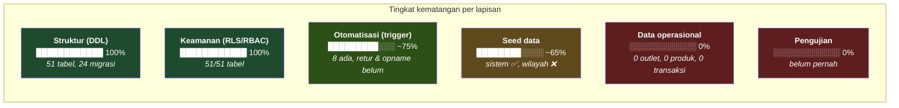
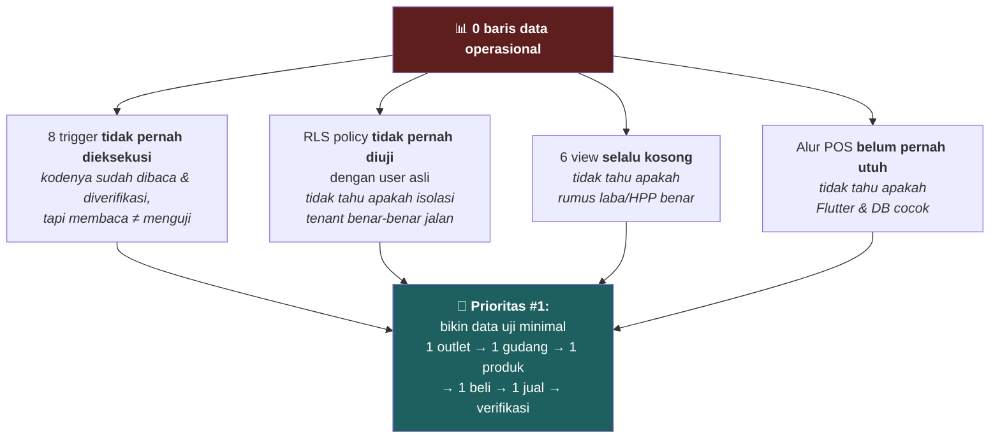
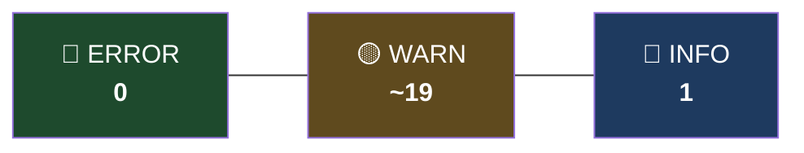
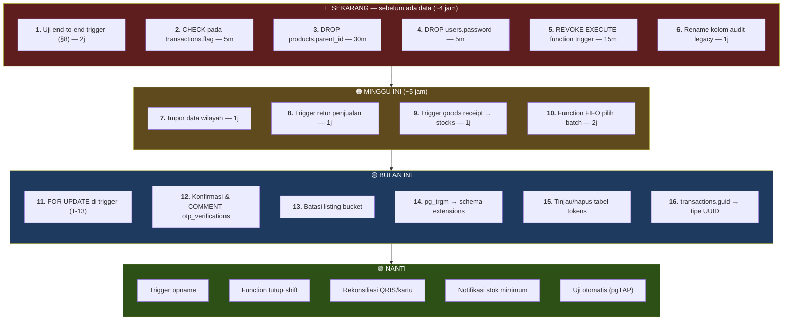
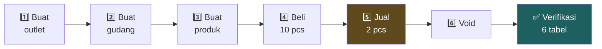

# Status Implementasi & Temuan — Mangkasir-Ritel

> **Tujuan dokumen:** menjawab **"sejauh mana ini sudah jadi, apa yang belum, dan apa
> langkah berikutnya?"** — secara jujur.
>
> **Kenapa dokumen ini penting untuk presentasi:** pembimbing yang berpengalaman **pasti**
> akan mencari kelemahan. Kalau kamu sudah menemukannya duluan dan punya rencana
> perbaikannya, posisi berubah total: dari "diperiksa" jadi "melaporkan".
>
> Semua temuan diverifikasi langsung terhadap database Supabase pada 15 Juli 2026.

## Daftar Isi
1. [Ringkasan Satu Halaman](#1-ringkasan-satu-halaman)
2. [Status per Modul](#2-status-per-modul)
3. [Kondisi Data Nyata](#3-kondisi-data-nyata)
4. [Temuan — Daftar Lengkap](#4-temuan--daftar-lengkap)
5. [Hasil Supabase Security Advisor](#5-hasil-supabase-security-advisor)
6. [Gap Fungsional](#6-gap-fungsional)
7. [Rekomendasi Prioritas](#7-rekomendasi-prioritas)
8. [Rencana Pengujian End-to-End](#8-rencana-pengujian-end-to-end)
9. [Yang Sudah Dikerjakan dengan Baik](#9-yang-sudah-dikerjakan-dengan-baik)
10. [FAQ](#10-faq)

---

## 1. Ringkasan Satu Halaman

```mermaid
flowchart LR
    subgraph DONE["✅ SELESAI & TERVERIFIKASI"]
        direction TB
        D1["51 tabel · 24 migrasi"]
        D2["RLS aktif <b>51/51</b> tabel"]
        D3["8 trigger otomatisasi"]
        D4["3 function keamanan"]
        D5["6 view laporan"]
        D6["Seed sistem: 26 permission<br/>7 role · 106 mapping · 12 unit"]
        D7["Modul Purchase <b>baru</b> lengkap<br/>(supplier → PO → GR → retur)"]
        D8["Ledger stok (stock_movements)"]
    end

    subgraph GAP["⚠️ BELUM / GAP"]
        direction TB
        G1["🔴 Trigger <b>belum teruji</b><br/>dengan data nyata"]
        G2["🔴 transactions.flag<br/>tanpa CHECK"]
        G3["🟠 Trigger function<br/>terekspos ke anon (RPC)"]
        G4["🟡 Wilayah 0 baris"]
        G5["🟡 Dua model varian<br/>hidup berdampingan"]
        G6["🟡 Kolom audit legacy<br/>(createdat)"]
        G7["🟡 users.password sisa"]
        G8["⚠️ Retur belum ada trigger"]
        G9["⚠️ FIFO belum otomatis"]
    end

    DONE -->|"fondasi kuat,<br/>tapi…"| GAP

    style DONE fill:#1e4a2d,color:#fff
    style GAP fill:#5f4a1e,color:#fff
```



### Penilaian jujur dalam satu paragraf

> **Fondasinya kuat, pembuktiannya belum ada.** Struktur database, model keamanan, dan
> otomatisasinya lengkap, konsisten, dan mengikuti pola yang benar untuk sistem retail
> multi-tenant — RLS di semua tabel, ledger append-only, snapshot HPP, three-way matching
> di pengadaan. Yang belum: **belum ada satu pun transaksi nyata yang pernah melewati
> sistem ini.** 8 trigger sudah terpasang dan kodenya sudah diverifikasi baris per baris,
> tapi belum pernah dieksekusi. Ini bukan kelemahan desain — ini tahap berikutnya yang
> memang belum dikerjakan.

### Kalimat pembuka presentasi yang disarankan

> *"Sebelum saya mulai, satu hal yang perlu saya sampaikan di depan: sistem ini fondasinya
> sudah lengkap — 51 tabel, RLS di semuanya, 8 trigger otomatisasi. Tapi belum ada data
> operasional, jadi trigger-nya belum pernah diuji dengan transaksi nyata. Saya sudah
> menyusun rencana pengujiannya, dan itu langkah pertama saya berikutnya. Sekarang saya
> jelaskan apa yang sudah ada dan kenapa desainnya begini."*

Menyampaikan ini **di depan** jauh lebih baik daripada ketahuan di tengah.

---

## 2. Status per Modul

| # | Modul | Tabel | Struktur | RLS | Otomatisasi | Teruji | Catatan |
|---|---|---|---|---|---|---|---|
| 01 | Identity & RBAC | 9 | ✅ | ✅ | — | ❌ | 26 permission & 7 role sudah di-seed |
| 02 | Organization | 3 | ✅ | ✅ | — | ❌ | 1 `businesses`, **0 outlet** → yatim |
| 03 | Product Catalog | 6 | ✅ | ✅ | ✅ 2 trigger | ❌ | ⚠️ dua model varian |
| 04 | CRM | 2 | ✅ | ✅ | — | ❌ | `suppliers` **baru** |
| 05 | Purchase | 6 | ✅ | ✅ | — | ❌ | **Seluruhnya baru** — PO→GR→retur |
| 06 | Inventory | 7 | ✅ | ✅ | ✅ 3 trigger | ❌ | Ledger = inti sistem |
| 07 | Sales POS | 5 | ✅ | ✅ | ✅ 2 trigger | ❌ | 🔴 `flag` tanpa CHECK |
| 08 | Finance | 3 | ✅ | ✅ | ✅ 1 trigger | ❌ | Tutup shift masih manual |
| 09 | Reference & Misc | 10 | ✅ | ✅ | — | — | ⚠️ wilayah 0 baris |

**Legenda:** ✅ selesai · ⚠️ ada catatan · ❌ belum · — tidak berlaku



> 💡 **Poin bercerita:** *"Kalau dilihat per lapisan, polanya jelas: dari bawah ke atas
> makin turun. Itu wajar — fondasi harus selesai dulu sebelum bisa diisi. Yang penting,
> tidak ada lapisan bawah yang bolong. Kalau struktur atau RLS-nya yang setengah jadi,
> itu baru masalah — karena semua di atasnya jadi tidak bisa dipercaya."*

---

## 3. Kondisi Data Nyata

Diverifikasi langsung dari database, 15 Juli 2026:

| Tabel | Baris | Status | Artinya |
|---|---|---|---|
| `permissions` | **26** | ✅ | Kamus izin lengkap |
| `roles` | **7** | ✅ | Owner, Administrator, Manager, Kasir, Purchasing, Gudang, Finance |
| `role_permissions` | **106** | ✅ | Pemetaan peran↔izin lengkap |
| `units` | **12** | ✅ | pcs, kg, liter, dll. |
| `businesses` | **1** | 🟡 | Ada, tapi **0 outlet** → yatim |
| `provinces` | **0** | ⚠️ | Form alamat tidak berfungsi |
| `cities` | **0** | ⚠️ | idem |
| `districts` | **0** | ⚠️ | idem |
| `villages` | **0** | ⚠️ | idem — `user_data.village_code` tidak bisa diisi |
| `outlets` | **0** | ⏳ | Belum ada cabang |
| `users` | **0** | ⏳ | Belum ada user login |
| `warehouses` | **0** | ⏳ | |
| `products` | **0** | ⏳ | |
| `stocks` | **0** | ⏳ | |
| `stock_movements` | **0** | ⏳ | **Ledger kosong** |
| `transactions` | **0** | ⏳ | |
| `cash_transactions` | **0** | ⏳ | |

### Konsekuensi yang harus disadari



**Yang penting dipahami dan disampaikan:** ini **bukan** berarti kerjanya belum apa-apa.
Struktur, keamanan, dan otomatisasi adalah bagian **tersulit** dan paling menentukan.
Mengisi data adalah bagian yang paling mudah — tapi memang belum dikerjakan.

---

## 4. Temuan — Daftar Lengkap

Diurutkan dari yang paling mendesak.

### 🔴 T-01 — Trigger belum teruji dengan data nyata

| | |
|---|---|
| **Prioritas** | 🔴 Kritis |
| **Bukti** | `transactions`, `stock_movements`, `products` semua **0 baris** |
| **Risiko** | Bug apa pun di 8 trigger **belum ketahuan**. Bisa jadi ada `NULL` handling yang meleset, urutan trigger yang tidak sesuai harapan, atau `RAISE EXCEPTION` yang terlalu agresif |
| **Kenapa terjadi** | Fokus pengembangan di struktur & migrasi. Pengisian data operasional adalah tahap berikutnya yang belum sampai |
| **Perbaikan** | Jalankan skenario uji end-to-end (§8) |
| **Effort** | ~2 jam |

Ini temuan **paling penting** di dokumen ini. Semua klaim "sistem otomatis mencatat X"
di Dokumen 03 masih berstatus **klaim berdasarkan pembacaan kode**, belum **fakta
tervalidasi**.

---

### 🔴 T-02 — `transactions.flag` tanpa CHECK constraint

| | |
|---|---|
| **Prioritas** | 🔴 Kritis |
| **Bukti** | Semua kolom status lain punya CHECK; `transactions.flag` tidak |
| **Risiko** | Trigger `trg_sync_void_transaction_stock` bergantung persis pada `'done'` dan `'void'`. Nilai `'VOID'` atau `'voided'` → **trigger diam-diam tidak jalan** → **stok tidak dikembalikan** → **tanpa error apa pun** |

Ini kategori bug terburuk: **gagal tanpa suara**. Tidak ada exception, tidak ada log, tidak
ada yang tahu sampai stock opname bulan depan menemukan selisih.

**Perbaikan (1 baris, ~5 menit):**
```sql
-- Cek dulu apakah ada nilai nyeleneh (harusnya 0 baris karena tabelnya kosong)
SELECT DISTINCT flag FROM transactions;

ALTER TABLE transactions
ADD CONSTRAINT chk_transactions_flag CHECK (flag IN ('done', 'void'));
```

**Kenapa terlewat:** `transactions` adalah tabel warisan Mangkasir yang di-migrasi apa
adanya. Tabel-tabel **baru** (purchase, inventory) semuanya punya CHECK — jadi ini bukan
kelalaian pola, tapi celah spesifik di tabel legacy.

> 💡 **Poin bercerita:** *"Ini temuan yang saya paling senang menemukannya, karena
> dampaknya besar tapi perbaikannya satu baris. Dan menariknya, ini menunjukkan pola:
> semua tabel yang saya buat baru punya CHECK. Yang terlewat justru tabel warisan yang
> saya migrasi apa adanya. Pelajarannya: tabel legacy harus diaudit dengan standar yang
> sama seperti tabel baru, bukan diasumsikan sudah benar."*

---

### 🟠 T-03 — Trigger function terekspos sebagai RPC ke `anon`

| | |
|---|---|
| **Prioritas** | 🟠 Tinggi |
| **Bukti** | Supabase Security Advisor: 8 function `SECURITY DEFINER` di schema `public` bisa dipanggil role `anon` dan `authenticated` via `/rest/v1/rpc/<nama>` |
| **Risiko** | Function trigger **tidak dimaksudkan** untuk dipanggil manual. Karena `SECURITY DEFINER`, mereka jalan dengan hak elevasi. Dipanggil di luar konteks trigger, `NEW`/`OLD` tidak ada → kemungkinan error, tapi permukaan serangan tetap ada dan tidak perlu |

**Function yang terekspos:**
`after_warehouse_upsert_func` · `before_warehouse_upsert_func` · `sync_price_history_func` ·
`sync_sale_to_cash_func` · `sync_sales_stock_movement_func` ·
`sync_stock_ledger_projection_func` · `sync_void_transaction_stock_func` — **plus**
`get_auth_business_id` · `has_permission` · `user_has_outlet_access`

**Perbaikan (~15 menit):**
```sql
-- 1. Trigger function: tidak ada alasan dipanggil manual → cabut total
REVOKE EXECUTE ON FUNCTION public.sync_sales_stock_movement_func()      FROM anon, authenticated;
REVOKE EXECUTE ON FUNCTION public.sync_stock_ledger_projection_func()   FROM anon, authenticated;
REVOKE EXECUTE ON FUNCTION public.sync_sale_to_cash_func()              FROM anon, authenticated;
REVOKE EXECUTE ON FUNCTION public.sync_void_transaction_stock_func()    FROM anon, authenticated;
REVOKE EXECUTE ON FUNCTION public.sync_price_history_func()             FROM anon, authenticated;
REVOKE EXECUTE ON FUNCTION public.before_warehouse_upsert_func()        FROM anon, authenticated;
REVOKE EXECUTE ON FUNCTION public.after_warehouse_upsert_func()         FROM anon, authenticated;

-- 2. Function keamanan: cabut dari anon saja
--    (authenticated tetap perlu — dipanggil dari dalam RLS policy)
REVOKE EXECUTE ON FUNCTION public.get_auth_business_id()                       FROM anon;
REVOKE EXECUTE ON FUNCTION public.has_permission(varchar, bigint)              FROM anon;
REVOKE EXECUTE ON FUNCTION public.user_has_outlet_access(bigint)               FROM anon;
```

> ⚠️ **Uji dulu di branch.** Mencabut `EXECUTE` dari `authenticated` untuk 3 function
> keamanan **berpotensi merusak RLS** — mereka dipanggil dari dalam policy. Cabut dari
> `anon` saja lebih aman. Trigger function aman dicabut dari keduanya karena dipanggil
> oleh sistem trigger, bukan oleh role user.

**Kenapa ini terjadi:** ini **efek samping desain Supabase**, bukan kesalahan. Semua yang
ada di schema `public` otomatis diekspos PostgREST — **termasuk yang tidak dimaksudkan
sebagai API**. Alternatif yang lebih rapi: taruh function internal di schema terpisah
(misal `private`) yang tidak diekspos.

---

### 🟡 T-04 — Dua model varian hidup berdampingan

| | |
|---|---|
| **Prioritas** | 🟡 Menengah — **tapi window-nya sedang terbuka** |
| **Bukti** | `products.parent_id` (model lama Mangkasir) **dan** tabel `product_variants` (model baru, migrasi `0017c`) sama-sama ada |
| **Risiko** | Ambiguitas: varian disimpan di mana? Dua developer bisa pakai model berbeda → data varian tercecer di dua tempat → laporan salah |
| **Perbaikan** | **Hapus `products.parent_id`** |
| **Effort** | ~30 menit **sekarang** · berhari-hari nanti |

```sql
-- Aman dijalankan SEKARANG karena products = 0 baris
ALTER TABLE products DROP COLUMN parent_id;
```

> 💡 **Ini rekomendasi paling bernilai di dokumen ini,** dan alasannya bagus untuk
> diceritakan: *"Karena tabel produk masih 0 baris, menghapus `parent_id` sekarang cuma
> satu perintah. Kalau nanti sudah ada 50.000 produk yang sebagian pakai model lama, ini
> jadi proyek migrasi data berhari-hari dengan risiko kehilangan data. Utang teknis itu
> berbunga — dan bunga tertinggi dibayar kalau ditunda. Sekarang adalah momen termurah
> untuk membayarnya."*

---

### 🟡 T-05 — Tabel wilayah kosong (0 baris)

| | |
|---|---|
| **Prioritas** | 🟡 Menengah |
| **Bukti** | `provinces`, `cities`, `districts`, `villages` semua **0 baris** |
| **Risiko** | Form alamat pelanggan/user tidak berfungsi. `user_data.village_code` merujuk `villages.code` yang kosong → tidak bisa diisi |
| **Kenapa terlewat** | Ini data referensi **eksternal** (BPS/Kemendagri), bukan sesuatu yang muncul dari pengembangan |
| **Perbaikan** | Impor dataset wilayah Indonesia (publik, ~90.000 baris sampai level kelurahan). Sekali impor, selesai |
| **Effort** | ~1 jam |

Struktur tabelnya sendiri **sudah benar** — FK berjenjang `provinces → cities → districts →
villages` dan RLS read-only untuk semua user terautentikasi. Yang kurang cuma isinya.

---

### 🟡 T-06 — Kolom audit legacy (`createdat` tanpa underscore)

| | |
|---|---|
| **Prioritas** | 🟡 Menengah-rendah |
| **Bukti** | `outlets` & `users` pakai `createdat`, `createdby`, `updatedat`, `updatedby`. Plus `users.isemailverified` |
| **Standar proyek** | `created_at`, `created_by`, `updated_at`, `updated_by`, `deleted_at`, `deleted_by` |
| **Risiko** | Bukan bug — tapi bikin bingung. Developer baru akan menulis `created_at` dan dapat error kolom tidak ada. Query lintas tabel jadi tidak seragam |
| **Perbaikan** | `ALTER TABLE ... RENAME COLUMN` + sesuaikan kode Flutter |
| **Effort** | ~1 jam (termasuk update kode klien) |

```sql
ALTER TABLE outlets RENAME COLUMN createdat TO created_at;
ALTER TABLE outlets RENAME COLUMN createdby TO created_by;
ALTER TABLE outlets RENAME COLUMN updatedat TO updated_at;
ALTER TABLE outlets RENAME COLUMN updatedby TO updated_by;
-- idem untuk users; + users.isemailverified → is_email_verified
```

> ⚠️ **Ini breaking change untuk klien.** Aman dilakukan **sekarang** (0 data, kemungkinan
> belum ada klien production). Semakin lama ditunda, semakin mahal.

---

### 🟡 T-07 — `users.password` masih ada

| | |
|---|---|
| **Prioritas** | 🟡 Menengah |
| **Bukti** | Kolom `users.password` masih ada, padahal autentikasi sudah via **Supabase Auth** (`auth.users`) |
| **Risiko** | Kolom ini **tidak dipakai** tapi tetap ada. Kalau suatu saat ada yang mengisinya (misal import data lama), jadi penyimpanan kredensial ganda — sumber kebocoran klasik. Juga membingungkan: developer baru bisa mengira auth-nya custom |
| **Perbaikan** | `ALTER TABLE users DROP COLUMN password;` |
| **Effort** | ~5 menit |

Konteks: ini warisan Mangkasir yang auth-nya custom (MariaDB + backend sendiri). Setelah
pindah ke Supabase Auth, kolomnya tidak dibersihkan. Hal yang sama berlaku untuk tabel
`tokens` (refresh token legacy) — perlu dikonfirmasi apakah masih dipakai.

---

### 🟡 T-08 — `transactions.guid` bertipe VARCHAR, bukan UUID

| | |
|---|---|
| **Prioritas** | 🟡 Rendah |
| **Bukti** | `transactions.guid` = `VARCHAR`, dirujuk 3 FK (`transaction_details`, `payments`, `sales_returns`). Sementara `products.uuid` = tipe `UUID` asli |
| **Risiko** | Boros (36 byte vs 16), tidak ada validasi format (`'bukan-uuid'` diterima), JOIN sedikit lebih lambat |
| **Perbaikan** | `ALTER COLUMN ... TYPE UUID USING guid::uuid` + 3 FK ikut diubah |
| **Effort** | ~2 jam (berisiko — perlu drop & recreate FK) |

**Bukan kritis** — sistemnya tetap benar. Tapi utang teknis yang lebih baik dibereskan
sekarang (0 baris) daripada nanti.

---

### 🟡 T-09 — `otp_verifications`: RLS aktif, 0 policy

| | |
|---|---|
| **Prioritas** | 🟡 Perlu konfirmasi |
| **Bukti** | Supabase Advisor (INFO): tabel punya RLS enabled tapi tidak ada policy |
| **Artinya** | Tabel **terkunci total** untuk role `anon` & `authenticated`. Cuma `service_role` yang bisa akses |
| **Penilaian** | Ini **kemungkinan besar disengaja dan benar** — klien memang tidak boleh membaca kode OTP orang lain. Tapi harus **dikonfirmasi**, bukan diasumsikan |
| **Aksi** | Konfirmasi ke tim; kalau memang disengaja, **tambahkan komentar** supaya tidak dikira kelupaan |

```sql
COMMENT ON TABLE otp_verifications IS
'RLS aktif tanpa policy = sengaja terkunci total.
Hanya service_role yang boleh akses. Klien tidak boleh membaca kode OTP.';
```

> 💡 Ini contoh bagus untuk diceritakan: *"Advisor menandai ini sebagai temuan, tapi setelah
> saya telusuri, ini justru desain yang benar. Yang salah cuma tidak ada dokumentasinya —
> jadi orang berikutnya akan mengira ini kelupaan dan malah 'memperbaiki' dengan
> menambahkan policy, yang justru membuka celah. Saya tambahkan COMMENT supaya niatnya
> terekam di database itu sendiri."*

---

### 🟡 T-10 — Policy permisif: `contact_us` & `tokens`

| | |
|---|---|
| **Prioritas** | 🟡 Rendah–menengah |
| **Bukti** | Advisor (WARN): `insert_contact_us` dan `insert_tokens` punya `WITH CHECK (true)` untuk INSERT |
| **Penilaian** | `contact_us` **wajar** — form kontak memang harus bisa diisi publik. `tokens` **perlu ditinjau** — kenapa siapa pun boleh insert token? |
| **Risiko** | `contact_us`: spam (mitigasi = rate limit, bukan RLS). `tokens`: perlu dipahami dulu apakah tabel ini masih dipakai |
| **Aksi** | Konfirmasi apakah `tokens` masih dipakai; kalau tidak (auth sudah via Supabase Auth), **hapus tabelnya** |

---

### 🟡 T-11 — Storage bucket `product-images` public + allow listing

| | |
|---|---|
| **Prioritas** | 🟡 Rendah |
| **Bukti** | Advisor (WARN): bucket public dengan policy SELECT luas (`Public Read Access`) → klien bisa **melihat daftar semua file** |
| **Risiko** | Bucket public memang perlu supaya URL gambar bisa diakses. Tapi **listing** tidak perlu — orang bisa melihat semua gambar produk semua tenant, termasuk yang belum publish |
| **Perbaikan** | Batasi policy SELECT hanya untuk akses objek langsung, bukan listing |
| **Effort** | ~20 menit |

Konfigurasi bucket sendiri sudah baik: limit 5MB, mime terbatas ke `image/jpeg|png|webp|gif`.

---

### 🟡 T-12 — Extension `pg_trgm` di schema `public`

| | |
|---|---|
| **Prioritas** | 🟡 Rendah |
| **Bukti** | Advisor (WARN): extension terpasang di `public`, sebaiknya di schema terpisah |
| **Risiko** | Rendah — sebatas kebersihan namespace. Function extension ikut terekspos ke PostgREST |
| **Perbaikan** | `ALTER EXTENSION pg_trgm SET SCHEMA extensions;` + sesuaikan `search_path` |
| **Effort** | ~15 menit (perlu uji — index yang memakainya bisa terpengaruh) |

---

### ⚠️ T-13 — `balance_after` tanpa row lock

| | |
|---|---|
| **Prioritas** | ⚠️ Catatan teknis |
| **Bukti** | Trigger membaca `SELECT warehouse_id, qty INTO ... FROM stocks WHERE id = ...` **tanpa** `FOR UPDATE`, lalu menghitung `balance_after` sebelum INSERT |
| **Risiko** | Dalam kondisi bersamaan ekstrem (2 kasir jual batch sama di milidetik sama), `balance_after` bisa meleset |
| **Yang TIDAK terpengaruh** | `stocks.qty` **tetap benar** — karena `UPDATE stocks SET qty = qty + NEW.qty` bersifat atomik. Jadi stok sungguhannya aman |
| **Dampak** | `balance_after` cuma untuk audit trail, bukan sumber kebenaran. Jadi tidak merusak stok — tapi bisa membingungkan saat audit |
| **Perbaikan** | Tambahkan `FOR UPDATE` pada SELECT di trigger |

```sql
SELECT warehouse_id, qty INTO v_warehouse_id, v_current_stock_qty
FROM stocks WHERE id = NEW.stock_in_id
FOR UPDATE;   -- ← kunci baris sampai transaksi selesai
```

> 💡 **Poin bercerita yang kuat:** *"Ini temuan yang paling halus dan saya cukup bangga
> menemukannya. Stoknya sendiri tetap benar karena `qty = qty + x` itu atomik. Yang bisa
> meleset cuma `balance_after` — yang fungsinya audit. Jadi dampaknya kecil, tapi tetap
> layak dibetulkan karena kalau nanti ada audit dan angkanya tidak nyambung, orang akan
> mengira stoknya yang salah — padahal bukan."*

---

## 5. Hasil Supabase Security Advisor

Dijalankan 15 Juli 2026 via `Supabase → Advisors → Security`.

| Level | Jumlah | Temuan |
|---|---|---|
| 🔵 INFO | 1 | `otp_verifications` RLS tanpa policy → **T-09** |
| 🟡 WARN | ~19 | `pg_trgm` di public (**T-12**) · policy permisif `contact_us`/`tokens` (**T-10**) · bucket listing (**T-11**) · 10 function SECURITY DEFINER × 2 role (**T-03**) |
| 🔴 ERROR | **0** | ✅ Tidak ada |



**Cara membaca hasil ini dengan jujur:**

- **0 ERROR** = tidak ada lubang keamanan fatal. Ini hasil yang **bagus**, dan sebagian
  besar karena RLS aktif di 51/51 tabel — itu penyebab ERROR paling umum di project Supabase
- **Mayoritas WARN** berasal dari **satu akar masalah** (T-03: function `SECURITY DEFINER`
  di schema `public`), bukan 19 masalah berbeda. Satu perbaikan menutup ~14 warning
- **Beberapa WARN adalah false positive** — `contact_us` memang harus bisa diisi publik,
  `otp_verifications` memang harus terkunci

> 💡 **Kalimat untuk pembimbing:** *"Advisor memberi 19 warning, tapi setelah saya telusuri
> satu-satu, itu bukan 19 masalah. Sekitar 14 berasal dari satu akar — function
> SECURITY DEFINER di schema public — dan itu efek samping cara kerja Supabase, bukan
> kesalahan desain. Dua di antaranya justru false positive: desainnya memang begitu.
> Yang benar-benar perlu dibetulkan ada 3-4. Nol ERROR."*

Ini jawaban yang menunjukkan kamu **membaca dan menilai** hasil tool, bukan cuma
menempelkannya.

---

## 6. Gap Fungsional

Proses yang **seharusnya otomatis** tapi belum:

| Proses | Sekarang | Idealnya | Prioritas |
|---|---|---|---|
| **Retur penjualan → kembalikan stok** | ⚠️ Manual | Trigger seperti void | 🟠 Tinggi |
| **Retur pembelian → kurangi stok** | ⚠️ Manual | Trigger | 🟡 Menengah |
| **Goods receipt → buat batch `stocks`** | ⚠️ Manual | Trigger dari `goods_receipt_items` | 🟠 Tinggi |
| **FIFO otomatis pilih batch** | ⚠️ Flutter yang pilih | Function `pick_stock_batch_fifo()` | 🟠 Tinggi |
| **Stock opname → selisih** | ⚠️ Manual | Trigger + `reference_type='opname'` | 🟡 Menengah |
| **Tutup shift → hitung saldo** | ⚠️ Manual | Function `close_cash_period()` | 🟡 Menengah |
| **Rekonsiliasi QRIS/kartu** | ❌ Belum ada | Modul terpisah | 🟢 Nanti |
| **Notifikasi stok minimum** | ❌ Belum ada | View + push | 🟢 Nanti |

### Gap paling menonjol: retur penjualan

Void punya trigger (`trg_sync_void_transaction_stock`), tapi retur tidak. Ini
**inkonsistensi** — dua proses yang sama-sama mengembalikan stok, satu otomatis satu tidak.

Kalau Flutter lupa menulis `stock_movements` saat retur, **stok tidak bertambah** dan tidak
ada yang tahu. Persis masalah yang dihindari dengan menaruh logika di database — tapi di
sini justru dibiarkan di aplikasi.

**Rekomendasi:** trigger `trg_sync_sales_return_stock` pada `sales_return_items`, mengikuti
pola `sync_void_transaction_stock_func` (loop item → insert `stock_movements` `in` dengan
`reference_type='return'`).

### Gap FIFO

`transaction_details.stock_in_id` mengharuskan Flutter memutuskan **batch mana** yang dijual.
Kalau Flutter asal pilih batch pertama yang ketemu, FIFO tidak terjamin → barang lama busuk
di rak, HPP salah.

**Rekomendasi:** function `pick_stock_batch_fifo(product_guid, warehouse_id, qty)` yang
mengembalikan daftar `(stock_in_id, qty)` — termasuk kasus 1 penjualan mengambil dari 2
batch (batch A tinggal 1 pcs, jual 3 → 1 dari A + 2 dari B).

---

## 7. Rekomendasi Prioritas



### Kenapa urutannya begini

**Semua di 🔴 SEKARANG adalah hal yang biayanya naik drastis setelah ada data.**

| Tugas | Biaya sekarang | Biaya setelah ada data |
|---|---|---|
| `DROP parent_id` | 1 perintah | Migrasi data + risiko kehilangan |
| Rename kolom audit | 4 perintah | Breaking change untuk klien production |
| `DROP password` | 1 perintah | Audit dulu siapa yang pakai |
| CHECK pada `flag` | Langsung | Harus bersihkan data nyeleneh dulu |
| `guid` → UUID | Relatif mudah | Drop & recreate 3 FK di jutaan baris |

> 💡 **Ini poin presentasi yang kuat:** *"Semua yang saya taruh di prioritas pertama punya
> satu kesamaan: harganya naik drastis begitu ada data. Sekarang `DROP COLUMN parent_id`
> itu satu perintah. Setelah ada 50.000 produk, ini proyek migrasi berhari-hari.
> Jadi urutan prioritas saya bukan berdasarkan 'mana yang paling parah', tapi 'mana yang
> paling murah dikerjakan sekarang dan paling mahal ditunda'. Utang teknis itu berbunga —
> dan bunganya mulai jalan begitu data pertama masuk."*

Ini cara berpikir yang membedakan developer junior dari yang mulai matang, dan pembimbing
akan menangkap itu.

---

## 8. Rencana Pengujian End-to-End

Ini **PR prioritas #1**. Tulis sebagai script SQL supaya bisa diulang.

### Skenario minimal



### Script uji

```sql
BEGIN;   -- ← semuanya akan di-ROLLBACK di akhir, database tetap bersih

-- ═══ 1. Outlet ═══
INSERT INTO outlets (uuid, business_id, name, currency, is_active)
VALUES (gen_random_uuid(), 1, 'Outlet Uji', 'IDR', true)
RETURNING id;   -- catat → :outlet_id

-- ═══ 2. Gudang ═══ (uji trigger 7 & 8: is_default otomatis)
INSERT INTO warehouses (uuid, outlet_id, name)
VALUES (gen_random_uuid(), :outlet_id, 'Gudang Uji')
RETURNING id;   -- → :warehouse_id

-- ✅ VERIFIKASI 1: gudang pertama harus otomatis jadi default
SELECT is_default FROM warehouses WHERE id = :warehouse_id;
-- HARAPAN: true  ← membuktikan trg_before_warehouse_upsert jalan

-- ═══ 3. Produk ═══ (uji trigger 5: riwayat harga)
INSERT INTO products (uuid, outlet_id, name, sku, price, cost, qty, status, is_stock, is_use_stock)
VALUES (gen_random_uuid(), :outlet_id, 'Indomie Uji', 'TEST-001', 3500, 2800, 0, 'active', true, true)
RETURNING id, uuid;   -- → :product_id, :product_uuid

-- ✅ VERIFIKASI 2: riwayat harga tercatat otomatis
SELECT count(*) FROM product_prices WHERE product_id = :product_id;
-- HARAPAN: >= 1  ← membuktikan trg_sync_product_price jalan

-- ═══ 4. Pembelian: 10 pcs ═══
INSERT INTO stock_in_headers (uuid, outlet_id, type)
VALUES (gen_random_uuid(), :outlet_id, 'PURCHASE') RETURNING id;   -- → :sih_id

INSERT INTO stock_in_details (stock_in_header_id, product_guid, batch_number, qty, cost)
VALUES (:sih_id, :product_uuid, 'BATCH-UJI-001', 10, 2800) RETURNING id;   -- → :sid_id

INSERT INTO stocks (product_guid, warehouse_id, stock_in_detail_id, qty)
VALUES (:product_uuid, :warehouse_id, :sid_id, 0) RETURNING id;   -- → :stock_id
-- ↑ qty=0 dulu; ledger yang akan mengisinya

INSERT INTO stock_movements (stock_id, product_guid, warehouse_id,
    movement_type, qty, reference_type, reference_id, balance_after)
VALUES (:stock_id, :product_uuid, :warehouse_id, 'in', 10, 'purchase', :sih_id, 10);

-- ✅ VERIFIKASI 3: proyeksi terisi otomatis dari ledger
SELECT qty FROM stocks   WHERE id = :stock_id;       -- HARAPAN: 10
SELECT qty FROM products WHERE uuid = :product_uuid; -- HARAPAN: 10
-- ← membuktikan trg_sync_stock_ledger jalan

-- ═══ 5. Penjualan: 2 pcs, tunai ═══ ⭐ INTI PENGUJIAN
INSERT INTO transactions (guid, invoice, outlet_id, date, sub_total, flag)
VALUES ('uji-guid-001', 'INV-UJI-001', :outlet_id, NOW(), 7000, 'done')
RETURNING id;   -- → :trx_id

INSERT INTO transaction_details (transaction_guid, product_guid, stock_in_id,
    product_name, product_sku, qty, price, cost, total_price)
VALUES ('uji-guid-001', :product_uuid, :stock_id, 'Indomie Uji', 'TEST-001', 2, 3500, 2800, 7000);
-- ↑ INI memicu rantai: trigger 1 → trigger 2

-- ✅ VERIFIKASI 4: rantai trigger penjualan
SELECT movement_type, qty, reference_type, balance_after
FROM stock_movements WHERE reference_type = 'sale';
-- HARAPAN: type='out', qty=-2, balance_after=8   ← trigger 1

SELECT qty FROM stocks   WHERE id = :stock_id;       -- HARAPAN: 8   ← trigger 2
SELECT qty FROM products WHERE uuid = :product_uuid; -- HARAPAN: 8   ← trigger 2

-- Pembayaran tunai → memicu trigger 3
INSERT INTO payments (transaction_guid, payment_methode, paid, change_amount, date)
VALUES ('uji-guid-001', 'CASH', 10000, 3000, NOW());

-- ✅ VERIFIKASI 5: kas otomatis — INI YANG PALING SERING SALAH
SELECT debit, kredit, source, description FROM cash_transactions WHERE source = 'SALE';
-- HARAPAN: debit = 7000 (= paid 10000 − change 3000), BUKAN 10000
-- ← membuktikan trigger 3 menghitung kas dengan benar

-- ✅ VERIFIKASI 6: kategori kas dibuat otomatis
SELECT name, type FROM cash_categories WHERE outlet_id = :outlet_id;
-- HARAPAN: 'Penjualan POS', 'income'  ← self-provisioning jalan

-- ═══ 6. Void ═══
UPDATE transactions SET flag = 'void', updated_by = 'uji' WHERE guid = 'uji-guid-001';

-- ✅ VERIFIKASI 7: stok kembali
SELECT movement_type, qty, reference_type FROM stock_movements
WHERE reference_type = 'adjustment';
-- HARAPAN: type='in', qty=+2   ← trigger 4

SELECT qty FROM stocks   WHERE id = :stock_id;       -- HARAPAN: 10 (kembali)
SELECT qty FROM products WHERE uuid = :product_uuid; -- HARAPAN: 10

-- ✅ VERIFIKASI 8: ledger tetap utuh — jejak audit lengkap
SELECT movement_type, qty, reference_type, balance_after, created_at
FROM stock_movements ORDER BY id;
-- HARAPAN 3 baris: in +10 (purchase) · out −2 (sale) · in +2 (adjustment)
-- ← membuktikan ledger append-only: tidak ada yang dihapus

ROLLBACK;   -- ← database kembali bersih, seolah tidak terjadi apa-apa
```

### Skenario tambahan yang layak diuji

| # | Uji | Harapan |
|---|---|---|
| 9 | Jual **QRIS**, bukan CASH | `cash_transactions` **tetap 0 baris** — bukan kas fisik |
| 10 | Jual dengan `stock_in_id` yang batch-nya tanpa gudang | `RAISE EXCEPTION` → **seluruh transaksi rollback** |
| 11 | Buat gudang **kedua** dengan `is_default=true` | Gudang pertama otomatis jadi `false` |
| 12 | Isolasi tenant: login user bisnis A, `SELECT * FROM outlets` | Cuma outlet bisnis A yang muncul |
| 13 | RBAC: user role Kasir coba `INSERT products` | 0 baris / ditolak — tidak punya `PRODUCT_CREATE` |
| 14 | Ubah `flag` ke `'VOID'` (huruf besar) | **T-02:** trigger tidak jalan, stok tidak kembali, **tanpa error** |

**Uji #14 sengaja dibuat untuk membuktikan temuan T-02.** Kalau bisa mendemonstrasikan bug
ini ke pembimbing lalu menunjukkan perbaikannya satu baris — itu momen presentasi yang kuat.

**Uji #12 dan #13 paling penting untuk membuktikan keamanan.** Butuh dua user asli di dua
bisnis berbeda. Ini yang membuktikan klaim "isolasi tenant di database" bukan sekadar teori.

> 💡 **Kenapa `BEGIN … ROLLBACK`?** Karena seluruh skenario dijalankan lalu dibatalkan —
> database production tetap bersih, tapi kamu **melihat trigger bekerja dengan mata sendiri**.
> Bisa diulang berkali-kali tanpa membersihkan apa pun.

---

## 9. Yang Sudah Dikerjakan dengan Baik

Presentasi yang cuma berisi kekurangan akan membuat pembimbing mengira proyeknya gagal.
Ini yang **layak disebut** — dan semuanya terverifikasi, bukan klaim kosong:

| # | Pencapaian | Kenapa layak disebut |
|---|---|---|
| 1 | **RLS aktif 51/51 tabel** | Kebanyakan project Supabase punya tabel yang lupa RLS-nya. Ini penyebab kebocoran data #1. Nol tabel bolong |
| 2 | **Ledger append-only** (`stock_movements`) | Ini pola yang dipakai sistem perbankan. Banyak POS komersial cuma punya `UPDATE qty` — dan tidak bisa jawab "kenapa stok salah" |
| 3 | **Snapshot HPP** (`transaction_details.cost`) | Bug klasik yang mahal: laba historis berubah saat harga beli berubah. Sistem ini menghindarinya |
| 4 | **Two-layer security** (outlet access + permission) | Memisahkan "boleh lihat mana" dari "boleh ngapain". Memungkinkan 1 orang punya peran berbeda di outlet berbeda |
| 5 | **Three-way matching** di pengadaan | PO → penerimaan → retur. Standar sistem pengadaan serius, bukan sekadar "tambah stok" |
| 6 | **`SET search_path TO ''`** di semua SECURITY DEFINER | Praktik keamanan yang bahkan sering dilewatkan developer berpengalaman |
| 7 | **3 FK delete rule dipakai secara sadar** | RESTRICT/CASCADE/SET NULL dipilih per kasus, bukan asal default |
| 8 | **DECIMAL untuk uang, bukan float** | Terdengar sepele, tapi ini penyebab selisih kas #1 di sistem retail amatir |
| 9 | **24 migrasi berurutan, tidak ada yang diedit** | Adanya `0019a/b/c/f` justru **membuktikan** aturannya diikuti: salah → migrasi baru, bukan edit yang lama |
| 10 | **0 ERROR di Security Advisor** | Sebagian besar berkat #1 |
| 11 | **Projection self-healing** | `products.qty` dihitung ulang penuh (`SUM`), bukan `qty − 2`. Kalau pernah rusak, transaksi berikutnya membetulkannya sendiri |

> 💡 **Cara menyampaikan yang seimbang:** *"Saya sudah audit sistem ini dan menemukan
> 13 temuan, 2 di antaranya prioritas tinggi. Tapi saya juga mau tunjukkan yang sudah
> benar, karena itu bagian yang paling sulit: RLS di 51 dari 51 tabel — nol yang bolong.
> Ledger append-only yang polanya sama dengan sistem perbankan. Snapshot HPP yang bikin
> laporan laba historis tidak pernah berubah. Yang belum itu pembuktian, bukan fondasi."*

---

## 10. FAQ

<details>
<summary><b>Q1: Kenapa berani menyebut kekurangan sendiri? Bukankah itu merugikan?</b></summary>

Justru sebaliknya. Ini pertimbangannya:

**Skenario A — kamu tidak menyebut, pembimbing menemukan.**
Kesan: *"Dia tidak tahu sistemnya sendiri"* atau lebih buruk, *"dia tahu tapi menyembunyikan."*
Sekali ini terjadi, **semua klaim lain jadi diragukan**. "Katanya RLS aman — apa saya
percaya?"

**Skenario B — kamu menyebut duluan, lengkap dengan prioritas dan perbaikannya.**
Kesan: *"Dia menguasai sistemnya sampai ke celahnya, dan dia sudah punya rencana."*
Posisi berubah: dari **diperiksa** jadi **melaporkan**. Ini posisi orang yang bertanggung
jawab atas sistem, bukan yang sedang diadili.

**Yang membedakan keduanya bukan jumlah temuan — tapi siapa yang menemukan duluan.**

Dan ada bonus: pembimbing yang berpengalaman **pasti** akan mencari kelemahan. Kalau kamu
sudah menyodorkan daftarnya, energinya pindah dari "mencari yang salah" ke "mendiskusikan
solusi" — dan itu percakapan yang jauh lebih produktif untuk kamu.

**Kuncinya:** tiap temuan **harus** disertai (a) prioritas, (b) perbaikan konkret,
(c) estimasi effort. Temuan tanpa rencana = keluhan. Temuan dengan rencana = kepemimpinan
teknis.
</details>

<details>
<summary><b>Q2: Kalau ditanya "kenapa belum ada data sama sekali?", jawab apa?</b></summary>

Jawab jujur, tapi bingkai dengan urutan kerja yang benar:

> *"Karena urutan kerjanya: struktur dulu, baru data. Kalau saya isi data duluan lalu
> ternyata strukturnya harus berubah — misal `parent_id` harus dihapus, atau kolom audit
> harus di-rename — saya harus migrasi data itu. Sekarang, semua perubahan struktur masih
> gratis: satu perintah `ALTER TABLE`, selesai. Jadi saya selesaikan dulu struktur, keamanan,
> dan otomatisasinya sampai benar-benar mantap. Pengisian data dan pengujian adalah tahap
> berikutnya, dan rencananya sudah saya susun."*

Lalu **langsung tunjukkan §8** — rencana pengujian yang sudah siap. Ini mengubah "belum
dikerjakan" jadi "sudah direncanakan, tinggal jalan".

**Kalau ditanya lanjut "kapan?"** — kasih angka: *"Skenario minimalnya sekitar 2 jam.
Yang lebih lama justru pengujian isolasi tenant, karena butuh dua user asli di dua bisnis
berbeda."*

**Yang jangan dijawab:** *"belum sempat"*. Itu jawaban yang tidak menjelaskan apa-apa.
</details>

<details>
<summary><b>Q3: Dari 13 temuan, mana yang paling penting kalau cuma boleh sebut satu?</b></summary>

**T-01: trigger belum teruji dengan data nyata.**

Alasannya: temuan lain (T-02 sampai T-13) semuanya **sudah diketahui dan sudah ada
solusinya**. Yang masih **tidak diketahui** justru bahaya sebenarnya — dan itu cuma bisa
diungkap dengan menjalankan sistemnya.

Analogi: T-02 sampai T-13 itu seperti retak yang sudah terlihat di dinding — sudah tahu di
mana, sudah tahu cara menambalnya. T-01 itu seperti belum pernah menyalakan listriknya sama
sekali — belum tahu ada masalah apa.

**Kalimat lengkapnya:** *"Kalau saya harus sebut satu, yang paling penting justru bukan bug
yang saya temukan — tapi bug yang belum saya temukan. Semua trigger sudah saya baca baris
per baris dan logikanya benar. Tapi membaca kode itu tidak sama dengan menjalankannya.
Sampai ada satu transaksi nyata lewat sistem ini, semua yang saya jelaskan hari ini
statusnya masih 'seharusnya begini', bukan 'terbukti begini'."*

Jawaban ini menunjukkan pemahaman soal **batas pengetahuan sendiri** — kualitas yang jarang
di developer junior dan sangat dihargai.
</details>

<details>
<summary><b>Q4: Kalau pembimbing minta perbaiki sesuatu di tempat, mana yang paling aman didemokan?</b></summary>

**T-02 (CHECK pada `flag`)** — paling aman dan paling berkesan:

```sql
-- 1. Buktikan masalahnya ada
SELECT conname, pg_get_constraintdef(oid) FROM pg_constraint
WHERE conrelid = 'transactions'::regclass AND contype = 'c';
-- → tidak ada CHECK untuk flag

-- 2. Bandingkan dengan tabel yang benar
SELECT conname, pg_get_constraintdef(oid) FROM pg_constraint
WHERE conrelid = 'purchase_orders'::regclass AND contype = 'c';
-- → ada CHECK untuk status ✅

-- 3. Perbaiki
ALTER TABLE transactions
ADD CONSTRAINT chk_transactions_flag CHECK (flag IN ('done','void'));

-- 4. Buktikan sekarang terlindungi
INSERT INTO transactions (guid, invoice, outlet_id, flag)
VALUES ('x','x',1,'VOID');
-- ❌ ERROR: violates check constraint "chk_transactions_flag"  ← inilah buktinya
```

**Kenapa ini demo yang bagus:**
- Cepat (< 1 menit)
- Aman (tabel kosong, tidak ada data yang bisa rusak)
- **Bisa dibuktikan** — langkah 4 menunjukkan hasilnya nyata, bukan klaim
- Menunjukkan alur berpikir lengkap: temukan → bandingkan dengan standar → perbaiki → buktikan

**Yang jangan didemokan langsung:** `REVOKE EXECUTE` (T-03) — bisa merusak RLS kalau salah
cabut. Itu harus diuji di branch dulu. Kalau ditanya, jelaskan alasannya — dan itu sendiri
sudah jawaban yang bagus: *"Yang ini saya tidak berani jalankan langsung di production,
karena 3 function itu dipanggil dari dalam RLS policy. Kalau salah cabut, semua query bisa
mengembalikan 0 baris. Saya uji di Supabase branch dulu."*
</details>

<details>
<summary><b>Q5: Apakah 13 temuan itu banyak untuk sistem sebesar ini?</b></summary>

Tidak — dan konteksnya penting untuk disampaikan:

**Skala sistemnya:** 51 tabel · 24 migrasi · 8 trigger · 6 view · ~200 RLS policy ·
proyek migrasi dari sistem legacy (MariaDB → PostgreSQL).

**13 temuan dengan 0 ERROR keamanan** untuk skala segini itu **wajar sampai bagus**.
Sebagai pembanding kasar: audit database production skala serupa biasanya menghasilkan
20–40 temuan, dan hampir selalu ada minimal 1 ERROR keamanan.

**Yang lebih penting dari jumlahnya — sebarannya:**

| Kategori | Jumlah | Artinya |
|---|---|---|
| Kesalahan **desain** | **0** | Tidak ada yang perlu dirancang ulang |
| Kesalahan **implementasi** | 2 (T-02, T-13) | Kecil, perbaikannya 1–2 baris |
| **Utang teknis legacy** | 4 (T-04, T-06, T-07, T-08) | Konsekuensi migrasi — **terduga** |
| **Efek samping platform** | 3 (T-03, T-11, T-12) | Cara kerja Supabase, bukan salah desain |
| **Belum dikerjakan** | 2 (T-01, T-05) | Bukan bug — memang tahapnya belum sampai |
| **Perlu konfirmasi** | 2 (T-09, T-10) | Mungkin justru sudah benar |

**Kalimat untuk pembimbing:** *"Yang saya perhatikan dari sebarannya: nol temuan di
kategori kesalahan desain. Artinya tidak ada yang perlu dirancang ulang — semuanya bisa
diperbaiki tanpa menyentuh arsitekturnya. Mayoritas temuan itu utang teknis dari migrasi
legacy, yang memang terduga, dan efek samping cara kerja Supabase, yang bukan kesalahan.
Yang benar-benar salah cuma dua, dan perbaikannya satu-dua baris."*

Analisis sebaran seperti ini jauh lebih berbobot daripada sekadar melaporkan angka 13.
</details>

<details>
<summary><b>Q6: Bagaimana cara memverifikasi sendiri klaim-klaim di dokumen ini?</b></summary>

Semua angka di 6 dokumen ini bisa dicek ulang. Buka **Supabase → SQL Editor**:

```sql
-- Klaim: "51 tabel, semuanya RLS aktif"
SELECT count(*) AS total_tabel,
       count(*) FILTER (WHERE relrowsecurity) AS rls_aktif
FROM pg_class c JOIN pg_namespace n ON n.oid = c.relnamespace
WHERE n.nspname = 'public' AND c.relkind = 'r';
-- HARAPAN: 51 | 51

-- Klaim: "8 trigger"
SELECT count(DISTINCT trigger_name) FROM information_schema.triggers
WHERE trigger_schema = 'public';
-- HARAPAN: 8

-- Klaim: "26 permission, 7 role, 106 mapping, 12 unit"
SELECT
  (SELECT count(*) FROM permissions)      AS permissions,
  (SELECT count(*) FROM roles)            AS roles,
  (SELECT count(*) FROM role_permissions) AS mappings,
  (SELECT count(*) FROM units)            AS units;
-- HARAPAN: 26 | 7 | 106 | 12

-- Klaim: "0 data operasional"
SELECT
  (SELECT count(*) FROM outlets)      AS outlets,
  (SELECT count(*) FROM users)        AS users,
  (SELECT count(*) FROM products)     AS products,
  (SELECT count(*) FROM transactions) AS transactions;
-- HARAPAN: 0 | 0 | 0 | 0

-- Klaim T-02: "transactions.flag tanpa CHECK"
SELECT conname, pg_get_constraintdef(oid) FROM pg_constraint
WHERE conrelid = 'transactions'::regclass AND contype = 'c';
-- HARAPAN: tidak ada yang menyebut kolom flag

-- Klaim: "0 Edge Function"
-- → cek di Supabase Dashboard → Edge Functions

-- Klaim: "24 migrasi"
-- → cek di Supabase Dashboard → Database → Migrations
```

**Untuk temuan keamanan (T-03, T-09 s/d T-12):**
Supabase Dashboard → **Advisors** → **Security** → jalankan ulang.

> 💡 **Ini juga strategi presentasi yang bagus:** kalau pembimbing meragukan satu angka,
> jangan berdebat — buka SQL Editor dan jalankan query-nya di depan. *"Ini datanya
> langsung dari database."* Jauh lebih meyakinkan daripada meyakinkan lewat kata-kata.
</details>

---

## Dokumen Terkait

- **[00] README & Panduan Baca** — skrip presentasi 15 menit
- **[01] System Overview & Arsitektur** — konteks arsitektur di balik temuan ini
- **[02] Master Data & Data Dictionary** — detail tabel yang disebut di temuan
- **[03] Alur Proses End-to-End** — trigger yang belum teruji (T-01) & `flag` (T-02)
- **[04] Supabase Primer** — kalau istilah `SECURITY DEFINER`, RLS, RPC terasa asing

---

*Dokumen 05 dari 6 · Terakhir diverifikasi terhadap database: 15 Juli 2026*
